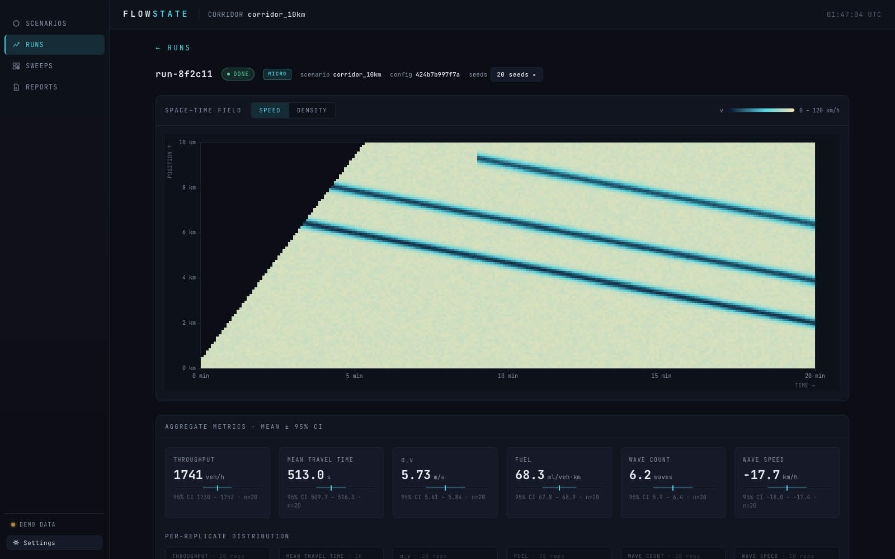
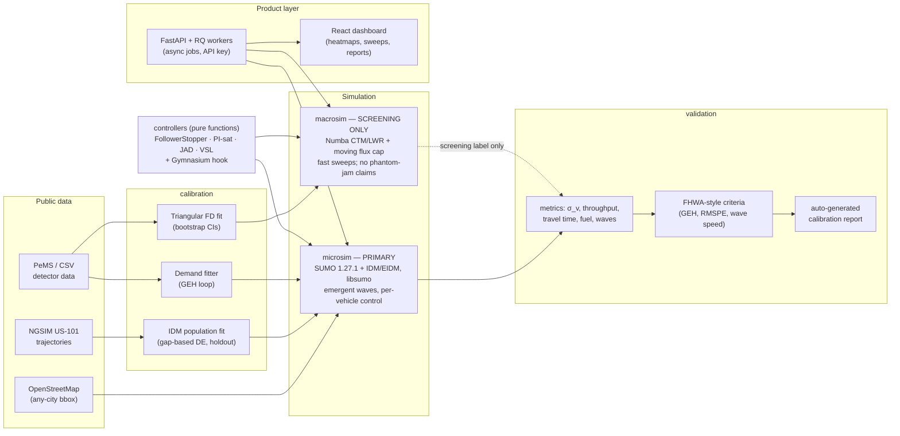

# FlowState v2

**Calibrated corridor digital twins for studying — and dissipating — stop-and-go
("phantom") traffic waves with sparse controlled vehicles and variable speed
limits.**

FlowState v2 turns a freeway corridor into a reproducible simulation study:
onboard the corridor (from OpenStreetMap or a built-in scenario), calibrate
car-following and demand against public trajectory/detector data, run seeded
multi-replicate experiments with smoothing controllers or VSL, and generate a
FHWA-style calibration/validation report a reviewer can rerun. The phenomenon
at the core — string instability growing into stop-and-go waves — is
*emergent* in the microscopic tier, not hand-seeded, which is what makes
controller results on it meaningful. Every headline number in this repository
traces to a seeded run with confidence intervals, including the results that
failed.



> **On v1:** FlowState v1 studied controlled dissipation of *seeded* shocks in
> a first-order (LWR) model — a model class that is string-stable by
> construction and cannot form phantom jams. v2 studies *emergent* stop-and-go
> waves in a calibrated microscopic model. v1 remains available at
> [abc000cool/FlowState](https://github.com/abc000cool/FlowState) as motivated
> preliminary work.

**Embeddable simulation:** `embed/` is a static page that replays 45 real
SUMO + IDM ring runs and the observed I-24 day, ready to deploy on Render or
Fly and iframe into a website ([embed/README.md](embed/README.md)).

## Architecture

Two simulation tiers with strictly separated jobs, one shared controller
library, and a validation stack that gates what may be claimed:



The macro tier is the ported v1 engine with a full test battery (Riemann
exactness, conservation, CFL guards). Its outputs are labeled
`tier="screening"` and the API refuses to build a validation report from them
— first-order models cannot form phantom jams, so they don't get to make
claims about them.

## Results

All results below are reproducible from committed scripts and artifacts;
sources: [docs/M3_RESULTS.md](docs/M3_RESULTS.md),
[docs/M3_US101_VALIDATION.md](docs/M3_US101_VALIDATION.md),
[docs/M2_RESULTS.md](docs/M2_RESULTS.md).

**Ring benchmark (CI-gated).** On the 230 m / 22-vehicle Sugiyama ring,
stop-and-go emerges with no seeding (sustained σ_v ≈ 2.4 m/s, full stops,
jam front drifting backward at ≈ −14 km/h) and a single FollowerStopper
vehicle — 1 of 22 — dampens it (σ_v reduction ≥ 25% asserted, ≈ 100%
measured; minimum speed raised from 0 to ≈ 2 m/s). This reproduction of
Sugiyama et al. (2008) and Stern et al. (2018) runs as a permanent
integration test.

**Penetration × compliance sweep** — 540 emergent (unseeded) SUMO runs on the
synthetic 10 km corridor, 27 cells × 20 common-random-number seeds:


| Result | Number (mean, 95% CI, n = 20 seeds) |
|---|---|
| Baseline waves | 3.85 [2.59, 5.11] waves/run; temporal σ_v 3.39 [2.83, 3.94] m/s |
| FollowerStopper 5% / 100% | σ_v 1.31 [1.24, 1.38] m/s; 0.15 [−0.02, 0.32] waves/run |
| FollowerStopper 10–20% / 100% | zero detected waves in all 20 replicates |
| Already resolvable at 1% / 100% | paired σ_v reduction +24.5% [+17.7, +31.4] |
| Throughput cost (synthetic corridor) | none resolved (+11.6 veh/h [−1.3, +24.4] at 5% / 100%) |
| Fuel (synthetic corridor) | −2.8% [−3.8, −1.7] at 1% / 100% → −5.7% [−7.2, −4.2] at 20% / 100% |
| **Robustness on real geometry** | The σ_v dose-response replicates on the 5-lane US-101 replica (−8.2% at 1% → −53.2% at 20%, all resolved). The *no-cost* result does **not**: that saturated site shows a resolved −0.3…−1.6% throughput cost and +1.4…+2.7% fuel at 1–10% penetration ([US101_PENETRATION.md](docs/US101_PENETRATION.md)) |
| Compliance × penetration | effects collapse onto the complied share of the fleet — half the compliance ≈ double the penetration needed |
| Controller comparison at 5% / 100% | FollowerStopper (σ_v −61.2%, waves −96.1%) and JAD under a realistic 30 s/±20% detection oracle (−60.6%, −90.9%) are statistically tied; faithful PI-saturation trails at −29.7%. All resolved, no throughput cost ([CONTROLLER_COMPARISON.md](docs/CONTROLLER_COMPARISON.md)) |
| Detection realism | JAD is *unreliable with a perfect oracle* — it chatters and worsens 5/20 seeds; 30–60 s latency with ±20% noise removes the failure entirely ([JAD_ORACLE_RESULTS.md](docs/JAD_ORACLE_RESULTS.md)) |
| US-101 replica validation | **1 PASS / 5 FAIL** on the FHWA-style criteria table |
| **I-24 MOTION flagship** (3.4 miles, ramps, 17,652-episode calibration on the same day) | **1 PASS / 5 FAIL in both demand arms.** Coverage-corrected demand takes segment-speed RMSPE from 183% to 36.8% and reproduces the recording's stop-and-go pattern, but the replica inserts only 82–84% of that demand and its backward fronts run at 8.7 km/h (12.4 with the relative detector) against 14.2 (16.4) observed — the wave-speed prediction is **not confirmed** on the corridor ([I24_VALIDATION.md](docs/I24_VALIDATION.md), [I24_DATA.md](docs/I24_DATA.md)) |
| Flux-cap comparison | the v1 ρ·v* cap (discrete Delle Monache–Goatin) beats the reduced-capacity variant against micro ground truth: paired speed-RMSE difference 0.84 m/s [0.36, 1.33] |

**Why the US-101 validation fails, in one line each:** the site is a 640 m
camera range whose congestion enters from downstream (imposing the measured
downstream boundary halves speed RMSPE from 72.8% to 36.6% and produces
backward waves in 20/20 replicates — but demonstrates propagation, not
prediction); the replica lacks the in-span on-ramp merge, so the observed
speed gradient is reversed; and the IDM population fitted on raw NGSIM noise
discharges queues too slowly, giving simulated wave speeds of ~11 km/h
against ~16 km/h observed. All of it is documented, none of it is hidden:
[docs/M3_US101_VALIDATION.md](docs/M3_US101_VALIDATION.md), with the
auto-generated report at
[docs/reports/us101_replica/report.md](docs/reports/us101_replica/report.md).

## Quickstart

One command (Docker + Compose):

```sh
docker compose up -d --build
```

Then open <http://localhost:8000> — the dashboard is served at `/`, the API
under `/api/v1/...`, OpenAPI docs at `/docs`, health at `/healthz`. The stack
is API + RQ worker + Redis; all simulations run on the worker, never in a
request handler. Both containers run as a non-root user (uid 10001), and the
published port is bound to `127.0.0.1` — reachable from your machine, not from
the network. Compose expects to own its results volume, so a `flowstate-runs`
volume left over from a pre-2.0.0 image needs `docker compose down -v` once.

**API key:** every `/api/...` route requires an `X-API-Key` header. Compose
starts with `flowstate-local-dev`, which is in this file and therefore not a
secret — it is safe only because the port is on loopback. Before you publish
the port (uncomment the plain `8000:8000` mapping in `docker-compose.yml`),
set your own:

```sh
FLOWSTATE_API_KEY=your-secret docker compose up -d
```

The API's own built-in default, `dev-key-change-me`, is accepted only under
the inline queue (the no-Docker dev path below). A deployed service —
`FLOWSTATE_QUEUE=redis`, which is what Compose runs — refuses to start on it
and tells you to set `FLOWSTATE_API_KEY`.

The dashboard ships pre-filled with `dev-key-change-me`, so on the Compose
stack open its **Settings** drawer once and paste in the key the API is
actually running (`flowstate-local-dev`, or your own); calls 401 until you do.
Whatever you enter is kept in the browser's `localStorage` under
`flowstate.apiKey` — it is one shared key per deployment, not a per-user
login, and any script that achieves XSS on the page can read it straight back
out, so treat it as a deployment credential and rotate it like one. Real auth
is a Phase 4 concern.

Smoke test:

```sh
curl -s http://localhost:8000/healthz
curl -s -H "X-API-Key: flowstate-local-dev" http://localhost:8000/api/v1/scenarios/preset
```

### Dev path (no Docker)

Needs [uv](https://docs.astral.sh/uv/) and Python 3.12; SUMO 1.27.1 installs
from PyPI wheels as part of the sync.

```sh
uv sync                                  # workspace + dev tools
uv run pytest tests -q -m "not slow"     # fast test battery
uv run uvicorn api.main:app --reload     # API on :8000, inline job queue
```

The inline queue (`FLOWSTATE_QUEUE=inline`, the default outside Docker) runs
jobs synchronously in-process — good for small local runs, not for real
sweeps. For the frontend against a local API: `cd frontend && npm install &&
npm run dev` (Vite on :5173, CORS pre-configured).

## Status

Under active construction. Milestone tracker:

- [x] **M0** — monorepo + macro tier ported with test battery, CI green
- [x] **M1** — ring-road emergence + single-AV dampening reproduced in CI
- [x] **M2** — FD + IDM population calibration from public data
- [x] **M3** — full 540-run sweep with CIs; US-101 validation executed end-to-end (criteria honestly mixed: see docs/M3_US101_VALIDATION.md)
- [x] **M4** — FastAPI service + dashboard + Docker
- [x] **M5** — hardening (load test: [docs/M5_LOAD_TEST.md](docs/M5_LOAD_TEST.md)), docs, versioned release

## Documentation

* [docs/README.md](docs/README.md) — index of all results documents,
  contracts, the generated report, and figures
* [docs/gallery/](docs/gallery/README.md) — demo corridor gallery: I-24
  (Nashville) and US-75 (Dallas) onboarded from OSM bboxes in minutes —
  an onboarding demo, explicitly not a validity claim
* [CHANGELOG.md](CHANGELOG.md) — release history
* [LICENSE](LICENSE) — Apache-2.0

## Limitations and roadmap

What the current results do **not** establish, distilled from the M2/M3
documents (each has the full version):

1. **The sweep corridor is synthetic.** All 540-run sweep results come from
   an EIDM-default fleet on a demand profile tuned for wave emergence, not a
   validated real corridor. They characterize controller behavior under
   controlled conditions; they are not field predictions.
2. **The US-101 site is short.** 640 m is a third of a typical wave's
   wavelength; GEH rests on 9 bins; the standard wave detector degenerates on
   a wall-to-wall congested site. The with-boundary arm shows the model
   propagates an imposed congestion state consistently — not that it predicts
   onset.
3. **Raw NGSIM is noisy — and that was not the whole story.** The US-101 IDM
   population was fitted on the raw Socrata export (differentiated-position
   speed noise). The I-24 MOTION refit on pipeline-smoothed positions and
   17,652 episodes gives the same high `a_max` (1.06 vs 1.11 m/s²) with a
   better holdout RMSE (5.29 vs 6.44 m), so the value is what gap-based
   calibration finds on two datasets ([docs/I24_DATA.md](docs/I24_DATA.md)
   §5). The too-slow US-101 waves were a site-length/density artifact
   ([docs/WAVE_SPEED_DIAGNOSIS.md](docs/WAVE_SPEED_DIAGNOSIS.md)).
6. **I-24 MOTION tracks about half of vehicle-time in the peak.** Every
   document in the export is a fragment (median 117 m); counts, flows and
   densities derived from it are lower bounds, speeds and wave speeds are
   sound. Demand for the flagship replica is therefore ambiguous and is run
   in two labeled arms ([docs/I24_DATA.md](docs/I24_DATA.md) §4).
4. **The macro tier screens; it never validates.** CTM outputs are labeled
   `tier="screening"` and are refused by the report generator by design.
5. **Controller caveats.** JAD has run only with its perfect wave oracle
   (best case); PI-saturation's ring-tuned defaults gridlock an open corridor
   and need retuning before any fair comparison.

Roadmap ([docs/ROADMAP.md](docs/ROADMAP.md)): the `i24_replica` flagship is
built (3.4 miles of real geometry with interchange ramps, calibrated on the
same day's 17,652 episodes; [docs/I24_DATA.md](docs/I24_DATA.md)) and its
criteria battery is in [docs/I24_VALIDATION.md](docs/I24_VALIDATION.md);
next are the flagship penetration × compliance sweep, the radar-detector
counts that would replace fragment counts, a flow-based downstream boundary
variant, the CTM/Kalman state-estimation tier, and RL controllers through the
existing Gymnasium hook. The reconstructed-NGSIM refit is dropped from scope:
its host domain has lapsed and I-24 MOTION supersedes it.

## Non-negotiables

1. No unvalidated claims — every headline number reproduces from a seeded run.
2. Emergent, not seeded — seeded experiments are always labeled `seeded=True`.
3. Standard metrics only: throughput, travel time, σ_v, fuel/energy, wave
   count/speed/amplitude.
4. No consumer nav-app advisory features — this is simulation and decision
   support.
5. Reproducibility: explicit seeds, config hashes, golden regression tests.
6. Honest uncertainty: headline metrics are mean ± 95% CI over ≥ 20 replicates.

## License

Apache-2.0. See [LICENSE](LICENSE).
