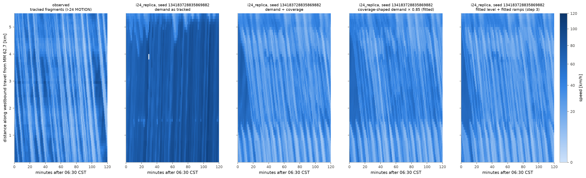
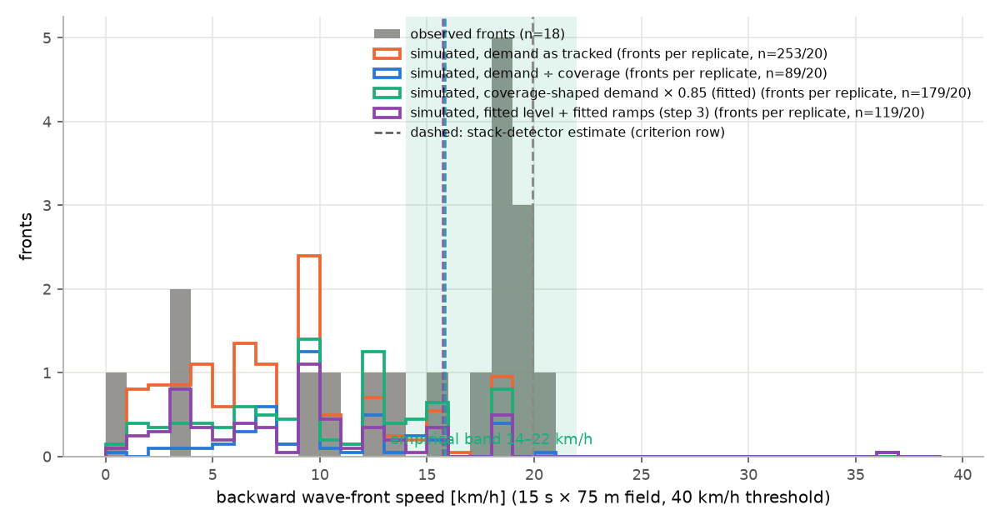
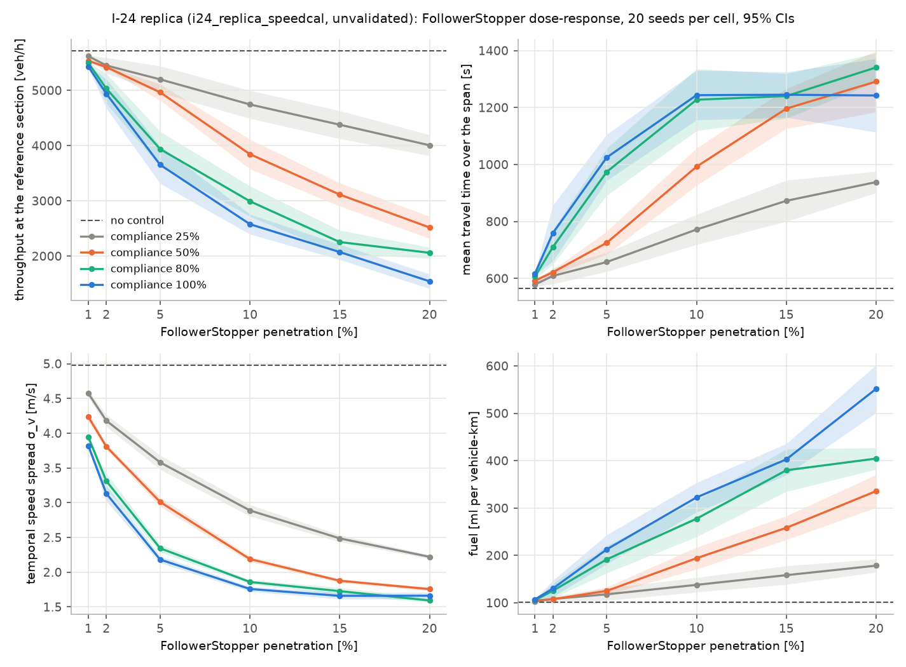

# FlowState: technical and commercial dossier

Version 2.1.0 line, as of 5 September 2026. Every number in this document
traces to a committed artifact, script or document in the repository
(abc000cool/flowstate-v2); the section on market and revenue is labelled as
estimate and hypothesis where it is one. The document is long by design: it
is the single place where the science, the evidence, the product and the
business case are written down together.

## 1. Executive summary

FlowState is a calibrated corridor digital twin for freeway traffic. It
reproduces the stop-and-go ("phantom") waves that form on congested
freeways with no visible cause, evaluates how a small share of controlled
vehicles or a variable speed limit changes those waves, and generates the
calibration and validation report that a transportation agency's reviewer
expects, in the format the FHWA Traffic Analysis Toolbox describes, from a
seeded, reproducible simulation.

What it is built on: Eclipse SUMO 1.27.1 with the Intelligent Driver Model as
the primary engine, controlled per vehicle through libsumo; a Numba-compiled
cell-transmission model as a screening tier that is never allowed to make
claims about wave formation; four pure-function controllers from the
literature (FollowerStopper, PI with saturation, Jam-Absorption Driving,
variable speed limits) plus a Gymnasium hook; a calibration package that fits
car-following populations to trajectory data and fundamental diagrams to
detector data; a validation package that scores a corridor against GEH,
speed RMSPE, wave speed, the ring benchmark, replicate counts and the
sensitivity grid; a FastAPI service with a job queue; a React dashboard; and
a static, embeddable replay of real engine output for public communication.

What has been shown, with confidence intervals from 20 seeds per cell:

- The ring benchmark of the literature reproduces: waves emerge without
  seeding within three minutes on a 230 m ring of 22 vehicles, and one
  controlled vehicle removes them (Sugiyama 2008; Stern 2018). This is a
  permanent, CI-gated test.
- On a synthetic 10 km corridor, 5% FollowerStopper penetration cuts the
  temporal speed spread by 61% and waves by 96% at no throughput cost, over
  540 runs.
- On a real corridor, the I-24 MOTION testbed in Nashville (30 November
  2022, 576,511 trajectory fragments, 42.8 million rows), the same
  controller at the same penetration costs 36% of throughput, raises travel
  time 82% and doubles fuel while cutting the speed spread 56%, over 500
  runs. The smoothing benefit is real; on a corridor near capacity it is
  paid for in capacity. This is the most important result of the project.
- The I-24 replica does not yet pass the FHWA-style criteria: after
  capacity and demand calibration it scores 4 PASS / 3 FAIL per demand arm
  (ring emergence, ring dampening, replicate count and the sensitivity grid
  pass; link flows, segment speeds and wave speed fail). The causes are
  identified and specific, and the document that records them is
  `docs/I24_VALIDATION.md`.

Where the business is: the calibration and reporting work that state
departments of transportation (DOTs), metropolitan planning organizations
(MPOs) and their consultancies do today by hand, at weeks of expert time per
corridor, with commercial simulators that cost five figures per seat. The
wedge is narrow and recurring: onboard a corridor, calibrate it to public
data, run the controller and speed-limit scenarios, and produce the report a
reviewer accepts. The honest state of that wedge is that the pipeline
exists end to end and is reproducible, and that the validation record, the
project's main asset, is not yet a pass on any real corridor.

## 2. The problem

### 2.1 Phantom waves

On a freeway carrying traffic near its capacity, a small disturbance, one
driver braking a little harder than the car behind expects, grows as it
passes backwards through the platoon. Each following driver reacts a little
late and a little too strongly. Within a few minutes the disturbance is a
stop-and-go wave: vehicles come to a halt, then accelerate, then halt again,
with no obstruction anywhere. The wave travels backwards against traffic at a
characteristic 14–22 km/h, a figure measured on freeways worldwide and
reproduced on the I-24 data used here (14.2 km/h with the standard detector,
16.0 with the stripe detector, on 30 November 2022).

The mechanism is string instability: for a car-following law a = f(gap,
speed, approach rate), a platoon is string-stable only if the partial
derivatives satisfy f_v²/2 − f_v·f_Δv − f_s ≥ 0 at equilibrium (Treiber and
Kesting 2013). Human driving, as calibrated from trajectory data, is
string-unstable in a band of densities that begins near capacity. The
Intelligent Driver Model with calibrated parameters is unstable in that band
too, which is precisely why it is the right model: the waves are emergent in
the simulation, not seeded.

### 2.2 Why it matters

Stop-and-go waves cost fuel, time and safety. Each vehicle that passes
through a wave decelerates and re-accelerates; fuel consumption in the
synthetic corridor's baseline is 65 ml per vehicle-kilometre against 62 with
the wave removed, and on the congested I-24 replica the baseline is 101 ml
per vehicle-kilometre. Travel time over the 5.5 km I-24 span in the replica's
baseline is 564 s against a free-flow time of about 220 s. The CIRCLES
program's 100-vehicle field test on I-24 in November 2022 reported energy
savings of the order of 15–20% near the controlled vehicles.

### 2.3 What can be done about it

Two families of intervention exist. Lagrangian control uses a small share of
vehicles, connected or automated, whose speed is commanded to absorb
disturbances instead of amplifying them; FollowerStopper and the PI
controller are the field-tested examples (Stern et al. 2018), and
Jam-Absorption Driving is the anticipatory variant (He, Liu and Liu 2016).
Eulerian control uses infrastructure: variable speed limits on gantries
that hold traffic below the unstable regime upstream of a bottleneck.
Agencies own the second family and are evaluating the first; both need a
simulation that reproduces the waves before any decision can rest on it.

## 3. What FlowState is

### 3.1 The product in one paragraph

A corridor is onboarded from OpenStreetMap or a built-in scenario. Its
driver population is calibrated from public trajectory data and its demand
from detector or trajectory counts. Twenty or more seeded replicates are
simulated with and without a controller or a speed-limit strategy. Standard
metrics, throughput, travel time, speed standard deviation, fuel, wave count
and speed, are computed with 95% confidence intervals. The corridor is
scored against acceptance criteria with an explicit pass or fail per row, and
a report with provenance, criteria table, figures and a limitations section
is generated automatically. Every number in that report traces to a seeded
run and a configuration hash.

### 3.2 Non-negotiables

The specification that governs the code base (CLAUDE.md) sets six rules
that shape everything below:

- No unvalidated claims: nothing may claim calibration or validation that
  has not been run, and every headline number must be reproducible from a
  seeded run.
- Emergent, not seeded: the headline phenomenon is emergent string
  instability; seeded experiments are permitted only when labelled.
- Standard metrics only in headline results.
- No consumer navigation-app advisory features; the product is simulation
  and decision support.
- Reproducibility: every run takes an explicit seed and records a
  configuration snapshot; CI reproduces golden results at the
  summary-statistic level.
- Honest uncertainty: stochastic results carry confidence intervals from at
  least 20 replicates.

### 3.3 Components

| Component | What it does | State |
|---|---|---|
| microsim | SUMO scenario builder and runner: ring, corridor, OpenStreetMap import with ramps and a measured boundary; per-vehicle control; streaming trajectory capture | Complete; 15 integration and unit test files |
| macrosim | Cell-transmission model with the Daganzo flux, CFL guard, conservation ledger, moving flux cap, VSL cap | Complete; screening tier only |
| controllers | FollowerStopper, PI with saturation, JAD with deferred commitment, VSL; Gymnasium environment | Complete; 116 tests |
| calibration | IDM population fit by differential evolution on gap error with holdout; triangular fundamental diagram with bootstrap CIs; demand fitter; coverage estimators; lane-change observables; multiplier fitter | Complete |
| validation | Metrics, wave detectors with a synthetic benchmark, criteria profiles with sources, ring benchmark, report generator with Markdown and PDF output | Complete |
| api | FastAPI, Pydantic v2, job queue (inline or Redis), SQLite store, single API key | Complete; load-tested at 10 concurrent sweep jobs |
| frontend | Vite and React dashboard: scenarios, runs, sweeps, reports, heatmaps | Complete |
| embed | Static replay of 45 real ring runs and the observed I-24 day, deployable to Render or Fly | Complete, verified in a browser |
| scripts | Data extraction, calibration, validation batteries, sweeps, figures, cloud bootstrap | Complete |

Test count at the time of writing: 830 in the fast battery, plus slow
performance tests run weekly.

## 4. How it works

### 4.1 Architecture

Two simulation tiers with strictly separated jobs share one controller
library and one validation stack. The microscopic tier is SUMO with IDM (or
the extended EIDM) and is the only tier that may make claims about wave
formation and dissipation. The macroscopic tier is a first-order
cell-transmission model, string-stable by construction and therefore unable
to form phantom jams; it is retained as a fast screening tier (a thousand
cells by ten thousand steps in under a second) and as the seed of a future
real-time state-estimation tier. Every macro output is labelled screening
and the report generator refuses to produce a validation report from macro
runs alone.

The service layer is deliberately thin: a FastAPI application with a
Redis-backed job queue (or an in-process queue for development), results as
Parquet plus SQLite metadata, a React dashboard, and Docker packaging. Each
deferred component has a named upgrade path (Postgres, Kafka ingestion, the
Kalman estimator, reinforcement-learning controllers).

### 4.2 The microscopic engine

IDM acceleration is a = a_max [1 − (v/v0)^4 − (s*/s)²] with the desired gap
s* = s0 + max(0, vT + vΔv/(2√(a_max b))). Parameters per vehicle are drawn
from a calibrated population (a truncated multivariate normal) with a seeded
generator. Controllers are pure functions from an observation to a command
speed, applied through SUMO's own safety checks so that no controller can
command a collision. Compliance is a per-vehicle Bernoulli draw made once
per run. Trajectories are streamed to Parquet in bounded batches; fuel comes
from SUMO's HBEFA4 emission classes.

Performance on a laptop, measured by tests: the ring at more than 50 times
real time; the 10 km corridor at more than 5 times real time; a 20-replicate
sweep in well under 15 minutes on four processes.

### 4.3 Scenarios

- ring_sugiyama: 230 m, 22 vehicles, the emergence benchmark, CI-gated.
- corridor_10km: the single-lane synthetic corridor used for controller
  batteries.
- us101_replica: the NGSIM US-101 site, 640 m, five lanes, with a measured
  downstream boundary.
- i24_replica (three demand arms plus a fitted-ramps arm): 3.4 of the 4
  instrumented miles of I-24 westbound in Nashville from real
  OpenStreetMap geometry, two on-ramps, two off-ramps, a measured downstream
  speed schedule, demand from the trajectory instrument's crossings.
- osm_generic: any bounding box or extract to a runnable scenario, tested.

### 4.4 Controllers

FollowerStopper (Stern et al. 2018) commands a speed from the gap and the
negative part of the approach rate across three parabolic region boundaries
(4.5, 5.25, 6.0 m at 1.5, 1.0, 0.5 m/s²), never above a reference speed
taken from the recent platoon mean. PI with saturation (Stern et al. 2018,
Eqs. 3–5) is implemented as published, after the project found and
corrected a simplification that had produced a 94% throughput collapse;
the superseded variant is retained only to reproduce that failure.
Jam-Absorption Driving follows the slow-in, hold, fast-out phases with an
intercept-timing derivation and a deferred-commitment rule that removes the
chatter a perfect oracle induces. The VSL controller posts a speed ladder
per 0.5–1.0 km gantry segment from downstream occupancy and speed, scaled by
compliance in the microscopic tier and capping the free-flow branch in the
macroscopic tier.

### 4.5 Calibration

Car-following: leader-follower episodes of at least 30 s with no lane
change are extracted from trajectory data; each episode is fitted by
differential evolution on gap RMSE (Kesting and Treiber 2008); a population
distribution is fitted to the per-episode parameters; a 70/30 holdout
reports the out-of-sample gap RMSE. On I-24, 17,652 episodes gave a holdout
RMSE of 5.29 m (6.44 m on 2,452 NGSIM episodes).

Fundamental diagram: a triangular diagram fitted by constrained least
squares to Edie flow and density with the congested branch by exact-LP
quantile regression and a 200-resample bootstrap; on I-24 the congested wave
speed is 16.1 km/h [15.7, 16.5].

The FHWA sequence, applied in September 2026 to I-24 and then to US-101 with
no retuning: capacity first (the population's mean headway scaled so a
straight road carries the field capacity), then demand (one level fitted on
the first hour of speeds with the second hour held out), then the ramp
levels, boundary discharge and gap acceptance jointly, again out of sample.

### 4.6 Validation

The criteria profile (`fhwa_default`) scores link flows by GEH < 5 on at
least 85% of link-hours (from the 2004 Traffic Analysis Toolbox Volume III,
Table 4; the 2019 update replaces fixed targets with data-driven envelopes
and states no GEH target, and the code says so), segment-speed RMSPE ≤ 15%,
backward wave speed within 14–22 km/h without seeding, ring emergence and
dampening reproduced over 20 seeds, at least 20 replicates, and a published
penetration × compliance grid with confidence intervals. State profiles
(Oregon DOT's VISSIM protocol, TxDOT's analysis procedures) are selectable
and each carries its source. The wave-speed row names the detector that
produced it; a synthetic benchmark of planted waves showed the standard 40
km/h threshold detector recovers nothing on congested backgrounds while a
slant-stack estimator recovers a planted 16 km/h within 0.1 km/h, so the
stack is the default.

### 4.7 Reproducibility

Every run records its configuration hash, seed, SUMO and package versions.
Golden regression tests hold engine-produced summary statistics for the
ring, a corridor smoke run and a macro corridor, compared at relative 1e-6
(SUMO is deterministic per version) and 1e-9 (numpy). Schema changes move
every configuration hash and are documented with each change; the physics
is checked to be unchanged when they do.

### 4.8 Onboarding time

Measured on the I-24 corridor: about 1.5 hours of machine time from the raw
export to a criteria table (extraction 309 s for 42.8 million rows, an IDM fit
on 17,652 episodes, the replica build, 20 seeds per arm), and roughly one
working day of engineering for the corridor-specific decisions (mainline
chain, ramp attachment, boundary zone). The reusable part of that
engineering is now code.

## 5. Why it is built this way

### 5.1 Why SUMO and IDM rather than a macroscopic model

FlowState v1 studied controlled dissipation of seeded shocks in a
first-order LWR model. That model is string-stable by construction: its
entropy solutions dissipate perturbations and cannot form stop-and-go waves,
so a controller "dissipating" a hand-seeded jam demonstrated the model's
built-in dissipation, not the controller's merit. Version 2 moved the
phenomenon into a model family where it is emergent, the one used by the
CIRCLES program and the Stern lineage, so results are comparable to the
canonical literature. SUMO adds per-vehicle control, built-in emissions,
OpenStreetMap import and industry recognition, and installs from PyPI.

### 5.2 Why hand-designed controllers first

Interpretable baselines from the field literature are what an agency can
evaluate. Reinforcement learning is exposed through a Gymnasium hook and
deferred until a corridor is validated; a learned policy on an unvalidated
replica would be a result about the replica.

### 5.3 Why publish failures

The validation record is the project's asset, and a record that only
reported passes would be worth nothing to a reviewer. Every criteria table
in this document shows its failures with a cause. This is also the sales
argument: nobody else in this space shows their failures, and the buyers
who matter notice.

## 6. Evidence

### 6.1 The ring benchmark

The CI-gated test runs the 230 m ring with 22 vehicles for 600 simulated
seconds. Emergence: the across-vehicle speed standard deviation in the last
300 s exceeds 1.5 m/s, at least one vehicle reaches zero, and the jam drifts
backwards at −25 to −5 km/h. Dampening: with one FollowerStopper vehicle,
the spread falls to below 0.75 of the baseline and the minimum speed rises.
In the I-24 battery of September 2026 both checks pass on 20 of 20 seeds.
The embed's data pack extends this to 45 runs across 18, 22 and 26 vehicles,
zero to two controlled vehicles, and switch-on from the start or after five
minutes; in the 22-vehicle case with switch-on at five minutes the per-minute
speed spread goes from 2.42 m/s to 0.00 within two minutes of activation.

### 6.2 The synthetic corridor battery (540 runs)

On corridor_10km with the EIDM fleet, 27 cells of penetration {1, 2, 5, 10,
15, 20}% × compliance {25, 50, 80, 100}% plus the baseline, 20 common-random-
number seeds each. At 100% compliance the paired reduction in temporal speed
spread climbs from 24.5% at 1% penetration to 76.4% at 20%, with diminishing
returns; waves fall from 3.85 per run to 0.15 at 5% and to zero at 10–20%.
Throughput does not change within its confidence interval. The controller
comparison at 5% / 100%: FollowerStopper and JAD with a realistic 30 s
oracle are statistically tied (σ_v 1.31 and 1.33 m/s against 3.39 baseline,
fuel −5%), PI with saturation trails (−29.7% σ_v), and the superseded PI
variant collapses throughput by 94% and is kept only as a cautionary result.

### 6.3 US-101

The NGSIM US-101 replica (640 m, five lanes, 2,452 episodes) fails the
physical criteria: with the measured boundary, GEH passes on 55.6% of bins,
speed RMSPE is 36.6%, and the backward wave speed reads 5.8 km/h. The
wave-speed failure was diagnosed as a site and operating-density artifact:
on a 1.5 km ring the same calibrated fleet produces in-band waves (14.6 km/h
at 60 veh/km, 17.1 km/h and 98% in band at 80 veh/km with the relative
detector), and the fitted fundamental diagram's congested wave speed is
14.6 km/h, two independent estimates agreeing. The same two calibration
steps applied to US-101 with no retuning in September 2026 improved speed
RMSPE to 27.9% but overshoot flows (GEH 22%) because the demand level stands
in for a merge the site lacks; wave speed is unchanged.

### 6.4 I-24 MOTION: the flagship

The data: the INCEPTION v1.x release for 30 November 2022, westbound, a 19.5
GB JSON export parsed as a stream and never extracted, 576,511 fragments to
42.8 million rows at 5 Hz in 309 s. The instrument tracks about 0.5–0.65 of
vehicle-time at the peak, so counts are lower bounds while speeds are
robust; demand is therefore run in labelled arms.

The replica: 3.4 of the 4 instrumented miles from real OpenStreetMap
geometry, two on-ramps and two off-ramps with auxiliary lanes, a measured
downstream boundary, a fleet of 17,652-episode calibration. Two SUMO
lane-change defaults created bottlenecks the data does not have and were
calibrated on independent observables (a diverge stall and a keep-right
obligation US freeways do not have).

The first battery (September 3): 1 PASS / 5 FAIL in both arms. The
coverage-corrected arm reproduces the recording's stop-and-go pattern
(RMSPE 36.8% against 183% for the uncorrected arm) but inserts only 82–84%
of its demand and its fronts run at 8.7 km/h.

The diagnosis: the population fitted on congested episodes saturates at
about 1,650 veh/h per lane on a straight road, below the 1,775 veh/h per lane
the instrument tracked at the same site (a lower bound). Insertion mechanics
were shown not to matter (spreading insertion frees the buffer and changes
nothing downstream). Capacity calibration per the FHWA procedure scaled the
mean headway from 1.51 to 1.32 s at zero cost in gap error (5.31 → 5.29 m on
1,500 episodes). A demand level fitted on the first hour's speeds with the
second hour held out gave 0.85 of the coverage-corrected profile; a
data-only coverage estimator later agreed with that factor independently.

The rerun (September 4–5, twenty seeds per arm, ring rows evaluated inside
the battery, sensitivity row fed from the flagship sweep):

| Criterion | Tracked demand | Coverage-corrected | Fitted level | Threshold |
|---|---|---|---|---|
| Link flows, GEH < 5 on ≥ 85% of link-hours | 24.3% FAIL | 11.8% FAIL | 15.3% FAIL | ≥ 85% |
| Segment-speed RMSPE ≤ 15% | 187.8% FAIL | 33.7% FAIL | 36.0% FAIL | ≤ 15% |
| Backward wave speed, standard detector | 7.9 km/h FAIL | 10.4 km/h FAIL | 9.9 km/h FAIL | 14–22 |
| Backward wave speed, stripe detector (not the criterion) | 7.4 | 14.2 | 14.4 | observed 16.0 |
| Ring emergence, 20 seeds | PASS | PASS | PASS | every seed |
| Ring dampening, 20 seeds | PASS | PASS | PASS | every seed |
| Replicates ≥ 20 | PASS | PASS | PASS | ≥ 20 |
| Sensitivity grid with CIs | PASS | PASS | PASS | 24 cells |

Demand realised: 100%, 81%, 95.5%. Throughput 4,024, 5,576, 5,710 veh/h.
Mean travel time 248, 601, 564 s.

The residual is spatial: from 2.2 km downstream the replica is within a few
km/h of the recording; the first kilometre, the Old Hickory merge, runs a
third too slow and the next kilometre a third too fast. Closing that on-ramp
free-flows the entire corridor, so it is the replica's only bottleneck;
the ramp's level is not the overshoot; cutting mainline cooperation
gridlocks the merge; doubling gap acceptance clears it and under-congests
the middle. The joint fit moved a quarter of the ramp demand from Old
Hickory to Hickory Hollow and improved the held-out hour from 42.6% to
35.6%; the four-arm battery scoring that arm is the last computation in
flight at the time of writing.

### 6.5 The flagship sweep (500 runs)

On the fitted I-24 arm, FollowerStopper at its literature settings, 20 seeds
per cell:

| Penetration | Compliance | Throughput | Change | Travel time | Change | σ_v | Change | Fuel change |
|---|---|---|---|---|---|---|---|---|
| none | | 5,710 veh/h | | 564 s | | 4.98 m/s | | |
| 1% | 100% | 5,428 | −5% | 617 s | +9% | 3.82 | −23% | +6% |
| 5% | 100% | 3,652 | −36% | 1,025 s | +82% | 2.18 | −56% | +111% |
| 10% | 100% | 2,577 | −55% | 1,243 s | +120% | 1.76 | −65% | +222% |
| 20% | 100% | 1,544 | −73% | 1,242 s | +120% | 1.66 | −67% | +451% |
| 5% | 50% | 4,964 | −13% | 725 s | +29% | 3.01 | −40% | +24% |
| 20% | 25% | 4,006 | −30% | 938 s | +66% | 2.22 | −55% | +78% |

Every change is a paired difference against the same-seed baseline whose
95% interval excludes zero. The mechanism: a controlled vehicle holding a
larger-than-equilibrium gap on a corridor whose demand sits at the fleet's
capacity is a moving capacity drop, and drivers behind it queue and overtake
(lane changes rise from 1.25 to 2.32 per vehicle-km at 20%). The synthetic
corridor's no-cost result does not survive a real corridor near capacity.
The magnitudes will move when the replica passes its criteria; the sign at
these penetrations will not, and the next controller must be capacity-aware.

### 6.6 What the validation record says, in one paragraph

The engine reproduces the physics of emergent waves and their dissipation
on the benchmark, and the calibration procedure moves every criterion on a
real corridor in the right direction. No real corridor passes the flow,
speed and wave-speed rows yet. The remaining blockers are specific: the
demand on I-24 is an estimate from a half-blind instrument (radar detector
counts for a day with trajectories would replace it), and the replica's
congestion is generated at one merge where the real road congests further
downstream too. A second corridor validated by the same procedure with no
retuning is what would turn the method claim into evidence; US-101 was the
first attempt and behaves as the method predicts, which is not the same as
passing.

### 6.7 The calibration steps on I-24, in numbers

Step 1, capacity (straight four-lane road at a saturating 2,400 veh/h per
lane, two seeds per point, throughput at 3 km):

| Headway scale | Mean T [s] | Capacity [veh/h per lane] |
|---|---|---|
| 1.00 | 1.511 | 1,631 |
| 0.95 | 1.436 | 1,690 |
| 0.90 | 1.360 | 1,754 |
| 0.85 | 1.285 | 1,796 |
| 0.80 | 1.209 | 1,833 |
| 0.75 | 1.133 | 1,948 |

Interpolating to the tracked target of 1,775 veh/h per lane gives a scale of
0.875 and T = 1.322 s; the population-mean gap RMSE over 1,500 sampled
episodes moves from 5.313 m to 5.294 m.

Step 2, the demand level on the coverage-shaped profile (first hour fitted,
second hour held out, one seed per point):

| Level | Inserted | RMSPE fitted hour | RMSPE held-out hour |
|---|---|---|---|
| 0.60 | 1.000 | 1.156 | 2.193 |
| 0.70 | 1.000 | 0.742 | 1.718 |
| 0.80 | 0.994 | 0.401 | 0.460 |
| 0.85 | 0.945 | 0.320 | 0.396 |
| 0.90 | 0.895 | 0.337 | 0.382 |
| 1.00 | 0.807 | 0.361 | 0.378 |
| 1.10 | 0.734 | 0.373 | 0.389 |

Step 3, the joint fit of ramp levels, boundary discharge and gap acceptance
(43 evaluations, four rounds, one seed per point):

| Point | Old Hickory ramp | Hickory Hollow ramp | HH exit | Bell exit | Boundary | Gap acceptance | Fitted hour | Held-out hour | Inserted |
|---|---|---|---|---|---|---|---|---|---|
| As is | 1.00 | 1.00 | 1.00 | 1.00 | 1.00 | 1.00 | 0.356 | 0.426 | 0.942 |
| Best | 0.75 | 1.25 | 1.125 | 1.00 | 1.00 | 1.00 | 0.332 | 0.356 | 0.960 |

### 6.8 The merge diagnostics

Segment mean speeds over the study period [km/h], one seed, on the fitted
arm; the observed row is the recording:

| Variant | Inserted | Ramp merged | RMSPE | 0.0 km | 0.5 | 1.1 | 1.6 | 2.2 | 2.7 | 3.3 | 3.8 | 4.4 | 4.9 |
|---|---|---|---|---|---|---|---|---|---|---|---|---|---|
| Observed | | | | 36.3 | 32.5 | 29.8 | 31.3 | 37.6 | 36.9 | 37.7 | 29.0 | 30.4 | 33.7 |
| As is | 0.942 | 1,833 / 2,241 | 0.393 | 20.9 | 21.1 | 29.4 | 35.8 | 34.6 | 34.0 | 34.1 | 31.8 | 29.9 | 33.3 |
| Ramp at tracked level | 0.993 | 1,414 / 1,414 | 0.405 | 24.6 | 24.6 | 30.8 | 39.9 | 37.9 | 36.6 | 35.6 | 30.4 | 27.5 | 32.1 |
| Ramp closed | 0.996 | 0 / 0 | 1.232 | 65.1 | 62.5 | 56.1 | 50.9 | 48.2 | 45.6 | 44.4 | 42.9 | 37.8 | 35.6 |
| Cooperation halved | 0.564 | 772 / 2,241 | 0.726 | 9.3 | 8.5 | 9.5 | 13.8 | 11.3 | 9.4 | 9.0 | 10.8 | 8.6 | 24.1 |
| Gap acceptance doubled | 0.991 | 2,215 / 2,241 | 0.491 | 22.5 | 22.9 | 33.9 | 45.8 | 43.8 | 40.7 | 39.6 | 35.0 | 31.0 | 29.4 |

### 6.9 Tracking coverage, three ways

Per 15-minute window, lanes pooled: the equilibrium-based factor the
replica builder used, the maximum-likelihood spacing mixture, and the
section-scaled mixture that is now recommended.

| CST | Equilibrium | Gap mixture | Section mixture (recommended) |
|---|---|---|---|
| 06:30 | 0.605 | 0.638 | 0.656 |
| 07:00 | 0.565 | 0.615 | 0.648 |
| 07:30 | 0.504 | 0.578 | 0.627 |
| 08:00 | 0.481 | 0.548 | 0.559 |
| 08:15 | 0.484 | 0.552 | 0.584 |

The recommended coverage is 8–25% above the equilibrium factor, which lowers
the peak corrected inflow from 1,935 to 1,786 veh/h per lane, the same
correction the speed fit found on its own; both estimators are biased low
under the correlated tracking losses the data shows, so the true coverage
may be higher still.

### 6.10 Controllers compared on the synthetic corridor

At 5% penetration and 100% compliance, 20 common-random-number seeds
(`docs/CONTROLLER_COMPARISON.md`):

| Controller | σ_v temporal [m/s] | Waves per run | Throughput [veh/h] | Fuel [ml/veh-km] |
|---|---|---|---|---|
| Baseline, no control | 3.39 [2.83, 3.94] | 3.85 [2.59, 5.11] | 1,247 [1,227, 1,266] | 65.4 |
| FollowerStopper | 1.31 [1.24, 1.38] | 0.15 [−0.02, 0.32] | 1,258 [1,247, 1,270] | 62.2 |
| JAD, 30 s + 20% noise oracle | 1.33 [1.24, 1.42] | 0.35 | 1,259 | 62.2 |
| JAD, perfect oracle, no deferral | 1.78 [1.30, 2.26] | 2.10 | 1,162 | 67.2 |
| JAD, perfect oracle, 30 s deferral | 1.33 [1.23, 1.44] | | | |
| PI with saturation (Stern Eqs. 3–5) | 2.38 [2.12, 2.64] | 2.25 | 1,238 | 63.6 |
| PI mean-fraction (superseded) | 2.14 [1.96, 2.33] | 2.25 | 79 [29, 130] | 241 |

FollowerStopper and JAD with a realistic oracle are statistically tied; the
deferral rule gives JAD with a perfect sensor the same result as with a noisy
one, which removed a bimodality that a too-good sensor had caused; PI with
saturation, implemented as published, trails; the superseded PI variant is a
cautionary result.

### 6.11 US-101 before and after the procedure

| Criterion | M3 with boundary (2026-08) | Calibrated (2026-09) |
|---|---|---|
| GEH < 5 on ≥ 85% of bins | 55.6% FAIL | 22.2% FAIL |
| Speed RMSPE ≤ 15% | 36.6% FAIL | 27.9% FAIL |
| Wave speed 14–22 km/h | 5.8 km/h FAIL (stripe 10.7) | 5.8 km/h FAIL (stripe 12.9) |
| Replicates ≥ 20 | PASS | PASS |

Capacity calibration on US-101 needed a headway scale of 0.794 (T 1.285 →
1.020 s) at a 6.8% gap-RMSE cost, unlike I-24's zero; the fitted demand level
of 1.25 stands in for a merge the 640 m site lacks and overshoots flows.
The procedure is a method, and it says the same thing on both corridors:
speeds move toward the recording, flows are limited by what the site does
not contain, and the wave-speed row is limited by the site's length.

## 7. The market

Labelled as estimate and hypothesis: none of the figures in this section
come from an artifact in the repository; they are the reasoning the business
case rests on and the interview kit in `docs/INTERVIEWS.md` exists to test
them.

### 7.1 Who pays for traffic simulation today

State DOTs, MPOs and the consultancies they hire build microsimulation
models for corridor studies, interchange designs, managed-lane and
variable-speed-limit evaluations, and connected-vehicle pilots. The tools
are PTV Vissim, Aimsun and TransModeler, commercial licences that commonly
run five figures per seat per year, or SUMO, free but do-it-yourself.
Calibration to FHWA or state criteria is slow, manual, expert work measured
in weeks per corridor, and a rejected calibration report is a common and
expensive event.

Order-of-magnitude anchors, from public sources rather than the repository:
the United States has 52 state DOTs and roughly 400 MPOs; the largest
transportation consultancies (AECOM, WSP, Jacobs, HNTB, Kimley-Horn, Stantec
and dozens of regional firms) each run many corridor studies a year; the
global traffic-simulation software market is usually estimated in the low
hundreds of millions of dollars a year, and the broader intelligent-
transportation-systems market in the tens of billions. FlowState's wedge is
a slice of the consulting labour, not of the software licences.

### 7.2 The wedge

A corridor-scoped, web-based tool that onboards any corridor from
OpenStreetMap, semi-automates calibration to public data, runs smoothing and
VSL scenario analysis, and generates the calibration and validation report
reviewers demand. It does not compete with Vissim on breadth. It competes
with two weeks of a $150–250 per hour engineer's time on one narrow,
recurring task, and it has something the incumbents do not: a published,
reproducible validation record that includes its failures.

### 7.3 Who buys, in order

- Small and mid-size traffic-engineering consultancies: they do the
  calibration weeks the wedge replaces; procurement is fast; the pain is
  acute.
- University labs in traffic flow and connected-vehicle control (Vanderbilt
  and the I-24 MOTION team, Berkeley and CIRCLES, TTI, UT-Austin): credibility
  and the academic route; free or near-free.
- MPO and DOT pilots: slow procurement, larger contracts, and the only path
  to the data that makes validation possible (radar detector counts, probe
  speeds).
- Automated-vehicle and fleet operators evaluating smoothing controllers:
  a later segment; the flagship sweep is exactly the kind of result they
  would need before a deployment decision.

Not consumers, not navigation-app users; the specification forbids advisory
push features.

### 7.4 Competitive landscape (estimate)

| Offering | What it is | Strength | Where FlowState differs |
|---|---|---|---|
| PTV Vissim | Commercial microsimulation, the industry default | Breadth, acceptance, ecosystem | Calibration and reporting are manual; licences are five figures per seat |
| Aimsun Next | Commercial micro/meso/macro with real-time options | Multi-resolution, real-time products | Same manual calibration burden |
| TransModeler | Commercial, GIS-integrated | Planning-model integration | Same |
| SUMO (Eclipse) | Open-source engine FlowState builds on | Free, per-vehicle control, OSM import | No calibration pipeline, no report, no validation record |
| Flow (Berkeley) | RL research framework on SUMO, unmaintained | Research lineage | Not a product; no validation stack |
| Consultancies' in-house scripts | Ad-hoc calibration workflows | Fit to one firm | Not reproducible, not shared, not published |

FlowState's position is the calibration-and-validation layer on top of the
free engine, with the report as the deliverable and the published record as
the credential. It does not attempt the incumbents' breadth (signals,
transit, pedestrians, multimodal networks).

### 7.5 Market timing

Three forces make the next few years the window: connected and automated
vehicles are entering fleets at penetrations where this battery's results
matter (1–5%); the CIRCLES field test on this very corridor put smoothing
control on agencies' agendas; and FHWA's 2019 update of the calibration
guidance moved toward data-driven acceptance envelopes, which favours tools
that carry their evidence with them.

## 8. Where the revenue is

Hypotheses to test in interviews, not assumptions:

- Per-corridor-study pricing for consultancies: the onboarding, calibration
  and report for one corridor and one data set, in the low hundreds to low
  thousands of dollars per study depending on data work, against the
  several thousand dollars of engineer time it replaces.
- Annual site licences for labs and agencies: hosted workspace, compute and
  report generation, support.
- Pilot contracts with agencies: a corridor of theirs, their detector data,
  a validation report they can submit; priced as a study plus the data
  onboarding.
- Data onboarding as a service: writing the loader for a new detector or
  trajectory format is a day of work and recurs per agency.
- Training and review: teaching a consultancy's staff to run the pipeline
  and reviewing their reports.

### 8.1 Pricing scenarios (hypotheses)

| Segment | Offer | Price hypothesis | Unit economics |
|---|---|---|---|
| Consultancy, per study | Onboarding, calibration, criteria battery, report | $1,500–5,000 per corridor study | Compute per study is a few dollars on a cloud VM; the cost is data work and review |
| Consultancy, annual | Workspace for their engineers, unlimited studies, support | $10,000–30,000 per year | Replaces part of a licence seat and weeks of calibration labour per year |
| University lab | Site licence, hosted or on-premises | Free to $5,000 per year | Credibility and the research pipeline |
| Agency pilot | Their corridor, their data, a submittable report | $25,000–75,000 per pilot | Data onboarding dominates; the report is the deliverable |
| Data onboarding | A loader for a new detector or trajectory format | $2,000–5,000 per format | About a day of engineering |

A first-year plan that is internally consistent with the state of the
evidence: three to five consultancy studies, one agency pilot built around
the I-24 corridor and the radar counts, two university users, and the
preprint. That is tens of thousands of dollars of revenue, not hundreds, and
it is the right size for a validation record that does not yet contain a
pass.

### 8.2 What would move the revenue up a tier

A validated corridor, because it converts the product from a method into a
prediction tool an agency can act on; a capacity-aware controller with a
published dose-response, because it is the result automated-vehicle fleets
and agencies both want; and a hosted multi-tenant product, because it
converts studies into subscriptions.

Open-core is the intended model: the engines, controllers and validation
library stay open source (credibility, academic adoption, and the moat is
the validation evidence, which cannot be forked); the hosted workspace,
compute, report generation and support are paid. The technical moat is
thin, since SUMO is free; the defensible assets are the published validation
record, the calibration-automation pipeline, and relationships with testbeds
and agencies.

What the revenue is not, yet: a validated corridor. Until one passes, every
sale is a sale of the method and the honesty of its reporting, which is a
real thing to sell to a reviewer-facing consultancy but a weaker thing to
sell to an agency deciding on infrastructure.

## 9. Where to sell it

- Tennessee DOT and the I-24 MOTION team at Vanderbilt: the flagship
  corridor is theirs; the results in this document are the introduction, and
  the radar detector counts the project needs are theirs to share.
- Texas DOT and the North Central Texas Council of Governments: the
  specification names Texas as the second target; TxDOT's analysis
  procedures are already a selectable criteria profile and the demo gallery
  includes a Dallas corridor.
- Caltrans: PeMS detector data is public and the loader exists; a
  California corridor with measured counts is the DOT-style validation case
  that needs no request.
- Consultancies with microsimulation practices, approached through ITE
  section meetings, the TRB Annual Meeting and the ITS World Congress, with
  the auto-generated report as the demonstration.
- The CIRCLES consortium and university labs, through the preprint outlined
  in `docs/PAPER_OUTLINE.md` and the open-source release.
- Federal programs: FHWA's Traffic Analysis Toolbox lineage, USDOT SBIR and
  STTR solicitations on traffic management and connected vehicles, and state
  research programs.

Funding paths appropriate to the project's stage, from the business plan:
the competition cycle with the validation study, an arXiv preprint and
open-source release, micro-grants aimed at young builders once a validated
demo exists, and a university collaboration as the institutional on-ramp.
Venture funding is premature until a paying pilot exists.

## 10. How it could be implemented

### 10.1 Deployment modes

- On-premises: the Docker image runs the API, the worker and the dashboard
  on an agency's own machine; results stay inside the agency. Redis, SQLite
  and local volumes; no external dependency beyond SUMO wheels.
- Hosted, single tenant: the same image on a cloud VM per customer, with
  the API key as the deployment credential; this is how the flagship sweep
  ran (a 32-vCPU VM finished 500 runs in about seven hours).
- Hosted, multi-tenant: the named upgrade path (Postgres, per-user projects,
  real authentication, object storage for results) once more than one
  customer shares an instance.
- Library only: the Python packages installed by a consultancy's engineers
  who run the scripts themselves; the open-core baseline.
- Public communication: the embed, a static page with no backend, on the
  agency's or consultancy's website.

### 10.2 Integration paths

- Detector feeds: PeMS station data and generic CSV exports for the
  fundamental diagram and demand; radar detector data as it becomes
  available; the loaders normalise to one schema.
- Trajectory data: NGSIM, highD and I-24 MOTION loaders for car-following
  calibration; new formats are a day of loader work.
- Geometry: any OpenStreetMap extract or bounding box through the tested
  onboarding function, with corridor pruning, ramps and boundary.
- Decision support for variable speed limits: the VSL controller in both
  tiers, with compliance scaling, is the agency-facing product controller.
- Connected and automated vehicle evaluation: the four vehicle controllers
  and the Gymnasium hook for learned policies once a corridor is validated.
- Real-time state estimation: the macro tier plus a Kalman filter is the
  designed path to a live product, deferred until a detector feed contract
  exists.

### 10.3 Operating model for a study

A corridor study runs in a fixed sequence that the scripts already encode
for I-24: extract and inspect the data; fit the driver population and the
fundamental diagram; build the replica from geometry and counts; run the
criteria battery with at least 20 seeds per arm; diagnose failures with the
capacity, insertion, merge and detector experiments; apply the calibration
steps out of sample; rerun; publish the report with its failures and causes.
The measured time for the first corridor was about 1.5 hours of machine
time and one working day of engineering.

### 10.4 An implementation timeline (estimate)

| Phase | Work | Duration | Depends on |
|---|---|---|---|
| Now to validated corridor | Radar counts as demand, merge joint objective, battery rerun, second corridor with PeMS counts | 4–8 weeks of engineering plus compute | The radar counts and a PeMS account |
| Capacity-aware controller | A gap policy tied to the fundamental diagram or a floor on the commanded speed; the flagship sweep as baseline | 3–6 weeks | The fitted arm |
| Pilot readiness | Real authentication, per-user projects, Postgres, object storage, generated dashboard types, hosted deployment, versioned release | 3–5 weeks | Hosting and identity decisions |
| First pilot | An agency corridor with their data through the procedure, a submittable report | 6–10 weeks | A champion at the agency |
| Product | Multi-tenant hosting, billing, onboarding flow, documentation site | Ongoing | Paying users |

### 10.5 Operating a deployment safely

The cloud bootstrap in the repository builds a VM from a public image,
installs the engine, runs a sweep and shuts the machine down when it is
done; results come back as small summaries. A 32-vCPU machine costs about
$1.55 an hour on demand and finishes a 500-run battery in about seven hours.
The one operational failure of this cycle, a VM left idle for about forty
hours after its job finished, is the reason the shutdown is now automatic.

## 11. Roadmap

Done in the current cycle: the I-24 flagship end to end (data, calibration,
replica, validation, capacity and demand calibration, joint ramp fit,
flagship sweep), the engine gaps from a ten-lens audit (VSL in both tiers,
report contrasts and PDF, golden regressions, tier-sanity test, OSM emitter,
Gym hook, demand fitter, GEH aggregation, criteria profiles, ring rows),
the second-round refinements (wave detector benchmark, coverage estimator,
lane-change calibration target, joint fitter, US-101 through the procedure),
the embed, the website brief and the cloud bootstrap.

Next, in order of leverage:

- Radar detector counts for a day with trajectories (owner action): replaces
  every demand estimate and lets the flow criterion be adjudicated.
- A capacity-aware smoothing controller: the flagship sweep's baseline is
  its benchmark.
- The Old Hickory merge: a joint objective on speeds and lane shares, since
  the two disagree on gap acceptance.
- A second corridor with measured counts (PeMS) through the same procedure.
- Production hardening for a hosted product: authentication, per-user
  projects, Postgres, object storage, generated dashboard types from the
  OpenAPI schema, and a hosted deployment; a versioned release.

## 12. Risks and limitations

- The corridor is not validated. Absolute predictions for any roadway are
  not supportable today; relative comparisons on the same corridor with the
  same seeds are.
- The demand on the flagship is an estimate from an instrument that misses a
  third to a half of vehicles; two independent estimators now agree on the
  correction but neither is a measurement.
- The wave-speed criterion depends on the detector; the project made the
  choice explicit and benchmarked it, but earlier artifacts carry the
  standard detector's readings.
- Model form: IDM's equilibrium flow peaks well below the desired speed,
  which is why capacity calibration was needed; other car-following models
  would need the same procedure.
- One corridor, one day, one instrument; the method claim needs a second
  site.
- Commercial pull is untested: the interview kit exists and no interviews
  have been run.
- Operations: a cloud VM idled for about forty hours during this cycle
  because the launching session lost connectivity; the bootstrap now stops
  the machine itself when its job ends.

### 12.1 Questions a reviewer asks, and the answers

- Does it reproduce phantom jams without seeding them? Yes, on the ring
  benchmark in CI on every commit and on both corridor replicas, which show
  backward-moving stop-and-go stripes from demand noise alone.
- Is the calibration real? The driver population is fitted to 17,652
  car-following episodes with a 30% holdout; the fundamental diagram carries
  bootstrap intervals; the capacity and demand steps are fitted out of
  sample with the second hour held out.
- Does any corridor pass? No. The best arm scores 4 of 7 rows; the physical
  rows fail with a stated cause each.
- Why not just use the standard detector for wave speed? Because on
  congested backgrounds it finds nothing; the synthetic benchmark in the
  tests shows it, and the criterion now names its detector.
- Are the controller results real? They are results about the model with
  paired confidence intervals over 20 seeds; on the synthetic corridor they
  match the field literature's direction; on the real corridor they show a
  throughput cost the literature's ring experiments could not.
- Can it run on any city? Onboarding from OpenStreetMap works and is tested;
  validation needs that corridor's counts and speeds, and the honest product
  behaviour is to refuse a validation report without them.
- What is the biggest risk? That the demand estimate on the flagship is
  wrong in a way only measured counts can reveal.

## 13. Appendix A: criteria definitions

- GEH = sqrt(2(m − c)² / (m + c)) on hourly volumes, simulated m against
  observed c, per link-hour; pass when at least 85% of link-hours are below 5.
- RMSPE on segment mean speeds per five-minute window and 549 m segment,
  replicate mean against observed; pass at or below 15%.
- Backward wave speed: fronts of connected jam regions in the space-time
  speed field, sign convention backward, the mean of replicate means; pass
  within 14–22 km/h; the detector recipe is named on the row.
- Ring emergence and dampening: the CI gate's checks evaluated over seeds;
  pass when every seed passes.
- Replicates: at least 20 seeds per arm.
- Sensitivity grid: penetration {1, 2, 5, 10, 15, 20}% × compliance {25, 50,
  80, 100}% published with confidence intervals.

## 14. Appendix B: calibrated parameters

| Population | v0 [m/s] | T [s] | a_max [m/s²] | b [m/s²] | s0 [m] | Holdout gap RMSE |
|---|---|---|---|---|---|---|
| NGSIM US-101 (2,452 episodes) | 32.1 | 1.285 | | | 2.02 | 6.44 m |
| I-24 MOTION (17,652 episodes) | 32.4 | 1.511 | 1.055 | 1.703 | 2.533 | 5.29 m |
| I-24, capacity-calibrated | 32.4 | 1.322 | 1.055 | 1.703 | 2.533 | 5.29 m (sampled 5.31 → 5.29) |
| US-101, capacity-calibrated | 32.1 | 1.020 | | | 2.02 | 6.53 → 6.98 m (sampled) |

Fundamental diagrams: US-101 congested wave speed 14.6 km/h [10.6, 19.0];
I-24 16.1 km/h [15.7, 16.5], capacity lower bound 1,775 veh/h per lane, jam
density lower bound 137 veh/km per lane.

## 15. Appendix C: artifact index

- Calibration: idm_us101.json, idm_i24.json, idm_i24_capacity.json,
  idm_us101_capacity.json, fd_us101.json, fd_i24.json, demand_i24.json,
  demand_scale_i24.json, demand_scale_i24_corrected.json,
  demand_scale_us101.json, i24_coverage.json, i24_lanechange_observed.json,
  i24_lanechange_fit.json, i24_boundary_ramps_fit.json.
- Validation: i24_validation_observed.json, i24_validation_tracked.json,
  i24_validation_corrected.json, i24_validation_speedcal.json,
  i24_validation_waves_relative.json, us101_validation_calibrated.json,
  wave_speed_sitelength.json, wave_speed_sitelength_i24.json.
- Experiments: i24_capacity_experiment.json, i24_merge_experiment.json,
  i24_merge_experiment_params.json, m3_sweep_summary.json,
  i24_sweep_summary.json, us101_penetration_summary.json,
  jad_oracle_summary.json, jad_deferral_summary.json, pi_retune_summary.json,
  m5_load_test.json.
- Documents: docs/I24_DATA.md, I24_VALIDATION.md, I24_CAPACITY.md,
  I24_SWEEP.md, US101_CALIBRATED.md, M3_RESULTS.md, M3_US101_VALIDATION.md,
  WAVE_SPEED_DIAGNOSIS.md, CONTROLLER_COMPARISON.md, JAD_ORACLE_RESULTS.md,
  JAD_DEFERRAL_RESULTS.md, PI_CONTROLLER_FIX.md, LESSONS.md, QA.md,
  INTERVIEWS.md, ONBOARDING_TIME.md, WEBSITE_BRIEF.md, ROADMAP.md,
  AUDIT_2026-09-03.md, and the build specification CLAUDE.md.

## 16. Appendix D: glossary

- String instability: the growth of a disturbance as it passes backwards
  through a platoon of vehicles.
- Penetration: the share of vehicles under control.
- Compliance: the probability that a controlled vehicle follows its command.
- GEH: the Geoffrey E. Havers statistic comparing simulated and observed
  hourly volumes.
- RMSPE: root-mean-square percentage error.
- σ_v: the standard deviation of vehicle speeds, temporal (per vehicle over
  time) or spatial (across vehicles per instant).
- Edie flow and density: generalised definitions from vehicle distance and
  time in a space-time bin.
- Coverage: the fraction of vehicle-time a trajectory instrument tracks.
- Common random numbers: the same seeds across cells so that differences are
  paired.

## 17. References

Lighthill and Whitham (1955); Richards (1956); Daganzo (1994, 1995);
Treiber, Hennecke and Helbing (2000); Treiber and Kesting (2013); Sugiyama
et al. (2008), New Journal of Physics 10:033001; Stern et al. (2018),
Transportation Research Part C 89:205–221; He, Liu and Liu (2016),
Transportation Research Part B; Delle Monache and Goatin (2014); Kesting and
Treiber (2008); FHWA Traffic Analysis Toolbox Volume III (2004,
FHWA-HRT-04-040; 2019 update, FHWA-HOP-18-036); Gloudemans et al. (2023),
Transportation Research Part C 155:104311 (I-24 MOTION); CIRCLES
MegaVanderTest (I-24, November 2022).
