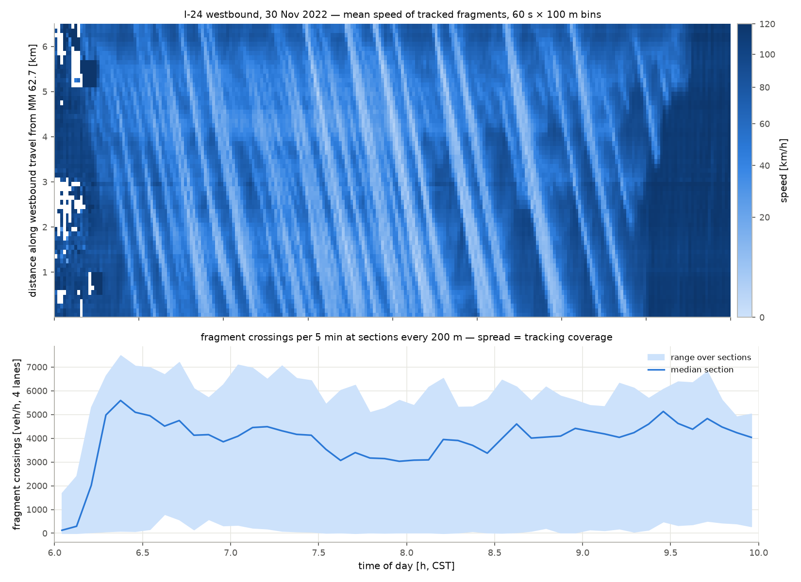

# I-24 MOTION: what the data is, and what it can and cannot support

**Date:** 2026-09-02 · **Data:** I-24 MOTION INCEPTION v1.x, run
`6386d89efb3ff533c12df167__post10` (30 Nov 2022, 06:00–10:00 CST, MM 58.7–62.7
near Nashville, TN) · **Artifacts:** `artifacts/i24_wb_overview.json`,
`artifacts/idm_i24.json`, `artifacts/demand_i24.json`,
`artifacts/i24_replica_inputs.json` (`artifacts/fd_i24.json` is produced by
`scripts/fit_fd_i24.py`; its 200-resample exact-LP bootstrap costs ~3 h with
two workers and is committed separately when it finishes — no FD number from
I-24 is quoted anywhere until then) · **Scripts (run order):**
`scripts/i24_extract.py` → `scripts/i24_overview.py` →
`scripts/i24_extract_episodes.py` → `scripts/fit_idm_i24.py`,
`scripts/fit_fd_i24.py` → `scripts/i24_geometry.py` → `scripts/i24_build_replica.py`.

This is the ROADMAP §1.1–1.3 record. Every number traces to one of the
artifacts above or to the conversion's `meta.json`
(`data/i24motion/processed/i24_wb_20221130/`, gitignored; sha256 of the source
zip `aa97dd93d2bf250e…` is copied into every artifact as `data_hash`). Data use
is governed by the I-24 MOTION agreement; published use must cite Gloudemans
et al. (2023), *Transp. Res. C* 155:104311.

## 1. The file, and how it is read

The export is one 5.8 GB zip holding a single 19.5 GB JSON array of 816,694
MongoDB documents. It is never extracted: `calibration.loaders.i24motion`
streams the zip, decodes one document at a time with a sliding buffer and
`JSONDecoder.raw_decode`, keeps one carriageway, and writes 5 Hz Parquet in row
groups. Westbound (the AM-peak direction): 576,511 documents, 212,989,268 native
25 Hz samples → 42,764,894 rows at 5 Hz, 993 MB, 309 s wall.

The loader was written before the file existed and had to be reconciled with
the real schema and the official v1.x data documentation:

| Field | Documentation says | Loader convention |
|---|---|---|
| `_id` | BSON ObjectId, exported as `{"$oid": …}` | string id |
| `x_position` | feet along the roadway spline, **back-center** of the vehicle; MM 60 ≡ 316,800 ft, other markers ≈ MM × 5280 | `x` = **front bumper** on a travel-oriented axis, 0 at MM 62.7 for westbound (so `extract_episodes`' "gap = spacing − leader length" is bumper-to-bumper) |
| `y_position` | feet, lateral, positive westbound; lanes for direction −1: 12–24 ft lane 1 (HOV) … 48–60 ft lane 4 | `lane = floor(y/12)`: 1–4 mainline, 0 median shoulder, ≥ 5 auxiliary/ramp lanes |
| `timestamp` | Unix s, 25 Hz | snapped to the shared 0.04 s grid; `t` = seconds after 06:00:00 CST (1669809600) |
| speed | not published | gradient of the smoothed positions at 25 Hz, then decimated |
| `coarse_vehicle_class` | 0 sedan, 1 midsize, 2 van, 3 pickup, 4 semi, 5 truck | kept; westbound: 207,207 / 196,703 / 16,859 / 95,358 / 53,697 / 6,687 |

## 2. Every document is a fragment

The documentation calls them "trajectory fragments" and the VT-tools paper
(Ji et al. 2024, arXiv:2311.10888) states the v1 trajectories are "not
currently suitable for some types of analyses such as long-term vehicle"
following. Measured on the westbound day:

| Quantity | Value |
|---|---|
| Fragment duration, median / p90 / max | 9.9 s / 31.4 s / 1270 s |
| Fragment span along the road, median / p90 | 117 m / 450 m |
| Duration histogram (0–5, 5–10, 10–20, 20–30, 30–60, 60–120, 120–300, ≥ 300 s) | 137,211 · 151,513 · 161,446 · 63,557 · 49,293 · 11,915 · 1,567 · 9 |
| Fragments lasting ≥ 30 s | 62,784 (10.9%) |

A median fragment covers about one camera field of view. Nothing here stitches
fragments; every downstream use works on them as delivered.

## 3. The day

The upper panel is the mean tracked speed in 60 s × 100 m bins over the
4-mile westbound testbed. Congestion enters from the downstream (Bell Road)
end at about 06:20 and stop-and-go stripes propagate upstream across the whole
instrument until about 09:30 — dozens of them, at a visually consistent
backward slope. Per 15 min (`stats_15min` in the overview artifact):

| Window (CST) | Fragments | Mean bin speed [km/h] | Bins < 40 km/h |
|---|---|---|---|
| 06:00–06:15 | 10,176 | 120.1 | 0.6% |
| 06:30–06:45 | 43,709 | 47.1 | 38.1% |
| 07:00–07:15 | 43,820 | 45.0 | 42.4% |
| 07:30–07:45 | 47,497 | 31.6 | 71.3% |
| 07:45–08:00 | 46,385 | 29.1 | 77.5% |
| 08:15–08:30 | 37,387 | 43.7 | 43.2% |
| 09:00–09:15 | 32,025 | 60.1 | 22.8% |
| 09:45–10:00 | 18,088 | 112.1 | 0.0% |

The replica's study period is 06:30–08:30 CST (onset, peak, start of recovery)
after a 600 s warmup.

## 4. Tracking coverage — the limitation that governs everything flow-based

The lower panel of the figure counts fragment crossings per 5-min window at
cross-sections every 200 m. On a ramp-free stretch the true count is the same
at every section up to travel-time lag, so the spread across sections is a
coverage diagnostic: some sections see almost nothing (≈ 90 veh/h at 2400 m,
≈ 1,400 veh/h at 400 m in the peak hour, against 3,500–4,300 at their
neighbours), because fragments break at camera boundaries and under
overpasses (documentation, "Known artifacts"). Edie flow over 500 m cells,
which is insensitive to where fragments break, confirms that the tracked
mainline flow at the peak is about 3,300 veh/h over most of the corridor —
830 veh/h per lane.

That is physically too low for stop-and-go traffic at 25–35 km/h. The check
that quantifies it (`coverage` in `artifacts/i24_replica_inputs.json`): the
tracked Edie density per lane over the measured span, against the density the
calibrated IDM population (§5) holds at the observed Edie speed,
`ρ_eq = 1/(s_eq(v) + L)` with `s_eq = (s0 + vT)/√(1 − (v/v0)⁴)` and `L = 5 m`.
Edie speed is a ratio of vehicle-distance to vehicle-time and is
coverage-robust; density is not; the ratio isolates the share of vehicle-time
that was tracked.

| Window (CST) | Tracked ρ [veh/km/lane] | Edie v [km/h] | ρ_eq(v) [veh/km/lane] | Apparent coverage |
|---|---|---|---|---|
| 06:30–06:45 | 26.7 | 40.9 | 40.3 | 0.66 |
| 06:45–07:00 | 28.1 | 33.5 | 46.2 | 0.61 |
| 07:00–07:15 | 26.7 | 36.8 | 43.3 | 0.62 |
| 07:15–07:30 | 28.3 | 33.5 | 46.2 | 0.61 |
| 07:30–07:45 | 29.6 | 25.8 | 54.4 | 0.54 |
| 07:45–08:00 | 29.9 | 24.1 | 56.6 | 0.53 |
| 08:00–08:15 | 28.2 | 25.9 | 54.3 | 0.52 |
| 08:15–08:30 | 23.8 | 34.8 | 45.1 | 0.53 |

The I-24 MOTION paper reports position recall of 0.95 on its labeled
validation clips; on this day's post-processed export, in the peak, roughly
half of the vehicle-time is tracked (occlusion by tall vehicles in interior
lanes is the documented mechanism). Consequences, all carried forward
explicitly:

* **Speeds, wave speeds and wave counts are trustworthy** (coverage-robust).
* **Counts, flows and densities are lower bounds** at the local coverage.
  The fundamental-diagram branch slopes `v_f` and `w` are invariant to a
  uniform coverage factor; `q_max` and `ρ_jam` are not.
* **Demand is ambiguous.** The replica is therefore run in two labeled arms:
  demand as tracked, and demand divided by the per-window apparent coverage
  above (0.52–0.66). The correction is derived from the data and the
  independently calibrated car-following spacing, not from any validation
  target, and both arms are reported side by side
  (`scenarios/i24_replica.yaml`, `scenarios/i24_replica_corrected.yaml`).
* **The cleanest fix is external:** the same testbed carries TDOT's radar
  detector system (30 s volume/occupancy/speed). If those counts for
  30 Nov 2022 are available from the I-24 MOTION data listing, they replace
  both the tracked demand and the observed side of the GEH criterion. That is
  a request for the data owner's account (ROADMAP §6).

## 5. Leader–follower episodes and the IDM population fit

`scripts/i24_extract_episodes.py` pairs each mainline vehicle with the nearest
tracked vehicle ahead in its lane at the same 0.2 s slot (the schema publishes
no leader ids), takes passenger-class followers (sedan/midsize/van/pickup),
and cuts ≥ 30 s continuous episodes at fragment ends, lane changes and leader
changes. Two masks documented in `scripts/i24_data.py` handle fragmentation's
failure modes: a gap above 100 m (the true leader is probably an untracked
fragment) or below 0.5 m (a duplicate fragment of the same vehicle) cuts the
episode instead of poisoning it. An untracked leader closer than 100 m cannot
be detected; the q = 0.9 RMSE trim and the holdout number carry that cost.

| Quantity | I-24 (this work) | NGSIM US-101 (docs/M2_RESULTS.md) |
|---|---|---|
| Episodes | **17,652** (16,857 distinct followers; lanes 1–4: 7,959 / 3,189 / 1,914 / 4,590) | 2,452 |
| Duration median / p90 / max | 39.0 / 63.6 / 194.6 s | 48.4 / — / 116.7 s |
| Total car-following time | 216.9 h | 36.7 h |
| Samples below 40 km/h | 83% | site congested throughout |
| Speed source | pipeline-smoothed positions, 25 Hz gradient | raw 10 Hz differentiation (quantized) |

`scripts/fit_idm_i24.py` → `artifacts/idm_i24.json` (created 2026-09-02T23:17:18Z):
all 17,652 episodes fitted, no subselection; per-episode seeded differential
evolution on the gap-RMSE objective (Kesting & Treiber 2008), δ fixed at 4,
70/30 split (12,356 train / 5,296 holdout), q = 0.9 trim (1,236 of 12,356
training fits excluded from the population statistics), 8 processes, 1,312 s
wall.

| Parameter | I-24 mean (sd) | NGSIM mean (sd) | Literature default |
|---|---|---|---|
| v0 [m/s] | 32.40 (5.50) | 32.12 (6.24) | 33.3 |
| T [s] | **1.51** (0.52) | 1.29 (0.45) | 1.4 |
| a_max [m/s²] | 1.06 (0.43) | 1.11 (0.40) | 0.73 |
| b [m/s²] | 1.70 (0.89) | 1.69 (0.87) | 1.67 |
| s0 [m] | **2.53** (0.74) | 2.02 (0.91) | 2.0 |

* **Holdout gap RMSE (population-mean parameters on 5,296 held-out episodes):
  5.29 m**, against 6.44 m for the NGSIM fit; training fits reach median
  1.49 m / mean 2.20 m / q90 3.83 m.
* The Nashville drivers keep a longer headway and a larger standstill gap than
  the Los Angeles population; `a_max` stays high, so the "raw-NGSIM
  differentiation noise biases `a_max` high" reading in docs/M2_RESULTS.md is
  not the whole story — the smoothed I-24 positions give the same value.
* `v0` remains weakly identified (83% of samples are congested), as before.
* Newell's first-order wave speed from these means, `(s0 + L)/T` with
  L = 4.5–5.0 m, is **16.8–17.9 km/h** — inside the empirical 14–22 km/h band
  (docs/WAVE_SPEED_DIAGNOSIS.md used the same estimate).

## 6. Corridor geometry

`scripts/i24_geometry.py` compiles `data/osm/i24_motion.osm` (motorway +
motorway_link ways in a bbox around the testbed; 106 ways) with `netconvert`,
re-implements the UTM forward projection so the auxiliary landmark layers
(WGS84) can be placed on the compiled net without a projection library
(worst mismatch against OSM junction nodes: 8 mm), walks the westbound
mainline chain (17 raw ways, 13.7 km, 4–5 lanes), and projects the 26
mile-marker signs and 14 westbound ramp landmarks onto it. A linear fit of
chain position on mile marker (residual RMS 58 m — the signs are installed
with error, as the documentation warns) gives 1,577 chain metres per data
mile, i.e. the OSM chain is 1.9% shorter than the roadway-spline coordinate;
the fit places the Old Hickory and Hickory Hollow on-ramp gores within ~10 m
of where the ramp-lane fragments appear in the data, which a single MM 60
anchor does not.

One trap re-learned (docs/gallery/README.md recorded it first): a
geometry-joined edge's id names only one of its member OSM ways, so a corridor
pruned by joined ids silently loses the rest. `osm_import(geometry_remove=False)`
now exposes the raw-way granularity the scenario must be written in.

## 7. Limitations — read before citing any number above

1. **Fragments, unstitched.** Episodes never outlive the shorter of two
   fragments; long-horizon behaviour (v0) is under-excited.
2. **Position-ordered leaders.** A minority of episodes pair a follower with
   the wrong vehicle when the true leader is untracked within 100 m.
3. **Coverage ≈ 0.5–0.7 in congestion** (§4): every count, flow and density
   from this data is a lower bound; the coverage-corrected arm rests on the
   calibrated equilibrium spacing.
4. **One day, one direction.** 30 Nov 2022 westbound; no weather or incident
   metadata was used.
5. **Vehicle classes.** 10% of westbound fragments are semis/trucks; the
   simulated fleet is passenger cars (5 m vType) drawn from a passenger-only
   population fit.
