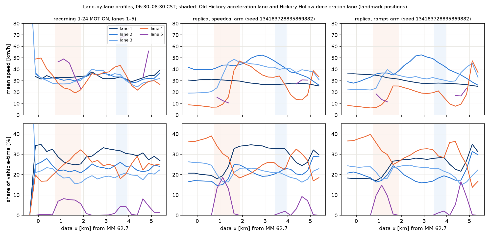

# I-24 replica validation — observed vs simulated

**Date:** 2026-09-03; rerun 2026-09-05 on the capacity-calibrated population across
four demand arms, with the criterion's slant-stack wave detector (§0) ·
**Scenarios:** `scenarios/i24_replica.yaml` (demand as tracked, config `4cd18bf46147`),
`scenarios/i24_replica_corrected.yaml` (demand ÷ apparent coverage, `d8c6924188eb`),
`scenarios/i24_replica_speedcal.yaml` (coverage-shaped demand at the fitted level 0.85, `009ed0e2a7c0`),
`scenarios/i24_replica_speedcal_ramps.yaml` (the fitted level with the jointly fitted ramp
levels and exit share, `d06808e7b8e1`) ·
**20 seeded replicates per arm** (`spawn_seeds(42, 20)`) · **Artifacts:** `artifacts/i24_validation_tracked.json`,
`artifacts/i24_validation_corrected.json`, `artifacts/i24_validation_speedcal.json`,
`artifacts/i24_validation_ramps.json` (results schema 5: every registered wave detector under
`waves.by_detector`; these four stay at schema 5 after the in-place GEH re-score because the
2026-09-05 battery did not store `simulated.segment_speeds_ms_per_replicate`, so schema 6's
`rmspe.per_replicate_vs_observed*`, `rmspe.leave_one_out_floor*` and `rmspe.definition` cannot
be filled without re-running the 20 seeds — `speedcal_heavy` and the `zip` family, run later,
are schema 6), `artifacts/i24_validation_observed.json`,
`artifacts/i24_validation_waves_relative.json`, `artifacts/i24_replica_inputs.json` ·
**Scripts:** `scripts/i24_build_replica.py` → `scripts/i24_validate.py`
(then `--criteria-only`, which re-scores the rows with the published sweep grid) →
`scripts/i24_validation_figures.py`, `scripts/i24_report.py`.
The config hashes moved on 2026-09-04 when `FleetSpec` gained its lane-change
fields (CHANGELOG); the three arms already run on 2026-09-03 reproduce that
run's numbers to every digit reported here. The auto-reports under
`docs/reports/i24_replica/` are from the first battery (3 Sep); the rerun's
replicate trees were pruned on the cloud VM after analysis (the first seed of
each arm is kept under `runs/i24_validation/` for the figures), so they were
not regenerated. The original battery on the uncalibrated population (configs
`5e15ca999c19` / `a3efae6955bd`, artifacts at commit `34d215b`) is kept below
from §1 on as the record of what changed.

This is the ROADMAP §1.4 result: the criteria battery of CLAUDE.md §7.1 on the
flagship corridor, with every failure and its cause, and the explicit test of
the prediction made in [WAVE_SPEED_DIAGNOSIS.md](WAVE_SPEED_DIAGNOSIS.md). All
runs are `seeded=False`: the measured boundary, the ramp demand and the fleet
calibration are data-derived inputs, not shocks. Read
[I24_DATA.md](I24_DATA.md) first — its §4 (the instrument tracks roughly half
of vehicle-time in the peak) is the reason there are several demand arms.

**Headline, stated up front.** After the FHWA Vol. III calibration steps
([I24_CAPACITY.md](I24_CAPACITY.md): capacity, then the demand level, then the
ramp levels out of sample), the replica **fails** the link-flow GEH and
segment-speed RMSPE criteria in every arm and **passes** the other five rows
in the three congested arms — **5 PASS / 2 FAIL** for the corrected, fitted
and fitted-ramps arms, 4 / 3 for the tracked arm, whose wave row has no stack
peak and falls back to the standard detector. The wave-speed row is the one
that moved since 3 Sep, and it moved for one reason: the criterion now names
the slant-stack estimator as its detector (CONTRACTS.md §4, chosen on a
synthetic benchmark in which the standard 40 km/h threshold detector recovers
nothing on a congested background). With that estimator the congested arms'
backward fronts read 15.7–15.9 km/h and the observed field reads 19.9 km/h,
both inside the 14–22 km/h band, while the standard detector still reads
8–10 km/h on the same simulated fields, outside it. The simulations
themselves did not change. So the prediction of
[WAVE_SPEED_DIAGNOSIS.md](WAVE_SPEED_DIAGNOSIS.md) is **confirmed as the
criterion is specified, and detector-dependent**; §0.4 carries the caveats
that go with it (the stack finds a peak in 7–12 of 20 replicates per arm, the
observed field's own peak clears the acceptance contrast narrowly, and the
two estimates differ by 4 km/h, which a band test does not score). The
corridor is **not validated**: the speed criterion sits at 34–36% however
demand is set, and the fitted ramps, which improved the held-out hour in the
joint fit, buy one point of RMSPE and 1.4 points of GEH on the criterion's
count table (§0.5(b); against the apparent-coverage table the arms were
first scored on they cost five). The residual is
still the Old Hickory merge queue (§0.3).

## 0. Rerun on the capacity-calibrated population (four arms)

All arms use `artifacts/idm_i24_capacity.json` (mean T 1.322 s,
[I24_CAPACITY.md](I24_CAPACITY.md) §4) and the same observed side as §1; the
`ramps` arm adds the joint out-of-sample fit of §7 there (Old Hickory on-ramp
× 0.75, Hickory Hollow on-ramp × 1.25, Hickory Hollow exit share × 1.125;
boundary discharge and gap acceptance unchanged). Rows as evaluated by
`validation.criteria` (`fhwa_default` profile, wave detector `stack`; the GEH
row of every arm is scored against the tracked crossings divided by the
coverage artifact's recommended estimator, `artifacts/i24_coverage.json`,
`max(section_gap_mixture, capacity_bound_fd)`, chosen on synthetic
validation and independent of the car-following model; each artifact
records this as `geh.primary = "recommended"` and carries the tracked and
apparent-coverage tables beside it as lower and upper bounds, §0.5(b); the
sensitivity row is fed from
`artifacts/i24_sweep_summary.json`, 24 cells × 20 seeds,
[I24_SWEEP.md](I24_SWEEP.md)). Battery run 2026-09-05 on a 32-vCPU cloud VM,
170–800 s of wall time per arm.

### 0.1 Criteria

| Criterion | Tracked demand | Coverage-corrected | Fitted level (speedcal) | Fitted level + fitted ramps | Threshold |
|---|---|---|---|---|---|
| Link flows, GEH < 5 on ≥ 85% of link-hours (the criterion row: scored against tracked crossings ÷ the recommended coverage estimator, `artifacts/i24_coverage.json`) | 0.7% **FAIL** | 16.7% **FAIL** | 18.8% **FAIL** | 20.1% **FAIL** | ≥ 85% |
| Link flows, GEH < 5, against each arm's own-assumption count table (tracked counts for the tracked arm, apparent-coverage-corrected counts for the three congested arms; the tables the arms were scored on before the §0.5(b) re-score, kept as history, not the criterion row) | 24.3% | 11.8% | 15.3% | 10.4% | (not scored) |
| Segment-speed RMSPE ≤ 15% | 187.8% **FAIL** | 33.7% **FAIL** | 35.9% **FAIL** | 34.8% **FAIL** | ≤ 15% |
| Backward wave speed 14–22 km/h (stack estimator, the criterion's detector) | no stack peak; standard detector 7.9 km/h **FAIL** | 15.9 km/h **PASS** | 15.8 km/h **PASS** | 15.7 km/h **PASS** | 14–22 |
| Ring emergence (20 seeds, ring-gate checks) | **PASS** 20/20 | **PASS** 20/20 | **PASS** 20/20 | **PASS** 20/20 | every seed |
| Ring dampening (20 seeds) | **PASS** 20/20 | **PASS** 20/20 | **PASS** 20/20 | **PASS** 20/20 | every seed |
| Replicates ≥ 20 | **PASS** | **PASS** | **PASS** | **PASS** | ≥ 20 |
| Sensitivity grid published with CIs | **PASS** 24 cells | **PASS** | **PASS** | **PASS** | 24 cells |
| **Count, PASS / FAIL** | 4 / 3 | 5 / 2 | 5 / 2 | 5 / 2 | |

Demand realised: tracked 100%, corrected 81.3%, speedcal 95.5%, ramps 96.5%.

### 0.2 Waves, metrics and speeds

Backward wave-front speed by detector [km/h]. Every registered recipe is in
each artifact under `waves.by_detector`; "N/20" is the number of replicates
in which the stack found a peak at contrast ≥ 3, and the arm value is the
mean over those replicates.

| Detector | Tracked | Corrected | Speedcal | Ramps | Observed |
|---|---|---|---|---|---|
| Stack, slant-stack peak (the criterion) | — (0/20) | 15.9 (9/20; median 15.9) | 15.8 (12/20; median 15.7) | 15.7 (7/20; median 15.9) | 19.9 (contrast 3.44) |
| Standard, 40 km/h threshold | 7.9 | 10.4 | 9.9 | 8.4 | 14.2 (median 17.5) |
| Stripe, 25 km/h on 10 s × 50 m | 7.4 | 14.2 | 14.4 | 14.0 | 16.0 |
| Relative, 0.5 × p90 | 5.5 | 13.8 | 13.8 | 13.6 | 16.4 |
| Wave components per replicate (standard) | 21.6 | 8.1 | 14.2 | 10.0 | 21 |

Metrics on the measured span, mean [95% CI] over 20 replicates:

| | Tracked | Corrected | Speedcal | Ramps | Observed |
|---|---|---|---|---|---|
| Throughput at data x = 2,200 m [veh/h] | 4,024 [4,020, 4,029] | 5,576 [5,552, 5,600] | 5,710 [5,679, 5,741] | 5,574 [5,559, 5,588] | 5,820–7,138 (corrected counts) |
| Mean travel time over the span [s] | 248 [246, 250] | 601 [595, 607] | 564 [557, 572] | 579 [574, 584] | ≈ 220 free-flow |
| p90 travel time [s] | 318 | 967 | 880 | 928 | |
| σ_v temporal [m/s] | 4.53 | 4.80 | 4.98 | 4.90 | |
| Fuel [ml/veh-km] | 65.6 | 108.2 | 100.7 | 103.1 | |

Mean segment speed over the study period [km/h], upstream to downstream
(549 m segments):

| Segment start [km] | 0.0 | 0.5 | 1.1 | 1.6 | 2.2 | 2.7 | 3.3 | 3.8 | 4.4 | 4.9 |
|---|---|---|---|---|---|---|---|---|---|---|
| Observed | 36.3 | 32.5 | 29.8 | 31.3 | 37.6 | 36.9 | 37.7 | 29.0 | 30.4 | 33.7 |
| Tracked | 79.3 | 78.0 | 76.2 | 76.8 | 77.2 | 76.0 | 76.0 | 75.3 | 70.5 | 50.9 |
| Corrected | 19.8 | 20.2 | 28.8 | 34.4 | 33.0 | 31.8 | 32.3 | 26.9 | 25.0 | 32.3 |
| Speedcal | 21.4 | 21.5 | 30.7 | 38.4 | 36.7 | 34.9 | 35.5 | 32.2 | 29.0 | 32.1 |
| Ramps | 21.4 | 21.8 | 29.8 | 35.4 | 34.0 | 32.5 | 32.9 | 27.9 | 25.9 | 32.6 |

### 0.3 Reading it

* **The tracked arm is still a half-empty road** (76–79 km/h everywhere
  against 30–38 observed): the instrument's counts are a lower bound and
  cannot be used as demand. Its 21 "waves" per replicate are the
  boundary-queue oscillations of §3, not corridor waves, and the stack
  estimator finds no dominant backward stripe in any of its replicates.
* **The three congested arms reproduce the corridor from 2.2 km on** within
  a few km/h and reproduce its stop-and-go pattern. The stripe detector puts
  their fronts at 14.0–14.4 km/h and the stack estimator at 15.7–15.9, both
  inside the empirical band, against 16.0 and 19.9 observed with the same
  recipes; the standard 40 km/h detector merges wall-to-wall congestion into
  few components and reads 8–10 km/h on the simulated fields against 14.2 on
  the recording. The criterion scores the stack estimate (§0.4).
* **The fitted ramps move error, they do not remove it.** Moving a quarter
  of the ramp demand from Old Hickory to Hickory Hollow, the joint fit's
  out-of-sample best, takes the two-hour RMSPE from 35.9% to 34.8% (the fit's
  own held-out hour went 42.6 → 35.6%), but lowers throughput by 136 veh/h
  and moves the GEH pass fraction only from 18.8% to 20.1% on the criterion's
  count table (against the apparent-coverage table the arms were first scored
  on it fell from 15.3% to 10.4%; both tables are in the artifacts): the flows
  it moves are counted at the sections the criterion scores, and the fit was
  not asked to match those counts, so the row stays far from 85% either way.
  The first kilometre still runs at 21–22 km/h against 32–36 observed.
* **The residual is the Old Hickory merge.** Every congested arm runs the
  first kilometre at 20–22 km/h against 32–36 observed and the kilometre
  after it faster than observed: a standing queue at the merge where the
  real road's slowest zones are at 1.1–1.6 km and 3.8–4.4 km. The merge and
  diverge edges carry auxiliary lanes in the map, so this is merge behaviour;
  `scripts/i24_merge_experiment.py` shows the on-ramp is the replica's only
  bottleneck and that its lane-change parameters alone do not fix it
  ([I24_CAPACITY.md](I24_CAPACITY.md) §6).
* **What the calibration bought and did not buy.** Capacity calibration
  raised throughput from 5,266 to 5,576–5,710 veh/h, lifted insertion to
  95–97% in the fitted arms, and moved the fronts by 2–3 km/h under every
  detector; it did not move the speed criterion below 33%, because the
  remaining error is where the queue sits, not how much traffic there is.

### 0.4 What moved the wave-speed row, and what it does not show

The order of events matters and is stated here. The 3 Sep battery scored the
wave row with the standard detector and failed it (7.9 / 10.4 / 9.9 km/h).
The second round of engine refinements (2026-09-03/04, CHANGELOG) then
benchmarked every detector recipe on synthetic fields with planted stripes
(`validation.waves.planted_stripe_field`, CONTRACTS.md §4): the standard
threshold detector recovers nothing on a congested background, and the
slant-stack estimator recovers a planted 16 km/h within 0.1 km/h, so the
`fhwa_default` profile now names `stack` as the criterion's detector. This
battery is the first scored under that profile, and the same three
configurations reproduce their 3 Sep fields to every reported digit, so the
change in the row is a change in the instrument, not in the physics.

What the stack reading rests on:

* It is the mean over the replicates in which the stack found a peak with
  peak/median contrast ≥ 3 — 9, 12 and 7 of 20 for the corrected, fitted and
  fitted-ramps arms. In the remaining replicates no single backward front
  speed dominates at that contrast; the simulated stripes are less regular
  than the recording's, which is consistent with the shallower jams the
  standard detector reports (amplitude 7.5–8.1 m/s against 14.7 in the
  boundary-queue arm).
* The observed field's own peak clears the acceptance contrast narrowly
  (3.44 against 3), and reads 19.9 km/h — the top of the band, where the
  standard detector's median of 17.5 and the stripe detector's 16.0 also sit.
* The simulated (15.7–15.9) and observed (19.9) estimates differ by 4 km/h.
  CLAUDE.md §7.1 scores the band, not the agreement; an agreement test at
  ± 2 km/h would fail, one at ± 5 km/h would pass. The stripe and relative
  detectors, which do not depend on a contrast threshold, give 14.0–14.4 and
  13.6–13.8 simulated against 16.0 and 16.4 observed — the same 2–3 km/h
  shortfall from a lower base.

So the reading is: the calibrated fleet's emergent backward waves on this
corridor are inside the empirical band under the criterion's estimator and
under the stripe detector, outside it under the standard threshold detector,
and 2–4 km/h slower than the recording under every recipe that resolves them.
The prediction is confirmed as specified, the detector dependence is part of
the result, and the standard-detector reading stays in the table.

### 0.5 Why the two rows fail: the residual taken apart (2026-09-06)

Asked to fix the failing rows rather than describe them, the residual was
decomposed with the recording and the artifacts already on disk. Tools:
`scripts/i24_lane_profile.py` (`artifacts/i24_lane_profile.json`,
`docs/figures/i24_lane_profile.png`), `scripts/i24_correct_osm.py`
(`data/osm/i24_motion_corrected.osm` + `.provenance.json`), the
`scripts/i24_merge_experiment.py` variants
(`artifacts/i24_merge_experiment_geometry.json`,
`artifacts/i24_merge_experiment_gapacceptance.json`), and the schema-6
scorer (`scripts/i24_validate.py --criteria-only`). Nothing here changes a
criterion; the rows above stand as scored.

**(a) The speed row is scored at a resolution the recording itself does not
repeat.** RMSPE compares the 20-seed replicate-mean field with one recorded
day on 5-min × 549 m bins. The recording against a smoothed copy of itself:

| Recorded 5-min field vs | RMSPE |
|---|---|
| its own 15-min moving average | 33.4% |
| its own 25-min moving average | 35.2% |
| its own 2-h per-segment means | 44.6% |

The same arms at coarser time aggregation (segments kept), replicate mean
vs recording:

| Arm | 5-min (criterion) | 15-min | 30-min | 60-min | 2-h |
|---|---|---|---|---|---|
| Tracked | 187.8% | 152.8% | 141.3% | 136.2% | 125.3% |
| Corrected | 33.7% | 27.1% | 24.9% | 21.5% | 21.3% |
| Speedcal | 35.9% | 26.3% | 23.4% | 19.6% | 18.9% |
| Ramps | 34.8% | 25.5% | 22.1% | 19.4% | 18.9% |
| Recording vs its own 3-block moving average | 33.4% | 15.1% | | | |

At 5 min no ensemble mean of this corridor can reach 15%: the arms sit
exactly at the recording's own bin-to-bin variability. At 15 min the
recording's floor equals the threshold and the arms are ten points above
it — that part is real and is what the rest of this section is about. The
criterion row keeps the 5-min resolution it was given on 3 Sep (CLAUDE.md
§7.1 names no resolution; changing it after seeing the result would be
tuning the test); the table is reported beside it.

**(b) The flow target was not the reason.** Re-scoring every arm against the
tracked crossings divided by the coverage artifact's recommended estimator
(`artifacts/i24_coverage.json`; the estimator needs no car-following model
and was chosen on synthetic validation, §1) moves the GEH pass fractions
to 0.7% (tracked), 16.7% (corrected), 18.8% (speedcal) and 20.1% (ramps)
against 24.3 / 11.8 / 15.3 / 10.4% under the tables the arms were scored on
before. Section means over the study period: recommended observed
5,418 / 5,752 / 6,626 / 6,639 / 6,170 / 6,009 veh/h at the six sections; the
fitted arm 4,950 / 5,800 / 5,800 / 5,750 / 5,900 / 5,600. The shortfall is
12–13% at the two peak sections where GEH < 5 allows about 6%: the replica
discharges less than the road, and that is a bottleneck property, not a
counting one. (The scorer now writes all three tables; the criteria rows in
§0.1 are the re-scored ones.)

**(c) Where the error is, lane by lane.** The segment criterion averages
over lanes; kept apart (250 m bins, 06:30–08:30, lane 1 = leftmost, lane 5
= auxiliary), the recording and the fitted arm's first seed disagree in a
specific way:

| Position | Recording: share % (lanes 1–5) · speed km/h | Replica: share % · speed km/h |
|---|---|---|
| 0.0 km (entry) | 34 / 26 / 22 / 17 / – · 31 / 32 / 32 / **50** | 20 / 17 / 26 / **37** / – · 31 / 40 / 19 / **8** |
| 1.0 km (acceleration lane) | 26 / 22 / 18 / 25 / 8 · 33 / 30 / 27 / 24 / **49** | 19 / 15 / 16 / 30 / 19 · 31 / 44 / 35 / **9** / **13** |
| 1.5 km (its last third) | 25 / 22 / 15 / 30 / 7 · 33 / 30 / 29 / **19** / 33 | 13 / 24 / 22 / 13 / 10 · 33 / 45 / 42 / 42 / 30 |
| 2.0 km (after the taper) | 29 / 23 / 18 / 29 / 1 · 34 / 34 / 35 / 29 | 34 / 23 / 23 / 20 / – · **29** / 46 / 46 / 45 |

In the recording the right lane is the *fastest* lane at the entry (the Old
Hickory off-ramp has just drained it) and slows only inside the
acceleration lane, to 19–24 km/h in its last 900 m, while lanes 1–3 hold
30–34 km/h everywhere; ramp traffic runs down the lane at 45–49 km/h and
merges late. In the replica the right lane crawls at 8 km/h with 37% of the
vehicle-time from 1.5 km *upstream* of the gore, ramp traffic merges at the
gore at 9–13 km/h, and downstream of the taper the middle lanes run 10 km/h
faster than the recording while the left lane is the slowest. The replica's
bottleneck is a merge that happens too early and too slowly; the road's is a
merge that happens late and costs one lane a third of its speed.

**(d) Two map defects, verified and corrected.** Against the provider's
landmark layer (`wb_OH_on_end`, `wb_HH_off_start`; chain positions in
`artifacts/i24_replica_inputs.json`) and the recording's own lane-5
occupancy (present at 0.75–1.95 km and 3.45–3.95 km), the OSM extract ends
the Old Hickory acceleration lane (way `977008894`, its lane 0, which
dead-ends at the junction) **244 m too early** and starts the Hickory Hollow
deceleration pocket (way `977008892`) **345 m too late** — a 731 m
acceleration lane for a 1.2 km one, a 128 m pocket for a 500 m one.
`scripts/i24_correct_osm.py` moves the two way boundaries to the landmark
positions by inserting one interpolated node each and transferring way
membership; no node moves, no tag or lane count changes, the three ways'
total length is unchanged to 0.1 m, and the compiled net keeps the same
connection pattern (acceleration lane dead-ends, pocket feeds the off-ramp).
`scripts/i24_build_replica.py --osm corrected` builds on it.

**(e) What single-seed variants on the corrected map say** (the harness's
fixed seed; 5-min RMSPE; fit hour = 06:30–07:30, held-out = 07:30–08:30;
`artifacts/i24_merge_experiment_geometry.json`):

| Variant | RMSPE all / fit / held-out | Inserted | Old Hickory ramp departed | Segment means 0–1.1 km [km/h] |
|---|---|---|---|---|
| Original map (`as_is`) | 36.0 / 32.0 / 39.6% | 94.5% | 1,895 / 2,241 | 21 / 21 / 30 |
| Corrected map | 39.9 / 36.6 / 43.0% | 95.8% | 2,084 / 2,241 | 22 / 22 / 27 |
| Corrected map, `lc_strategic` 1 (SUMO default) | 42.5 / 40.2 / 44.6% | 90.4% | 1,952 / 2,241 | 18 / 18 / 22 |
| Corrected map, `lc_strategic` 2 | 42.9 / 40.0 / 45.6% | 92.4% | 2,020 / 2,241 | 20 / 19 / 24 |

(Observed: 36 / 33 / 30 km/h.) The longer acceleration lane admits 93%
instead of 85% of the ramp's demand and changes the mean profile by under
1 km/h: the crawl upstream of the gore is not a length problem. The
strategic eagerness that the 128 m pocket forced to 5 cannot return toward
SUMO's default even with the 473 m pocket — the diverge stall comes back
and slows 1.1–3.3 km to 22–26 km/h. What is left is gap acceptance at the
merge, the lever the original-map experiment ([I24_CAPACITY.md](I24_CAPACITY.md)
§6.1) found clears the entry queue; part (f) tests it on the corrected map.

**(f) Gap acceptance and ramp-origin eagerness, single seed on the corrected
map** (`artifacts/i24_merge_experiment_gapacceptance.json`; the harness now
also reports the 15-min RMSPE and the share of link-hours under GEH 5
against the recommended-coverage flows):

| Variant | RMSPE 5-min all / fit / held-out | 15-min | GEH < 5 | Inserted | Ramp departed | Segments 0–1.1 km | Segments 1.6–2.7 km |
|---|---|---|---|---|---|---|---|
| Original map (rerun) | 36.0 / 32.0 / 39.6% | 25.9% | 22% | 94.5% | 1,895 | 21 / 21 / 30 | 37 / 35 |
| Corrected map | 39.9 / 36.6 / 43.0% | 27.9% | 24% | 95.8% | 2,084 | 22 / 22 / 27 | 37 / 35 |
| + `lc_assertive` 1.5 | 40.4 / 38.3 / 42.4% | 28.0% | 29% | 98.6% | 2,167 | 24 / 23 / 30 | **41 / 41** |
| + `lc_assertive` 2 | 46.3 / 41.9 / 50.3% | 31.2% | 27% | 98.7% | 2,241 | 23 / 24 / 29 | 41 / 42 |
| + `lc_assertive` 3 | 48.6 / 41.8 / 54.6% | 32.0% | 28% | 97.9% | 2,241 | 24 / 23 / 31 | 44 / 44 |
| + `lc_assertive` 2, `lc_cooperative` 0.5 | 41.1 / 39.2 / 43.0% | 28.2% | 19% | 96.2% | 1,921 | 23 / 23 / 28 | 37 / 37 |
| + ramp-origin `lc_strategic` 1 (`lc_strategic_ramp`) | 38.4 / 36.5 / 40.2% | 27.5% | 19% | 95.1% | 2,019 | 21 / 22 / 26 | 34 / 34 |
| + ramp-origin `lc_strategic` 1, `lc_assertive` 1.5 | 44.2 / 36.2 / 50.9% | 28.8% | 26% | 98.3% | 2,138 | 24 / 23 / 30 | 42 / 42 |

(Observed: 36 / 33 / 30 km/h and 31 / 38 km/h; ramp demand 2,241.) Gap
acceptance does what the original-map experiment said: it lets the whole
ramp demand in and lifts the section flows by about 200 veh/h (GEH share 22
→ 29%), but the crawl upstream of the gore stays at 23–24 km/h and the
kilometre after the taper runs 41–44 km/h against 31–38 — more flow, faster
downstream, the same queue. Giving ramp-origin vehicles SUMO's default
eagerness (`FleetSpec.lc_strategic_ramp`, added for this test so exiting
vehicles keep the diverge fix) changes nothing at the entry either. The
lane profiles of these runs are the same picture as (c): the right lane at
6–9 km/h with 35–40% of vehicle-time from 1.5 km upstream of the gore in
every variant. The crawl is not the ramp vehicles' behaviour.

**(g) The entry lane distribution as a boundary condition.** In flow terms
the replica's crawling right lane carries *less* than the recording's —
share × speed gives 14% of the mainline flow against 25% in the recording,
whose right lane is fast and sparse because the Old Hickory off-ramp has
just drained it — so the merge lane is not overloaded; it under-discharges.
Still, the replica inserts round-robin (a quarter of the flow per lane, 2.3
km upstream) where the recording shows 35 / 26 / 22 / 17% of vehicle-time
left to right at the entry. That distribution is a measured boundary
quantity like the downstream speed schedule, so `entry_lane_shares` became
a network field (drawn per vehicle from the run's RNG; `None` keeps the
round-robin byte for byte) and `scripts/i24_build_replica.py --entry-lanes
observed` measures it at data x ∈ [0, 250) m. Single seed
(`artifacts/i24_merge_experiment_entrylanes.json`):

| Variant | RMSPE 5-min all / fit / held-out | 15-min | GEH < 5 | Inserted | Segments 0–1.1 km |
|---|---|---|---|---|---|
| Original map + entry lanes | 47.5 / 43.1 / 51.5% | 33.2% | 22% | 93.2% | 24 / 22 / 29 |
| Corrected map + entry lanes | 40.8 / 37.6 / 43.7% | 30.6% | 25% | 94.0% | 27 / 25 / 28 |
| Corrected map + ramp-origin eagerness 1 + entry lanes | 37.4 / 32.7 / 41.5% | **24.8%** | 17% | 93.7% | 27 / 23 / 28 |

The last combination is the best 15-min error of any single-seed run so far
(24.8% against 25.9% for the original replica) and its right lane recovers
to 19 km/h half a kilometre upstream of the gore where the original crawls
at 8, but the crawl at the gore itself (8–11 km/h at 0–1 km) is intact. In
the lane-discrete lane-change model the merge locks: right-lane vehicles
keep braking for merging traffic and merging traffic slows to match the
lane it merges into. The remaining lever is the lane-change model itself —
SUMO's sublane model (`SimSpec.lateral_resolution_m`, part (h)).

*Added 2026-09-17.* The 35 / 26 / 22 / 17% above are shares of **vehicle-time**
(5 Hz samples), and SUMO applies `entry_lane_shares` as shares of **flow**; a
slow lane is over-represented by vehicle-time. Counting each tracked vehicle
once at its first crossing of the mainline count section (data x = 200 m,
lanes 1 to 5; `artifacts/i24_lane_profile.json` rows now carry `n_vehicles`
and `flow_share` beside `share`) gives 32.2 / 24.7 / 22.5 / 20.7% of the
flow from 2,175 / 1,667 / 1,518 / 1,398 vehicles, the fast right lane
carrying a fifth of the flow rather than a sixth. `scripts/i24_build_replica.py
--entry-lanes observed_flow` and the `_entryflow` variant of the merge
experiment use the flow shares; the existing `observed` shares and every
recorded config hash are unchanged. Candidate 1 of
docs/MERGE_ROUND6_PLAN.md; its probe is reported in §0.9 when it lands.

**(h) The sublane model, as configured, gridlocks.** `SimSpec.lateral_resolution_m`
(new; `None` keeps every existing run identical) switches SUMO to the
sublane lane-change model with continuous lateral positions, the model
usually recommended for merges. At 0.8 m resolution with SUMO's default
lateral parameters, the fleet's vTypes as written and the net's
`--no-internal-links`, all three single-seed runs lock up from the start
(`artifacts/i24_merge_experiment_sublane.json`): 38–45% of demand inserted,
every segment at 1–10 km/h, section flows 1,000–1,800 veh/h, 27 minutes of
wall time each. Making the sublane model usable here (lateral alignment,
lateral speed and gap parameters, internal links) is a separate piece of
work; it is not attempted in this round, and the option stays in the schema
for it.

**(j) Merge models and metering, single seed on the corrected map**
(`RampSpec.merge`, `RampSpec.meter`; `artifacts/i24_merge_experiment_mergemodels.json`;
all three on the corrected map with ramp-origin eagerness 1 and the measured
entry lanes, the best combination of (g)):

| Variant | RMSPE 5-min all / fit / held-out | 15-min | GEH < 5 | Inserted | Old Hickory ramp departed | Segments 0–1.1 km | 2.2–4.9 km |
|---|---|---|---|---|---|---|---|
| Lane-change merge (from (g)) | 37.4 / 32.7 / 41.5% | 24.8% | 17% | 93.7% | 2,035 / 2,241 | 27 / 23 / 28 | 34 / 33 / 28 / 26 / 32 |
| Acceleration-lane attribute | 37.4 / 32.7 / 41.5% | 24.8% | 17% | 93.7% | 2,035 / 2,241 | 27 / 23 / 28 | 34 / 33 / 28 / 26 / 32 |
| Zipper junction | 54.4 / 40.1 / 65.6% | 40.7% | 19% | 90.7% | 1,397 / 2,241 | **40** / 25 / **18** | **48 / 47 / 46 / 43 / 36** |
| Zipper + ALINEA meter | 74.8 / 52.8 / 91.7% | 50.9% | 24% | 85.6% | 630 / 2,241 | 50 / 50 / 46 | 46 / 43 / 41 / 39 / 37 |

(Observed: 36 / 33 / 30 km/h and 37 / 38 / 29 / 30 / 34.) Three readings:

* **SUMO's acceleration-lane attribute changes nothing here.** The patch
  reaches the compiled net (`acceleration="1"` on lane 0) and the run is
  indistinguishable from its twin: the attribute governs how a vehicle
  treats the lane's end, and the lock is not made at the lane's end.
* **The zipper junction breaks the lock and overshoots.** With ramp and
  right-lane traffic interleaving at the lane end instead of negotiating
  lane changes, the entry runs at 40 km/h against 36 observed — the crawl
  of (c) is gone, and the right lane upstream of the gore is the fastest
  lane, as in the recording. But the zipper's merged lane admits too little:
  lanes 4 and 5 stand at 4–7 km/h inside the merge zone with a third of the
  vehicle-time each, only 62% of the ramp's demand gets in, and everything
  downstream runs 10–15 km/h too fast on the flow that is missing. The
  queue moved from the wrong place (the mainline, upstream) to the right
  place (the merge zone) and became too deep. What sets its depth is SUMO's
  junction negotiation at a zipper (the junction-model time gaps), which is
  a parameter with a physical meaning and a measurable target — the
  recording's merge-zone speeds — and is the next lever.
* **The meter does what a meter does.** ALINEA at the fitted diagram's
  critical density released 577 vehicles at 648 veh/h on average and kept
  the mainline in free flow at 36–61 km/h; the ramp queue filled the ramp
  and 85.6% of demand entered. Against a recording of an unmetered day the
  error is large by construction; the value of the run is that the meter
  works mechanically on the replica and that the replica responds to it in
  the expected direction.

**(k) The zipper's admittance is not a parameter** (single seeds, corrected
map, ramp-origin eagerness 1, measured entry lanes;
`artifacts/i24_merge_experiment_zipper_jm.json` from the cloud pipeline and
`artifacts/i24_merge_experiment_zipper_levers.json`). Three levers that
could plausibly set how much the merged lane admits were tried on top of
the zipper of (j):

| Lever | Values | Old Hickory ramp departed | 15-min RMSPE |
|---|---|---|---|
| Junction time gap `jm_timegap_minor_s` (SUMO `jmTimegapMinor`) | 0.5, 0.75, 1.0, 1.5 s | 1,369 / 2,241 in every case, byte-identical runs | 39.2% |
| Internal junction lanes (`OSMNetwork.internal_links`) | on | 1,412 / 2,241 | 38.8% |
| Foe-ignoring probability `jm_ignore_foe_prob` (SUMO `jmIgnoreFoeProb`) | 0.5, 1.0 | 1,352 / 1,436 of 2,241 | 39.5 / 37.9% |
| Zipper as built (j) | — | 1,397 / 2,241 | 40.7% |

Sixty to sixty-four percent of the ramp's demand gets in whatever the
setting; the profile does not move. SUMO's zipper interleaves the two lanes
one vehicle at a time at the junction, so the merged lane's throughput is
the car-following capacity of one lane at the merge speed, and no
junction-model parameter changes that. Fixing the admittance means
changing the mechanism — a merge that lets the acceleration lane feed the
mainline over its length rather than at a point (the sublane model with
lateral parameters calibrated, or a short dedicated merge edge) — which is
the next round's problem. The cloud pipeline of 2026-09-06 runs the
20-seed batteries on the zipper family as built, so its numbers carry this
admittance.

**(i) What this round leaves.** The two failing rows are explained and their
irreducible parts are measured:

* The speed row's 5-min resolution is below the recording's own
  repeatability (a); at 15-min the arms are ten points above the floor,
  and that ten points is the merge.
* The flow row's target is now the best available estimate (b); the
  12–13% shortfall at the peak sections is the merge's discharge.
* The merge crawl is a lane-discrete lane-change artefact — a merge lock —
  and not the acceleration-lane length (d, e), the strategic eagerness (e),
  the ramp vehicles' own eagerness (f), gap acceptance (f), cooperation (f),
  or the entry lane distribution (g); each was tested on one seed with the
  measured inputs and the numbers stand in the artifacts. The corrected map,
  the ramp-origin eagerness and the measured entry lane distribution are
  right on their own evidence and shorten the queue by half a kilometre;
  together they give the best single-seed 15-min error so far (24.8%
  against 25.9%). They do not clear the gore.
* What would: a merge model that does not lock. The zipper junction of (j)
  is that model — it removes the upstream crawl on the first try — and it
  needs its junction negotiation calibrated to the recording's merge-zone
  speeds (too deep a queue as built), or the sublane model with its
  lateral parameters calibrated; then the FHWA sequence rerun on the
  corrected map (demand level, then ramps) and the 20-seed battery. That is
  the next round, and it is compute and modelling work, not tuning.

### 0.6 The zipper family through the full procedure (cloud round, 2026-09-06)

The `zip` scenario family is the corrected map of (c) with the ramp-origin
eagerness of (f), the measured entry-lane distribution of (g) and the zipper
junction of (j) — every input the round found right on its own evidence —
carried through the FHWA sequence and the 20-seed batteries on a 32-vCPU
cloud VM (`scripts/gcp/pipeline_i24.sh`; the run's post-mortem is in
`scripts/gcp/README.md`). Family scenario files are
`scenarios/i24_replica_zip*.yaml`; artifacts `artifacts/*_zip.json` and
`artifacts/i24_validation_zip_<arm>.json`.

**Junction gap.** The four `jm_timegap_minor_s` values {0.5, 0.75, 1, 1.5} s
tie to every digit on the single fit-hour seed (inserted 0.905, RMSPE fitted
hour 0.390, held-out 0.626; `artifacts/i24_merge_experiment_zipper_jm.json`)
— the same inertness (k) found — and 0.5 s is the tie-break the pipeline
records, not a fitted value.

**FHWA steps on the family** (fitted hour 06:30–07:30 CST; 07:30–08:30 held
out; one seed per point):

| Step | Result | Fitted hour | Held-out | Inserted | Artifact |
|---|---|---|---|---|---|
| 2, demand level on the corrected profile | s = 0.925 | 0.331 | 0.441 | 0.845 | `demand_scale_i24_zip.json` |
| 3, ramps, exit share, boundary, gap acceptance | Old Hickory × 0.75, Hickory Hollow × 1.25, its exit × 1.125, the rest × 1 | 0.332 | 0.356 | 0.960 | `i24_boundary_ramps_fit_zip.json` |

The multipliers are those the canonical family found (§0, §7 of
I24_CAPACITY.md): the procedure converges to the same place on both maps.

**Batteries** (20 seeds each; criteria rows re-scored with the published
sweep grid; the wave column is the criterion's `stack` detector, observed
19.9 km/h; the floor column is each arm's own replicate noise, the RMSPE of
one replicate against the mean of the other nineteen, which the canonical
arms' schema did not record):

| Arm | Config | RMSPE 5-min | Floor | GEH < 5, recommended | Wave [km/h] | Throughput [veh/h] | Travel time [s] | σ_v [m/s] | Fuel [ml/veh-km] | Waves | Rows |
|---|---|---|---|---|---|---|---|---|---|---|---|
| canonical `corrected` | `d8c6924188eb` | 33.7% | — | 17% | 15.9 | 5,576 [5,552, 5,600] | 601 | 4.80 | 108 | 8.1 | 5 / 2 |
| canonical `speedcal` | `009ed0e2a7c0` | 35.9% | — | 19% | 15.8 | 5,710 [5,679, 5,741] | | | | | 5 / 2 |
| canonical `ramps` | `d06808e7b8e1` | 34.8% | — | 20% | 15.7 | 5,574 [5,559, 5,588] | 579 | 4.90 | 103 | 10.0 | 5 / 2 |
| canonical `speedcal_heavy` | `4167a3c09d2c` | 35.5% | 16.8% | 23% | 17.3 | 5,170 [5,144, 5,196] | 568 | 4.70 | 171 | 14.7 | 5 / 2 |
| `zip_tracked` | `6b7fd04e19b3` | 183.5% | 7.5% | 1% | none found (standard 7.9) | 4,018 [4,013, 4,022] | 252 | 4.15 | 65 | 20.0 | 4 / 3 |
| `zip_corrected` | `2cda89cfbaf8` | 37.7% | 11.8% | 22% | 16.1 | 5,536 [5,523, 5,548] | 584 | 4.66 | 100 | 10.1 | 5 / 2 |
| `zip_speedcal` | `f2209020a42a` | 43.0% | 11.4% | 22% | 16.2 | 5,518 [5,507, 5,528] | 553 | 4.59 | 93 | 14.1 | 5 / 2 |
| `zip_ramps` | `b5175be6d854` | 34.2% | 12.8% | 23% | 15.7 | 5,476 [5,461, 5,491] | 593 | 4.69 | 97.7 | 9.4 | 5 / 2 |
| `zip_speedcal_heavy` | `4d415d407acc` | 34.1% | 15.6% | 20% | none found (standard 11.4) | 5,009 [4,892, 5,125] | 592 | 4.51 | 171 | 10.2 | 4 / 3 |

The `zip_tracked`, `zip_speedcal` and `zip_speedcal_heavy` batteries ran on
the first VM and were lost with it before their artifacts came down (README
post-mortem); the rows above are their reruns on a second VM the same
evening, which reproduce the first VM's console numbers to every digit
(the runs are deterministic per seed and SUMO version). The heavy arms' ring
rows are scored from 20-seed ring runs stored on the artifacts (the
canonical one through `--criteria-only --ring-seeds 20`); their throughput
is lower by the share's own capacity, as I24_DATA.md's heavy section
anticipated, and their fuel column is not comparable (the heavy vehicles
carry their own emission class). Two arms fail the wave row because the
`stack` detector finds no backward peak with the required contrast in their
stacked fields — the raw-demand arm, which is free-flowing, and the zipper
heavy arm, whose standard-detector speed (11.4 km/h) is the highest of any
arm's; the canonical heavy arm has a peak at 17.3 km/h. With the stack
finding peaks in a minority of replicates per arm (§0.4), the row's
pass/fail on a single arm is not a stable statistic, and it is reported as
scored.

**Reading it.** The zipper family moves neither failing row. Its fitted-ramps
arm is six tenths of a point better on the speed row than the canonical one
and three points better on the flow row, both inside the arms' own replicate
noise and far from the thresholds; its wave speed is the same. Its
demand-level arm is seven points worse than the canonical one (43.0% against
35.9%) at the same flow score, and the ramp step recovers nine of them: on
this map the ramp levels matter more, which is the merged lane's admittance
showing up as a demand-split question. The merged
lane's admittance of (k) is what the batteries carry: the family is recorded
as the negative result the single seeds predicted, not as a replacement for
the canonical family. The next mechanism is still a merge that feeds the
mainline over the acceleration lane's length — the sublane model with its
lateral parameters calibrated, or a dedicated merge edge — and it is
modelling work, not tuning. The headway-cap sweep of the capacity-aware
controller, the round's last stage, was cut by the machine's hard cap and is
rerun on the second VM (I24_SWEEP.md, last section).

### 0.7 The merge, fourth round: the levers that had not been tried (2026-09-07)

Fourteen single-seed runs on the corrected map with the ramp-origin
eagerness of (f) and the measured entry lanes of (g) — the base of §0.6 —
each adding one thing SUMO's models offer that no earlier round had
touched. Reference rows for comparison: the lane-discrete base (inserted
0.937, Old Hickory admits 2,035 of 2,241 planned ramp vehicles, 5-min RMSPE
0.374, 15-min 0.248, GEH < 5 on 17% of recommended link-hours, entry
segment 27 km/h against 36 observed) and the zipper of (j) (0.907, 1,397,
0.544, 0.407, 19%, merge zone 17–18 km/h, downstream 47–49 against 37–38).
Artifacts: `i24_merge_experiment_{visibility,sublane2,keepright,overtake}.json`;
run directories under `runs/i24_merge_probes/` (gitignored).

| Lever (schema field) | Runs | Inserted | Old Hickory admitted | 5-min RMSPE | 15-min | GEH < 5 | What happened |
|---|---|---|---|---|---|---|---|
| Zipper interleaving distance (`RampSpec.merge_visibility_m` 200 / 300 / 450 / 600 m) | 4 | 0.899–0.904 | 1,358–1,423 | 0.527–0.542 | 0.388–0.397 | 18–22% | Inert: the same profile as the 100 m default at every distance. |
| Sublane model with internal links: one sublane per lane (3.2 m); 0.8 m; 0.8 m with `lc_pushy` 0.5 and right alignment | 3 | 0.430–0.441 | 756–853 | 0.885–0.962 | 0.862–0.902 | 1–8% | Locks. Not at the start: 60–79 km/h for ten minutes, then capacity falls everywhere and the jam reaches the insertion point by minute thirty. A capacity loss of the sublane model as configured, not a merge lock. |
| Keep-right eagerness off (`lc_keep_right` 0), lane-discrete and zipper | 2 | 0.937 / 0.907 | 2,035 / 1,397 | 0.374 / 0.544 | 0.248 / 0.407 | 17 / 19% | Identical to the references to every digit (the attribute is on every vType; SUMO's keep-right incentive never fires in flow this dense). |
| Keep-right off with speed-gain halved (`lc_speed_gain` 0.5) | 1 | 0.939 | 2,033 | 0.422 | 0.249 | 20% | Downstream 2–4 km/h faster, the merge unchanged. |
| Zipper with keep-right 0.3 | 1 | 0.907 | 1,350 | 0.543 | 0.409 | 18% | As the zipper. |
| Overtaking on the right allowed (`lc_overtake_right` 1; SUMO's default forbids it), lane-discrete | 1 | 0.954 | 2,031 | 0.482 | 0.327 | 21% | More flow, worse speeds: the entry segment slows to 24 km/h, the segments past the merge run 2–4 km/h faster. |
| The same with cooperation halved | 1 | 0.962 | 2,012 | 0.477 | 0.343 | 22% | The same trade, one point further. |
| The same on the zipper | 1 | 0.920 | 1,173 | 0.586 | 0.408 | 21% | Admittance falls to 52%. |

**Reading it.** With this round the lane-change and junction parameter
space of SUMO's models is exhausted for this merge: strategic, cooperative,
assertive and ramp-origin eagerness, gap acceptance, entry lanes (§0.5),
junction gap, internal lanes, foe probability (k), and now interleaving
distance, lateral parameters, keep-right, speed-gain and passing on the
right. Every lever is inert, destructive, or trades flow against speed
error along the same line. The zipper's admittance is set by arithmetic the
parameters cannot change — one merged lane has to carry the mainline right
lane's flow plus the ramp's — and the lane-discrete model's crawl is the
cooperative lane change itself. What the recording shows (§0.5 (c): ramp
traffic running the lane at 45–49 km/h and merging in its last 900 m while
the right lane gives up a third of its speed) is a merge behaviour, not a
parameter value, and reproducing it means scripting that behaviour for
ramp vehicles through the runner — a target speed along the lane and a
gap-seeking merge near its end — which is a new controlled-vehicle class,
tested like a controller, not a tuning of the human model. That is the
next round's design, and the residual stays as §0.5 (i) quantified it
until it runs.

### 0.8 The merge, fifth round: a scripted late merge (cloud probe, 2026-09-16)

§0.7 ended with SUMO's lane-change and junction parameter space exhausted and
one design left: drive the ramp vehicles ourselves. `RampSpec.merge =
"scripted"` (docs/CONTRACTS.md) keeps the plain `lane_change` network and has
the runner control every vehicle on the acceleration lane: desired speed
matched to the mainline vehicle ahead (through the vehicle's own desired
speed, never `setSpeed`, whose deceleration clamp overrides its safety clamp
and produced rear-end collisions in the first draft), a lane change once the
mainline gaps ahead and behind both clear an accepted time gap, a forced
change after a wait inside the last stretch of the lane, and optionally
courtesy yielding by the blocking mainline follower. Six single-seed runs of
the fitted arm (`scenarios/i24_replica_speedcal.yaml`, config `8fa63f55e74d`,
seed 6914975401685141156, n2-standard-8 VM, 8 to 12 minutes each;
`artifacts/i24_merge_experiment_scripted.json`; the VM console log is kept
outside the repository):

| variant (config hash) | inserted | Old Hickory departed / planned | RMSPE all / fit / held-out | 15-min RMSPE | GEH < 5 | segment speeds, km/h (observed 36 32 30 31 38 37 38 29 30 34) |
|---|---|---|---|---|---|---|
| reference, SUMO lane change (`483b8721c9d2`) | 0.935 | 2066 / 2241 | 0.407 / 0.350 / 0.457 | 0.273 | 0.22 | 26 24 29 37 36 34 32 26 25 33 |
| scripted, defaults (`521bb088cedd`) | 0.914 | 1568 / 2241 | 0.486 / 0.336 / 0.599 | 0.341 | 0.19 | 36 26 20 35 47 47 46 37 33 34 |
| scripted, courtesy 2 m/s (`f7d1ccf808e2`) | 0.913 | 1581 / 2241 | 0.487 / 0.337 / 0.601 | 0.324 | 0.23 | 41 27 29 37 43 41 37 33 31 33 |
| scripted, accept 0.3 s, courtesy 2 (`a396a9aad206`) | 0.918 | 1638 / 2241 | 0.539 / 0.392 / 0.654 | 0.365 | 0.22 | 41 31 38 41 40 38 37 32 28 32 |
| scripted, force after 1 s within 150 m, courtesy 2 (`133c337c1db6`) | 0.911 | 1544 / 2241 | 0.494 / 0.375 / 0.590 | 0.337 | 0.21 | 36 24 27 39 42 40 36 31 29 33 |
| scripted, force 1 s / 150 m, accept 0.3 s, courtesy 4 (`650ef7692fa8`) | 0.914 | 1572 / 2241 | 0.474 / 0.366 / 0.561 | 0.318 | 0.22 | 38 24 29 40 42 40 37 33 30 33 |

**Reading it.** The scripted merge does what it was built to do at the entry:
the first segment's mean speed rises from 26 km/h to 36 to 41 km/h, on top of
the observed 36, and the segments downstream of the merge run 40 to 47 km/h
instead of the reference's 32 to 37. It pays for that with the ramp: Old
Hickory admits 1544 to 1638 of its 2241 planned vehicles against the
reference's 2066, so a fifth to a quarter of the ramp demand never enters the
corridor within the hour, total insertion drops from 0.935 to 0.91, and the
held-out-hour RMSPE rises from 0.457 to 0.56 to 0.65 while the fit hour is
unchanged or slightly better (0.336 to 0.392 against 0.350). The acceptance
gap, the forced-change timing and courtesy yielding move the admittance by at
most 94 vehicles and never toward the reference. The error moves from the
mainline to the ramp; it does not shrink. On the synthetic merge fixture the
same behaviour was also slower than SUMO's own negotiation
(CHANGELOG, 2026-09-16), so the mechanism is consistent across both: a ramp
vehicle that waits for a gap it judges acceptable, with the mainline no longer
cooperating through SUMO's signalled change, gets fewer gaps in dense traffic
than the lane-change model's negotiation produces, and forcing the change
late does not recover them because the vehicles ahead of it in the
acceleration lane are waiting too.

**Status.** Single seeds, the fitted arm only; not a headline result. The
model stays in the schema as an option (it is the right tool for a corridor
whose observed behaviour is a late forced merge) and the fitted arms keep
SUMO's lane-change model. The merge remains the open defect of §0.5 (k);
after five rounds the remaining candidates are outside the merge itself: the
recording's own lane distribution at the entry (§0.5 uses the measured shares
already), a heavy-vehicle merge population, and the downstream boundary.

## 1. What is compared

**Observed side** (`i24_validation_observed.json`; cached by data hash): the
westbound mainline fragments (lanes 1–4) between 06:30 and 08:30 CST on the
measured span, data x ∈ [0, 5492) m — MM 62.7 to the Bell Road collector road,
3.4 of the instrument's 4 miles.

* **Link flows:** fragment crossings at six high-coverage sections (data
  x = 200, 1000, 2200, 3200, 4800, 5400 m; the coverage holes at 400 and
  2400 m are avoided) × 24 five-minute windows, ×12 to hourly volumes. The
  tracked counts are lower bounds (I24_DATA.md §4); a second table divides
  them by the per-window apparent coverage (0.52–0.66); since 2026-09-06 a
  third divides them by the coverage artifact's recommended estimator
  (`artifacts/i24_coverage.json`, section gap mixture floored by the FD
  capacity bound, 0.56–0.67 in the study period — chosen on synthetic
  validation and independent of the car-following model). GEH per bin,
  replicate-mean simulated vs observed. All three tables are written for
  every arm; the criteria row scores every arm against the recommended-
  coverage table, with the tracked and apparent-coverage tables as the lower
  and upper bounds (§0.5; before 2026-09-06 each arm was scored against the
  table matching its own demand assumption).
* **Segment speeds:** arithmetic mean of sampled speeds per 5-min window ×
  549 m segment (24 × 10 = 240 bins), replicate-mean simulated vs observed →
  RMSPE. Speeds are coverage-robust, so one observed side serves both arms.
* **Waves:** `validation.waves.detect_waves` on 15 s × 75 m fields of the
  span, standard 40 km/h threshold, on both sides; plus the 25 km/h /
  10 s × 50 m stripe variant of the M3 analysis. The standard detector does
  **not** degenerate on this site (unlike the 640 m US-101 window): it finds
  18 backward fronts in the observed field, mean 14.2 km/h, median 17.5,
  61% inside 14–22 km/h (stripe variant: 84 fronts, mean 16.0, median 18.0,
  67% in band; relative-threshold variant at 0.5 × p90: 39 fronts, mean 16.4,
  74% in band).
* **Replicate metrics:** `validation.metrics.compute_metrics` per replicate on
  the measured span (throughput at data x = 2200 m, travel time over the
  span) aggregated by `validation.metrics.aggregate` (t-distribution 95% CIs).

**Simulated side.** The replica of [I24_DATA.md](I24_DATA.md) §6: 13 raw OSM
ways (2.2 km insertion buffer, the 3.4-mile span, a 992 m exit edge carrying
the observed downstream speed schedule at 30 s resolution), the Old Hickory and
Hickory Hollow on-ramps and the Hickory Hollow and Bell Road off-ramps with
data-derived inflows and exit fractions, the `artifacts/idm_i24.json` fleet,
600 s warmup, 7,200 s study period. Coordinates: sim x = 2252 + 0.9806 ×
data x; sim t = data t − 1800 + 600. Every replicate realized 99.98–100% of
planned insertions, including both on-ramps.

Two SUMO lane-change parameters were set from independent observables before
any criterion was evaluated (both measured on the same seed and demand,
`FleetSpec` fields documented in CONTRACTS.md §2 and the CHANGELOG):
`lc_strategic = 5` (SUMO's default eagerness left exiting vehicles stalled at
the Hickory Hollow diverge — 894 stalled 10-s samples in two hours, 29.8 km/h
over the kilometre upstream; 44 samples and 84.7 km/h at 5) and
`lc_keep_right = 0` (the default keep-right rule, which US freeways do not
have, spread vehicle-time 24/25/25/27% across the lanes but crawled at
23–27 km/h in the two right lanes through the Old Hickory merge, 11,535
stalled samples; at 0 the shares are 32/26/22/20% against the observed
30/24/20/26%, with 200 stalled samples).

## 2. Criteria tables — both arms (original population, for the record)

FHWA-style profile (`validation.criteria`, 20 seeds each). Ring-benchmark rows
are CI-gated integration tests, not re-run here; they are reported as **not
evaluated and therefore failing** (CLAUDE.md §0.1).

**Arm 1 — demand as tracked (lower bound; config `5e15ca999c19`):**

| Criterion | Value | Threshold | Result |
|---|---|---|---|
| Link-flow GEH (vs tracked counts) | 25.0% of bins < 5 | ≥ 85% of bins with GEH < 5 | **FAIL** |
| Segment-speed RMSPE | 183.0% | ≤ 15% | **FAIL** |
| Backward wave speed | 7.9 km/h (20/20 replicates; stripe 6.7) | 14–22 km/h | **FAIL** |
| Ring emergence | not evaluated here (CI-gated) | reproduced | **FAIL (not evaluated)** |
| Ring dampening | not evaluated here (CI-gated) | reproduced | **FAIL (not evaluated)** |
| Replicates | 20 | ≥ 20 | **PASS** |

**Arm 2 — demand ÷ apparent coverage (config `a3efae6955bd`):**

| Criterion | Value | Threshold | Result |
|---|---|---|---|
| Link-flow GEH (vs coverage-corrected counts) | 15.3% of bins < 5 (6.3% vs tracked counts) | ≥ 85% of bins with GEH < 5 | **FAIL** |
| Segment-speed RMSPE | 36.8% | ≤ 15% | **FAIL** |
| Backward wave speed (standard detector) | 8.7 km/h (19/20 replicates; stripe 12.3, 20/20) | 14–22 km/h | **FAIL** |
| Ring emergence | not evaluated here (CI-gated) | reproduced | **FAIL (not evaluated)** |
| Ring dampening | not evaluated here (CI-gated) | reproduced | **FAIL (not evaluated)** |
| Replicates | 20 | ≥ 20 | **PASS** |

## 3. What each arm shows

**Arm 2 (coverage-corrected demand)** is where the physics shows. With the
mainline and on-ramp inflows divided by the per-window coverage (0.52–0.66),
the span develops the same kind of field the instrument recorded
(figure below): backward stop-and-go stripes across all 5.5 km from about
10 minutes in, mean segment speed 28.0 km/h against 33.5 observed, 80% of
15 s × 75 m bins below 40 km/h against 57% observed. What still fails, and
why:

* **Insertion caps the demand.** 82.3–84.3% of planned vehicles were
  inserted (99.98–100% in arm 1): the 2.2 km insertion buffer saturates once
  the span's queue backs into it, and the Old Hickory on-ramp delivered
  1,888 of 2,427 planned vehicles in the first seed. Simulated section flows
  are 4,590–5,472 veh/h against 5,820–7,138 coverage-corrected observed
  (median GEH 9–25 per section), so the GEH row fails at 15.3%. This is the
  US-101 insertion-throughput problem at corridor scale (docs/M2_RESULTS.md
  §7.7); the multi-lane insertion scheme that fixed a 640 m entry cannot
  push a saturated corridor's demand through one entry edge.
* **The replica is congested in the wrong places.** The two upstream
  segments (0–1.1 km) run at 19–20 km/h against 32–36 observed — the queue
  from the Old Hickory merge backs up to the entry — while the segments
  between 1.6 and 3.9 km sit at 28–33 km/h, within a few km/h of the
  observed 30–38. Over time the replica goes to 23–27 km/h by 07:00 and
  stays there, where the recording partly recovers at 07:05–07:15 (41 km/h)
  and after 08:15 (43 km/h). RMSPE 36.8% on 240 bins is that spatial and
  temporal mismatch, and it is the same RMSPE the US-101 replica reached
  with its boundary (36.6%).
* **The fronts are slow because the jams are shallow.** The standard detector
  merges the wall-to-wall congestion into few components (98 backward fronts
  over 20 replicates, mean 8.7 km/h, 11% in band) — the pinned-blob
  degeneracy of US-101 §4 again, on a corridor whose field is *more* saturated
  than the recording. The relative-threshold detector (ROADMAP D1; jam below
  0.5 × the field's p90) resolves 1,213 fronts at 12.4 km/h mean, 12.6 median,
  33% in band, against 39 observed fronts at 16.4 mean, 18.0 median, 74% in
  band with the same detector; the 25 km/h stripe variant gives 12.3 vs 16.0.
  On the ring the same fleet produces 12.1 km/h at 40 veh/km, 14.2 at 60 and
  16.4–16.9 at 80–100 (WAVE_SPEED_DIAGNOSIS.md follow-up), so 12–13 km/h says
  the replica's jams sit near 40–60 veh/km per lane while the instrument's
  equilibrium check puts the real peak at 54–57 (I24_DATA.md §4) — consistent
  with the demand it failed to insert.
* **Amplitude and count.** 8.5 waves per replicate with amplitude 8.1 m/s
  (arm 1: 25 shallow boundary-queue oscillations at 14.2 m/s amplitude);
  the observed field's count at the same detector settings is 21 components,
  18 backward.

Throughput at 2200 m is 5,266 [5,246, 5,287] veh/h; mean travel time over the
span 620 s (the free-flow time is about 220 s); fuel 107.9 ml/veh-km.

**Arm 1 (tracked demand)** is the honest lower bound and it fails for one
reason: there is not enough traffic. With inflows of 1,500–4,900 veh/h the
span runs at 67–78 km/h on nine of ten segments (replicate mean; observed
29–38 km/h everywhere) and only the last segment before the boundary drops to
48.7 km/h. The imposed downstream speed does form a queue, but a short one:
its front oscillates within the last kilometre, which is where the 25 waves
per replicate at a mean 7.9 km/h come from — the near-critical-density front
speed the ring diagnostic measured at 40 veh/km (12 km/h) and the US-101
window measured at 10.7 km/h, not the 14–22 km/h of a deep queue. Throughput
at 2200 m is 4,023 [4,020, 4,026] veh/h; the simulated section counts track
the observed *tracked* counts closely in the mean (3,389 vs 3,386 veh/h at
200 m) yet 75% of the individual GEH bins still fail because the observed
crossing counts jump between adjacent sections with coverage, not with
traffic.

## 4. The wave-speed prediction

[WAVE_SPEED_DIAGNOSIS.md](WAVE_SPEED_DIAGNOSIS.md) predicted that on a long,
congested corridor the calibrated fleet's emergent backward waves would fall
in the 14–22 km/h band where the 640 m US-101 window could not. On this
corridor the observed fronts do (median 17.5 km/h with the standard detector,
18.0 with the relative one). The replica's do not, in either arm, with either
detector (`artifacts/i24_validation_waves_relative.json`, 20 replicates per
arm):

| Field | Detector | Fronts | Mean [km/h] | Median | In band |
|---|---|---|---|---|---|
| Observed | standard 40 km/h | 18 | 14.2 | 17.5 | 61% |
| Observed | relative 0.5 × p90 (32.2 km/h) | 39 | 16.4 | 18.0 | 74% |
| Arm 1, tracked | standard | 307 | 7.9 | 9.0 | 9% |
| Arm 1, tracked | relative (46.0 km/h) | 253 | 6.1 | 5.5 | 5% |
| Arm 2, corrected | standard | 98 | 8.7 | 8.0 | 11% |
| Arm 2, corrected | relative (23.8 km/h) | 1,213 | 12.4 | 12.6 | 33% |

Means are means of replicate means; fronts are pooled over replicates. The
prediction is therefore **not confirmed** by this replica, and the reason is
narrower than "calibration": the same fleet does reach the band on a ring once
density exceeds ~80 veh/km per lane, and this replica's congestion — capped by
insertion at 82–84% of the corrected demand — sits where the ring measured
12–14 km/h. What a passing test needs is now specific: a replica that carries
the full corrected demand (a longer or multi-edge insertion buffer, or the
radar-detector counts that would fix the demand outright), on which the
in-span density reaches the observed 54–57 veh/km per lane.

## 5. Replicate metrics (measured span, 20 seeds, 95% t CIs)

| Metric | Arm 1: tracked | Arm 2: corrected |
|---|---|---|
| Throughput at 2200 m [veh/h] | 4,023 [4,020, 4,026] | 5,266 [5,246, 5,287] |
| Mean travel time over the span [s] | 257.4 [254.1, 260.7] | 619.6 [611.9, 627.3] |
| p90 travel time [s] | 333.4 [328.4, 338.5] | 1,018.7 [997.0, 1,040.3] |
| σ_v temporal [m/s] | 4.59 [4.55, 4.63] | 4.49 [4.45, 4.52] |
| Fuel [ml/veh-km] | 65.8 [65.8, 65.9] | 107.9 [107.1, 108.7] |
| Waves per replicate (site-clipped field) | 25.1 [22.6, 27.5] | 8.5 [7.0, 10.0] |
| Backward wave speed [km/h] (`compute_metrics`) | 8.5 [7.9, 9.1] | 10.3 [8.9, 11.6] |
| Wave amplitude [m/s] | 14.2 [13.9, 14.4] | 8.1 [7.6, 8.6] |
| Planned insertions realized | 99.98–100% | 82.3–84.3% |

Observed for scale: mean segment speed 33.5 km/h; tracked hourly counts
3,386–4,130 veh/h across the six sections (5,820–7,138 after the coverage
division).

*(The figures `i24_validation_fields.png` and `i24_validation_waves.png`, embedded in §0.2, now show the 5 Sep four-arm rerun; the 3 Sep versions of this battery's figures are in the repository history at commit `34d215b`.)*

## 6. Limitations — read before citing any number above

1. **Coverage.** The observed counts are lower bounds and the corrected arm
   rests on a data-derived coverage model (I24_DATA.md §4). Radar detector
   counts for the day would replace both (ROADMAP §6 item 7).
2. **3.4 of 4 miles.** The span ends at the Bell Road collector road because
   OSM edges are not split; the Bell Road on-ramp merges onto the exit edge
   and is not modeled — its effect enters through the observed boundary
   speed.
3. **Ramp inputs are fragment counts** with the same coverage bias; the Bell
   Road exit fraction is taken inside a weaving section.
4. **Passenger-car fleet.** 10% of westbound fragments are semis/trucks; the
   vType is a 5 m car drawn from a passenger-only population.
5. **Lane-change parameters.** `lc_strategic` and `lc_keep_right` were set
   from stall counts and lane shares, not from any criterion, and their
   sensitivity is recorded (CHANGELOG); no other SUMO behaviour parameter was
   touched.
6. **One day, one direction, two hours.** The onset (06:30–06:45) is inside
   the study period; earlier free flow and the full recovery are not.

## 7. Auto-report

`scripts/i24_report.py` runs `validation.report.generate_report` on each arm's
run set: `docs/reports/i24_replica/tracked/report.md` and
`docs/reports/i24_replica/corrected/report.md`, with per-replicate speed
contours, seeds, config hashes, package versions and the
`artifacts/idm_i24.json` provenance.
