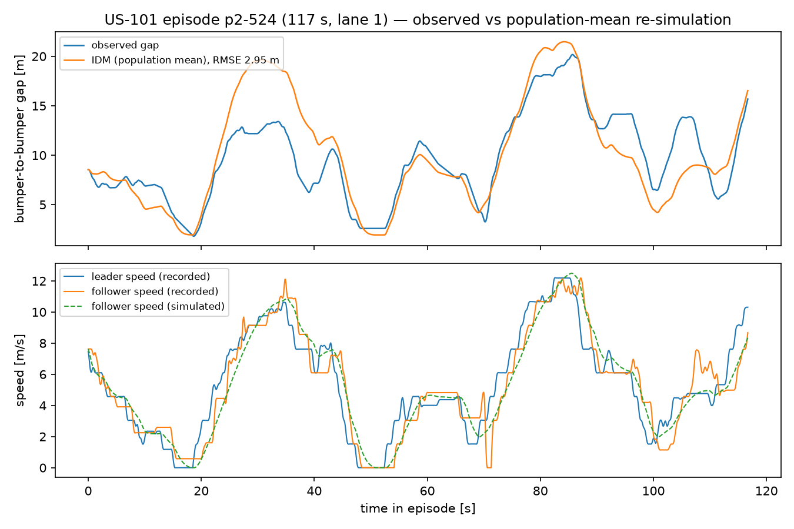
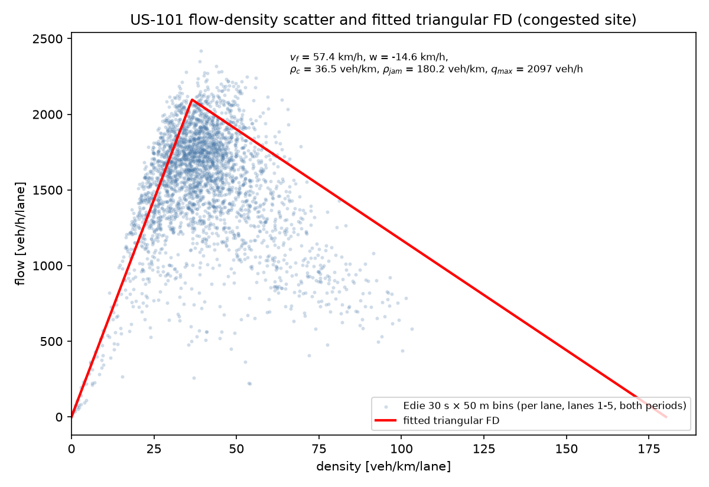
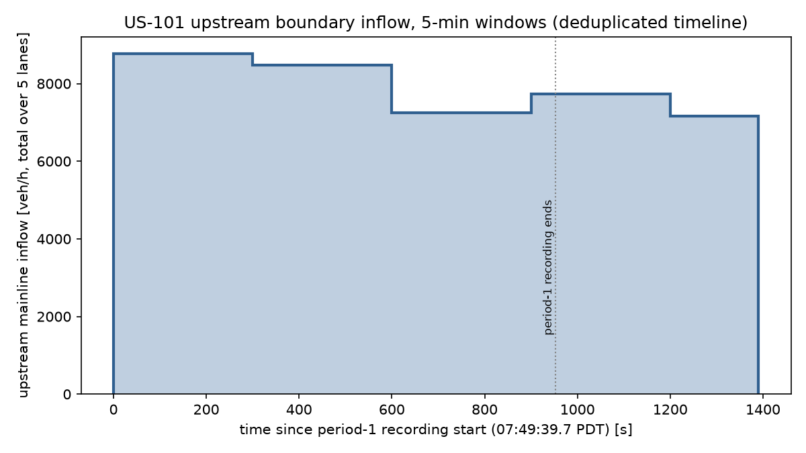

# M2 Calibration Results — NGSIM US-101

Phase-2 (M2) calibration of FlowState v2 against real public trajectory data.
Every number in this document traces to a committed artifact or a processed
summary produced by the driver scripts in `scripts/` (run order:
`extract_us101_episodes.py` → `fit_idm_us101.py`, `fit_fd_us101.py`,
`extract_demand_us101.py`, `demand_demo_corridor10k.py`,
`make_m2_figures.py`; all via `uv run --no-sync python ...` from the repo
root). Explicit seeds throughout (fits and bootstraps: seed 42).

## 1. Data

Raw NGSIM US-101 vehicle trajectories (data.transportation.gov, Socrata
resource `8ect-6jqj`, `location='us-101'`), exported ordered by
`(global_time, vehicle_id)` as `data/ngsim/us101_chunk_00..11.csv`
(12 × 200,000 rows). `us101_chunk_08.csv` was missing from the original
download and was re-fetched from the same Socrata resource with the same
query (offset 1,600,000); its boundary rows match the neighboring chunks.
Provenance hash (sha256 over the sorted chunk files' sha256s, recorded as
`data_hash` in every artifact):
`8578f4754b267ad09eed5b0b8b3e18c83b7d9036b7afdcec295d5d3f19195e22`.

Dataset facts verified during ingestion (handled in `scripts/us101_data.py`):

* **517,071 of 2,400,000 rows (21.5%) are exact duplicates** in the Socrata
  export; they are dropped, leaving 1,882,929 rows.
* The US-101 site was recorded in three 15-minute periods
  (07:50–08:05–08:20–08:35 PDT, 2005-06-15) that are **contiguous in wall
  time** — there are no `global_time` gaps between them — while
  `vehicle_id`/`frame_id` restart per period and the periods overlap by
  ~90 s of wall clock. Periods are split on the recording origin
  `global_time − frame_id·100 ms`, which is constant per period.
* **This 2.4M-row dump covers period 1 completely and only the first
  ~8.8 min of period 2; period 3 is absent.**

| period | wall clock (PDT) | rows (deduped) | vehicles |
|---|---|---|---|
| p1 | 07:49:39.7 – 08:05:32.5 (952.8 s) | 1,180,598 | 2,169 |
| p2 | 08:04:03.0 – 08:12:50.3 (527.3 s, truncated by the dump) | 702,331 | 1,130 |

The site is a ~640 m (2,100 ft) segment of southbound US-101 in Los Angeles:
5 mainline lanes (1–5), one auxiliary lane (6), on/off ramps (7/8).

## 2. Leader-follower episodes

`scripts/extract_us101_episodes.py` → `data/processed/us101_episodes.pkl`,
`us101_episode_summary.json`. Filters: follower `v_class = 2` (auto),
mainline lanes 1–5, ≥ 30 s continuous car-following at the native uniform
0.1 s frame interval, no lane change, no leader change, leader present in
the recording with known `v_Length` (bumper-to-bumper gap =
`Space_Headway − leader length`); samples with a non-positive recorded gap
(raw-NGSIM digitization junk) cut the episode rather than poisoning it.

| period | episodes | duration min/median/max [s] | total car-following time |
|---|---|---|---|
| p1 | 1,566 | 30.0 / 48.4 / 94.2 | 80,381 s (22.3 h) |
| p2 | 886 | 30.0 / 53.5 / 116.7 | 51,628 s (14.3 h) |
| **total** | **2,452** | | **36.7 h** |

## 3. IDM population calibration

`scripts/fit_idm_us101.py` → `artifacts/idm_us101.json` (created
2026-08-30T00:01:04Z). Method: the calibration package's per-episode seeded
differential evolution (gap-RMSE objective, Kesting & Treiber 2008; δ fixed
at 4), 70/30 train/holdout split (1,716 / 736 episodes), q = 0.9 RMSE trim
(172/1,716 poorly-excited fits excluded from the population statistics),
8 worker processes, 418 s wall. **All 2,452 episodes were fitted — no
longest-N subselection was needed** (per-episode fits cost ~1.3 s, well
inside the wall-clock budget).

| param | mean | sd (√cov diag) | CLAUDE.md §3.1 range | literature default |
|---|---|---|---|---|
| v0 [m/s] | 32.12 | 6.24 | 25–38 | 33.3 |
| T [s] | 1.29 | 0.45 | 0.8–2.2 | 1.4 |
| a_max [m/s²] | 1.11 | 0.40 | 0.3–1.5 | 0.73 |
| b [m/s²] | 1.69 | 0.87 | 1.0–3.0 | 1.67 |
| s0 [m] | 2.02 | 0.91 | 1.0–3.0 | 2.0 |

* **Holdout gap RMSE (population-mean parameters re-simulated on the 736
  held-out episodes): 6.44 m.** For scale, per-episode *training* fits (each
  episode with its own parameters) reach median 1.99 m / mean 2.36 m / q90
  3.96 m — the holdout number is the honest single-parameter-set
  generalization figure; the gap between the two is dominated by real driver
  heterogeneity.
* Sanity vs the §3.1 table: every population mean lies inside its
  calibration range. T, b, s0 land close to the literature defaults. a_max
  is high (1.11 vs 0.73) — raw-NGSIM speed noise rewards more aggressive
  acceleration; treat it as an upper-bias estimate. **v0 is weakly
  identified**: the site never reaches free flow, so v0's marginal (mean
  32.1, sd 6.2 across a 25–38 bound) mostly reflects the search bounds, not
  driver preference. This is expected for congested-only data and is noted
  in the artifact.
* The population sd's are broadened by episodes whose fits sit at the search
  bounds; per-vehicle draws from the artifact (truncated MVN, ±3σ per
  marginal) can therefore exceed the per-episode search ranges (e.g. a_max
  up to ~2.3 m/s²). Hard physical floors are enforced at draw time
  (`microsim.vehicles.IDM_HARD_LOWER`).

Figure: longest extracted episode (p2-524, 117 s, lane 1) — observed gap vs
re-simulation with the *population-mean* parameters (RMSE 2.95 m). The
staircase quantization of the recorded speeds is the raw-NGSIM
differentiation noise discussed in §7.

## 4. Fundamental diagram

`scripts/fit_fd_us101.py` → `artifacts/fd_us101.json` (created
2026-08-30T00:02:19Z). Observations: Edie's generalized definitions on the
trajectory field — 30 s × 50 m space-time bins per
(period, mainline lane), density = vehicle-time / bin area, flow =
vehicle-distance / bin area, at the native 0.1 s sampling weight
(`validation.fields.density_field` / `flow_field`); binning per lane yields
per-lane quantities directly. Trailing partial bins dropped; empty bins
excluded; all vehicle classes kept. 3,001 observations. Fit: package
`fit_triangular_fd` — free branch through the origin on bins with density ≤
20 veh/km/lane (explicit cut), capacity = 95th-percentile flow, congested
branch by τ = 0.9 quantile regression; 200/200 seeded bootstrap resamples
usable.

| param | estimate | 95% CI (bootstrap) |
|---|---|---|
| v_f | 57.4 km/h | (55.0, 59.9) |
| w | −14.6 km/h | (−19.0, −10.6) |
| ρ_jam | 180.2 veh/km/lane | (151.4, 231.3) |
| ρ_c | 36.5 veh/km/lane | (34.9, 38.5) |
| q_max | 2,097 veh/h/lane | (2,068, 2,130) |

Free-branch R² = 0.837.

Honest reading (also stored in the artifact notes): the site is congested
for the entire recording — only ~4% of bins fall below the free-branch cut
and the fastest observed bin speeds are ~65–70 km/h, so **v_f here is the
fastest *observed* operation, not the facility's free-flow speed** (US-101's
posted/free speed is far higher); its CI is tight only because the observed
cloud is consistent, not because free flow was sampled. The congested branch
is well populated: w = −14.6 km/h lies inside the empirical 14–22 km/h
backward wave band (§7.1), and ρ_jam's genuinely wide CI (151–231 veh/km)
reflects the long extrapolation to the density axis. Use this FD for
congested-regime screening; do not quote its v_f as a free-flow speed.

## 5. Demand

### 5.1 Observed upstream inflow (`artifacts/demand_us101.json`)

`scripts/extract_demand_us101.py`. Upstream mainline entry = first recorded
sample at `local_y ≤ 30 m` on lanes 1–5 (period-1 tracking begins < 20 m,
period-2 at ~21–26 m; on-ramp entries appear at ~150–165 m and are
deliberately excluded). Per-period 5-min tables
(`data/processed/us101_demand_summary.json`):

| window (period-relative) | p1 entries | p2 entries |
|---|---|---|
| 0–300 s | 731 | 630 |
| 300–600 s | 707 | 422 (partial window, 227.3 s) |
| 600–900 s | 593 | — |
| 900 s–end | 0 (censored, see below) | — |

NGSIM period processing censors entries near a period's end (vehicles that
cannot finish their traverse fall into the next period's id space): period 1
records its last upstream entry at wall 893.9 s although its rows run to
952.8 s, while period 2 (recording from wall 863.3 s) detects entries
steadily from ~880 s. The artifact therefore counts entries from period 1
through its last recorded entry and from period 2 strictly after that
instant; the ~2–5 s cross-period tracking offset can mis-assign on the
order of 10 vehicles (< 0.5%) at the seam. Deduplicated continuous timeline
(t = 0 at 07:49:39.7 PDT), 3,066 entries over 1,390.6 s:

| window | entries | inflow (total over 5 lanes) |
|---|---|---|
| 0–300 s | 731 | 2.437 veh/s (8,772 veh/h) |
| 300–600 s | 707 | 2.357 veh/s (8,484 veh/h) |
| 600–900 s | 604 | 2.013 veh/s (7,248 veh/h) |
| 900–1,200 s | 645 | 2.150 veh/s (7,740 veh/h) |
| 1,200–1,390.6 s (partial) | 379 | 1.988 veh/s (7,158 veh/h) |

That is ~1,430–1,750 veh/h/lane — a heavily loaded AM peak, consistent with
the congested FD.

### 5.2 Demand-fitter demonstration (`artifacts/demand_corridor10k_demo.json`)

`scripts/demand_demo_corridor10k.py`. **This artifact is a fitter
demonstration, not an observation**: "observed" counts were synthesized by
running the MACRO screening tier (`run_macro`, v1_legacy FD) on
`corridor_10km` with its own known inflow, and `calibration.demand.
fit_inflow` was started from a deliberately wrong flat 0.25 veh/s profile.
Result: convergence in 2 proportional-scaling iterations (4 macro calls
total), worst-bin GEH of the returned profile **1.36** (per-bin GEH 0.53 /
0.88 / 0.88 / 1.36 — all far under the FHWA < 5 threshold):

| step | truth | initial | fitted |
|---|---|---|---|
| t = 0 s | 0.450 | 0.250 | 0.479 |
| t = 120 s | 0.500 | 0.250 | 0.490 |
| t = 1,080 s | 0.400 | 0.250 | 0.466 |

The last step's residual (0.466 vs 0.400) sits inside a 300-s bin the GEH
criterion already accepts; the fitter stops at the criterion, as designed.

## 6. `us101_replica` scenario

`scenarios/us101_replica.yaml`: corridor, 640 m, **5 lanes** (the
`CorridorNetwork.lanes` bound was raised from ≤ 4 to ≤ 8 in
`flowstate_core.config` and docs/CONTRACTS.md §2 for this), micro tier,
seed 42, 20 replicates, 1,133 s = 180 s warmup + the 952.8 s period-1 span,
inflow = the deduplicated 5-min steps above, fleet via
`fleet.idm_calibration: artifacts/idm_us101.json`.

`fleet.idm_calibration` is now actually **consumed** by
`microsim.vehicles.draw_vehicle_params` (it previously was a schema field
only): when set, per-vehicle parameters are drawn from the artifact's
truncated multivariate normal (±3σ per marginal, hard physical floors kept)
with the run RNG, overriding the scalar fleet fields, and `meta.json`
records the artifact path + `data_hash` (unit tests in
`tests/test_microsim/test_microsim_vehicles.py::TestDrawFromCalibration`;
5-lane + calibrated-fleet SUMO integration smoke in
`tests/test_microsim/test_microsim_runner_smoke.py::TestCorridorSmoke::
test_five_lane_calibrated_fleet_smoke`).

Single-replicate smoke (seed 42, full 1,133 s): runs at ~710× realtime,
traffic on all 5 lanes, calibration provenance recorded. **Honest gap:**
SUMO realized only 1,886 of 2,592 planned insertions (~1.66 veh/s vs
2.29 veh/s planned) — the known per-edge insertion-queue throughput ceiling
(see `microsim.vehicles.write_corridor_routes` notes), not a lane-count
problem (a 2 km insertion buffer and `--eager-insert` were probed: 1.66 and
1.81 veh/s respectively). Mean post-warmup speed ≈ 68 km/h vs ~40 km/h
observed — expected, since the replica has no downstream boundary
congestion (§7). Closing the demand-realization and congestion-matching gap
via the GEH loop (§6.3 fitter, demonstrated above) is M3 scope.

## 7. Limitations

1. **Raw, not reconstructed, NGSIM.** CLAUDE.md §6.2 prefers the
   Montanino–Punzo reconstructed trajectories; this dump is the raw Socrata
   export, whose speeds are quantized/noisy differentiation artifacts
   (visible in the episode figure). The gap-based objective mitigates (gaps
   are measured, speeds only drive the leader input) but a_max in
   particular should be treated as biased high. Re-running
   `fit_idm_us101.py` on reconstructed data when available is the upgrade
   path — the loader accepts it unchanged.
2. **Congested-only site → FD free branch is data-poor.** v_f is the
   fastest observed operation, not free flow; ρ_jam is an extrapolation
   with an honestly wide CI (151–231 veh/km). The congested branch (w) is
   the trustworthy part.
3. **640 m site.** Episodes are short (median ~50 s) because vehicles
   traverse the section in under a minute — long-horizon behavior (e.g.
   v0) is under-excited. The section's congestion largely originates
   downstream of the camera range, so an inflow-only replica cannot
   reproduce the observed speeds without a downstream boundary condition
   (M3).
4. **Dump coverage.** Period 3 is absent and period 2 is truncated at
   08:12:50 by the 2.4M-row export; 21.5% duplicate rows were dropped;
   chunk 08 was re-fetched (§1).
5. **v0 weakly identified; broad covariance.** See §3 — draws from the
   artifact are physically floored but can exceed per-episode search
   ranges.
6. **Demand boundary censoring.** The period seam required a documented
   switch-over rule (§5.1, ≲0.5% mis-assignment); on-ramp inflow — 6.4% of
   period-1 vehicles and 6.0% of period-2 vehicles first appear in the
   ramp zone (lane 7 at ~150–165 m) — is excluded from the profile and
   from the replica.
7. **Replica demand realization.** SUMO's insertion throughput leaves ~27%
   of planned vehicles uninserted at this demand level (§6); M3's GEH
   calibration must either raise insertion throughput (per-lane insertion,
   `--eager-insert`, longer/parallel entry edges) or scale demand to the
   realizable boundary flow, and must add the downstream boundary.
