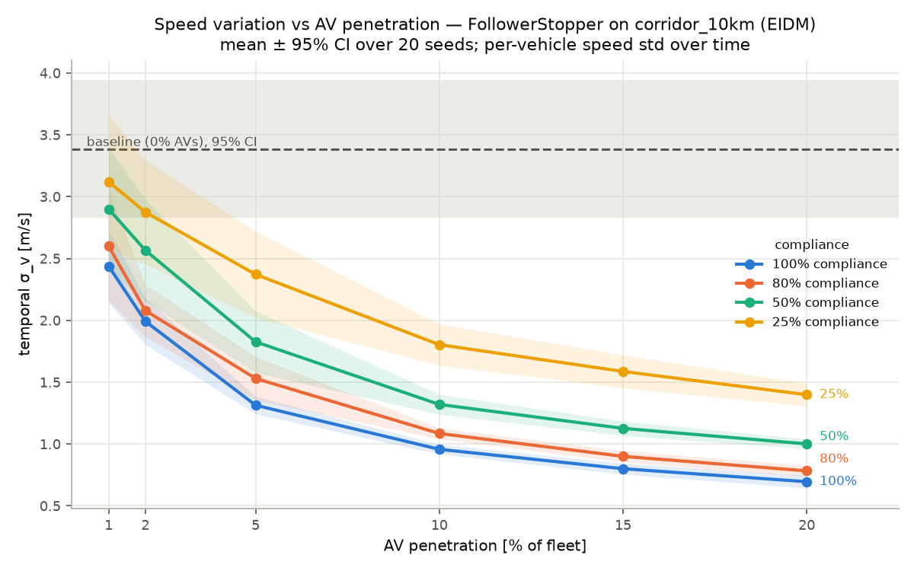
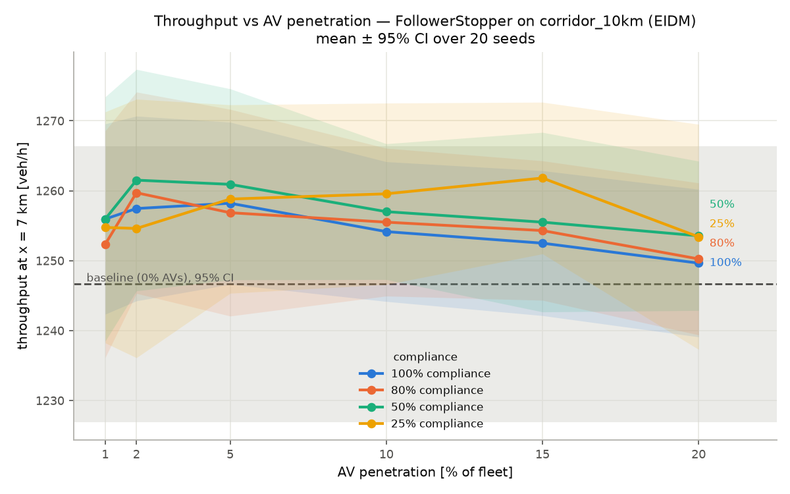
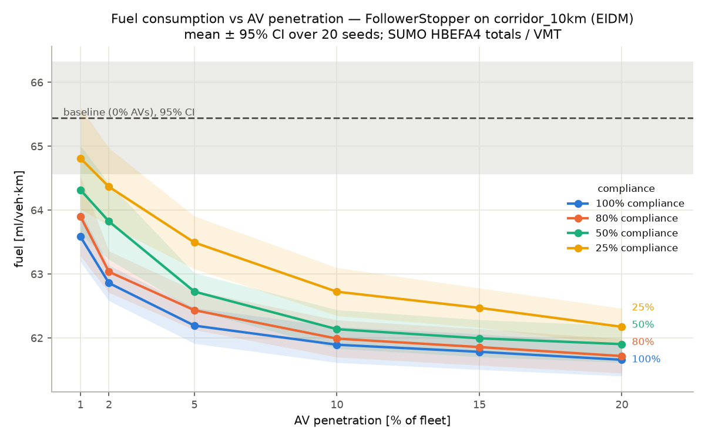
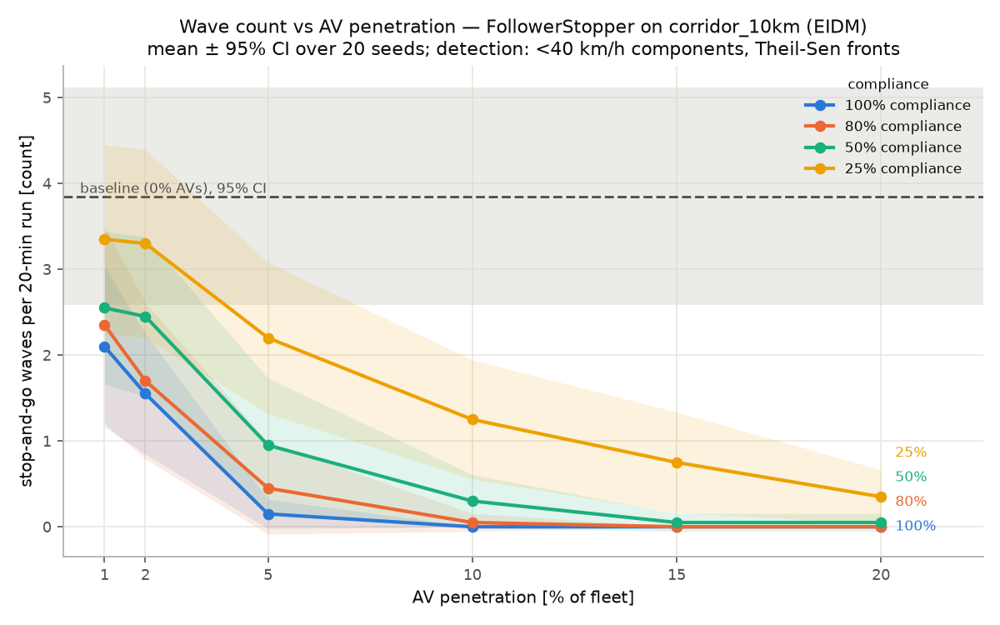
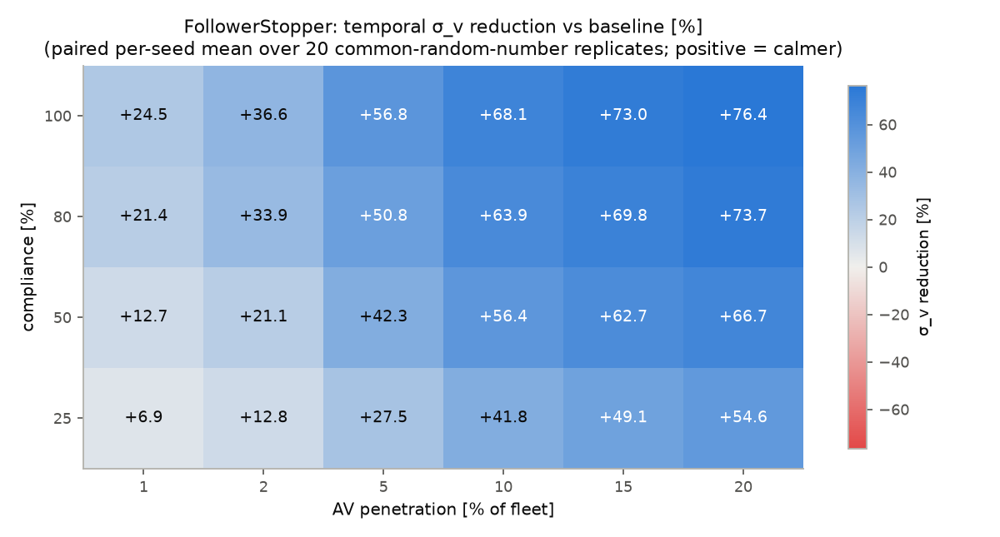
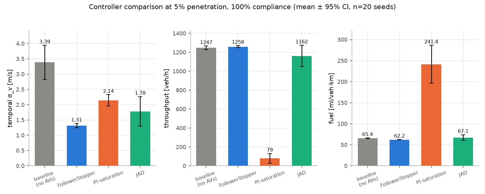
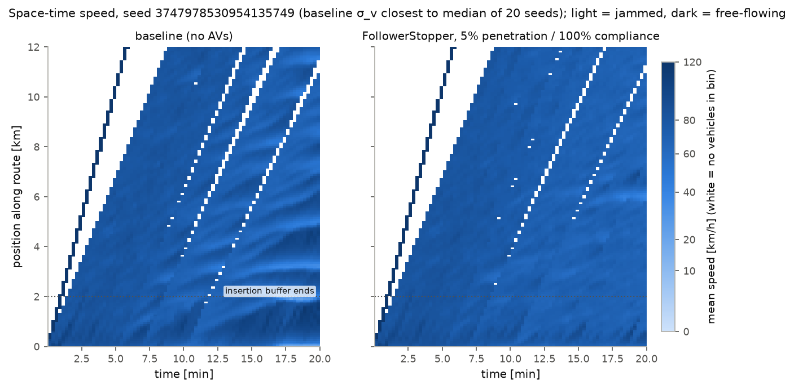

# M3 Results — Penetration × Compliance Sweep on `corridor_10km`

> **Scope disclaimer (read first).** Every number in this document comes from
> the **EIDM synthetic corridor `corridor_10km`** — a single-lane 10 km
> corridor with **screening-calibrated demand** chosen in Phase-1 tuning to
> sit at the edge of the string-unstable band. It is **not a validated real
> corridor**: the fleet uses the CLAUDE.md §3.1 default EIDM parameters with
> 15% heterogeneity (not the M2 US-101 IDM population fit), and the demand
> profile was tuned for wave emergence, not fitted to observed counts. The
> US-101 replica validation (GEH / RMSPE / wave-speed criteria against NGSIM
> data) is a **separate document**. Results here measure controller behavior
> under controlled synthetic conditions; they are not field predictions.

All values trace to `runs/m3_sweep/analysis.json`, produced by
`scripts/m3_analyze_sweep.py` from the raw run tree; the committed compact
copy (aggregates + provenance, per-seed detail dropped) is
[`artifacts/m3_sweep_summary.json`](../artifacts/m3_sweep_summary.json).
Nothing below is a free-text number (CLAUDE.md §7.4).

## 1. Experiment design

**Battery.** 27 cells × 20 replicates = **540 runs**, all micro-tier SUMO
(`eclipse-sumo` 1.27.1, libsumo), all **emergent** (`seeded=False` — waves
grow from insertion jitter alone, no perturbation block; CLAUDE.md §0.2):

| Arm | Cells |
|---|---|
| baseline | penetration 0%, no controller (1 cell) |
| FollowerStopper grid | penetration {1, 2, 5, 10, 15, 20}% × compliance {25, 50, 80, 100}% (24 cells) |
| controller comparison | `pi_saturation` and `jad` at 5% / 100% (2 cells) |

**Replication.** Master seed 42 → 20 replicate seeds via
`flowstate_core.rng.spawn_seeds`; the **same seed list is reused in every
cell** (common random numbers), so cell − baseline contrasts are paired.
Aggregates are mean ± 95% t-distribution CIs over n = 20 replicates
(`validation.aggregate`; CLAUDE.md §0.6). Paired per-seed deltas
(cell − baseline) are reported where they sharpen a claim; percent
reductions are per-seed `100·(baseline − cell)/baseline`, positive = better.

**Scenario provenance.** `scenarios/corridor_10km.yaml` as shipped: 2 km
insertion-buffer edge + 10 km single-lane main corridor (trajectory `x`
spans 0–12 km); EIDM fleet (v0 = 33.3 m/s, T = 1.4 s, a_max = 0.73 m/s²,
b = 1.67 m/s², s0 = 2.0 m, heterogeneity 15%); demand steps
1620 → 1800 → 1440 veh/h; 1200 s runs, 0.5 s step, 2 Hz output, 120 s
configured warmup. Controllers ran with registry default parameters
(`controller_params: {}`); AV compliance drawn once per run per vehicle
(Bernoulli). Versions: Python 3.12.13, numpy 2.5.2, pandas 3.0.5,
pyarrow 25.0.1, eclipse-sumo/libsumo 1.27.1, flowstate_core 2.0.0-dev.

**Sanity guards (all passed, enforced by the analysis script).** All 540
`meta.json` files parse; all 540 runs have `seeded=False` and
`tier="micro"`; every meta's config hash and seed match `MANIFEST.json`.

**Metric conventions.** `validation.metrics.compute_metrics` per run with
throughput at x = 7 000 m (mid main-corridor) and travel-time span
2 000–11 500 m; metrics cover the full recorded run including the 120 s
warmup transient (identical across cells under common random numbers).
Temporal σ_v = per-vehicle speed std over time, averaged over vehicles;
spatial σ_v = across-vehicle speed std per timestamp, averaged over time.
Travel times count only vehicles completing the span (censoring caveat in
§4.5). Wave detection: <40 km/h connected components on the 15 s × 75 m
speed field, Theil–Sen front fits.

## 2. Aggregate results, key cells

Mean [95% CI], n = 20 unless flagged. FS = FollowerStopper,
"p / c" = penetration / compliance. Full 27-cell aggregates:
`artifacts/m3_sweep_summary.json`.

| Cell | temporal σ_v [m/s] | spatial σ_v [m/s] | throughput [veh/h] | fuel [ml/veh·km] | waves [per run] | mean TT [s] |
|---|---|---|---|---|---|---|
| baseline (0% AV) | 3.39 [2.83, 3.94] | 3.50 [3.06, 3.94] | 1247 [1227, 1266] | 65.4 [64.6, 66.3] | 3.85 [2.59, 5.11] | 464 [450, 478] |
| FS 1% / 100% | 2.44 [2.14, 2.73] | 2.83 [2.56, 3.09] | 1256 [1242, 1270] | 63.6 [63.2, 64.0] | 2.10 [1.17, 3.03] | 464 [451, 477] |
| FS 2% / 100% | 1.99 [1.80, 2.18] | 2.39 [2.21, 2.58] | 1257 [1244, 1271] | 62.9 [62.6, 63.1] | 1.55 [0.85, 2.25] | 463 [451, 475] |
| FS 5% / 100% | 1.31 [1.24, 1.38] | 1.76 [1.64, 1.89] | 1258 [1247, 1270] | 62.2 [61.9, 62.5] | 0.15 [−0.02, 0.32] | 463 [451, 475] |
| FS 10% / 100% | 0.96 [0.92, 1.00] | 1.34 [1.26, 1.43] | 1254 [1244, 1264] | 61.9 [61.6, 62.2] | 0.00 [0.00, 0.00] | 465 [454, 477] |
| FS 15% / 100% | 0.80 [0.76, 0.85] | 1.15 [1.06, 1.24] | 1253 [1242, 1263] | 61.8 [61.5, 62.1] | 0.00 [0.00, 0.00] | 467 [455, 479] |
| FS 20% / 100% | 0.70 [0.64, 0.75] | 0.98 [0.89, 1.07] | 1250 [1239, 1260] | 61.7 [61.4, 61.9] | 0.00 [0.00, 0.00] | 469 [457, 481] |
| FS 5% / 25% | 2.37 [2.02, 2.72] | 2.75 [2.44, 3.06] | 1259 [1245, 1272] | 63.5 [63.1, 63.9] | 2.20 [1.32, 3.08] | 462 [450, 474] |
| FS 5% / 50% | 1.83 [1.58, 2.07] | 2.27 [2.04, 2.50] | 1261 [1247, 1275] | 62.7 [62.4, 63.0] | 0.95 [0.17, 1.73] | 462 [450, 474] |
| FS 5% / 80% | 1.53 [1.35, 1.71] | 2.00 [1.79, 2.21] | 1257 [1242, 1272] | 62.4 [62.1, 62.7] | 0.45 [−0.09, 0.99] | 463 [450, 475] |
| PI-sat 5% / 100% | 2.14 [1.96, 2.33] | 2.11 [1.93, 2.29] | **79 [29, 130]** | **241.4 [196.4, 286.5]** | 2.25 [1.75, 2.75] | 364 [346, 382] † |
| JAD 5% / 100% | 1.78 [1.30, 2.26] | 1.82 [1.65, 2.00] | 1162 [1050, 1274] | 67.1 [60.5, 73.8] | 2.10 [0.12, 4.08] | 463 [452, 475] |

† Survivor-biased: in PI-saturation runs only a handful of vehicles complete
the measurement span before the corridor grid-locks (§4.5), so its mean TT
is conditional on the few early finishers and is **not** comparable.

Baseline wave properties: amplitude 15.27 [14.50, 16.04] m/s (n = 17 —
3 replicates had no detected wave), backward front speed
8.2 [7.0, 9.4] km/h (n = 15; flagged **underpowered**, and below the
14–22 km/h empirical criterion band — see §4.6).

## 3. Figures

Print figures generated by `scripts/m3_analyze_sweep.py` from
`analysis.json`; CI bands/whiskers are 95% t-intervals over 20 seeds.

**(a) Temporal σ_v vs penetration, per compliance.**



**(b) Throughput vs penetration, per compliance.**



**(c) Fuel per vehicle-km vs penetration, per compliance.**



**(d) Wave count vs penetration, per compliance.**



**(e) Penetration × compliance matrix of paired temporal σ_v reduction [%].**



**(f) Controller comparison at 5% / 100% (σ_v, throughput, fuel).**



**(g) Space-time speed, baseline vs FS 5% / 100%, same seed.** Seed chosen
deterministically as the one whose baseline σ_v is closest to the 20-seed
median (seed 3747978530954135749) — representative, not cherry-picked. The
dark 120 km/h front at the left of each panel is the first platoon entering
the empty corridor; white bins hold no vehicles.



## 4. Findings

### 4.1 Penetration dose-response is monotone with diminishing returns

At 100% compliance, paired temporal σ_v reduction vs baseline climbs
+24.5% → +36.6% → +56.8% → +68.1% → +73.0% → +76.4% across penetrations
1 → 20% (every CI well clear of zero; figure e). The marginal benefit per
added AV shrinks steadily: the first 1% of the fleet buys ~25%, the last
5% (15 → 20%) buys ~3 points. Detected stop-and-go waves go from 3.85 per
baseline run to 0.15 at 5% / 100% and to **zero in all 20 replicates** at
10–20% / 100% and 15–20% / 80% (10% / 80% and 15–20% / 50% each retain a
single 1-wave replicate). The
space-time pair (figure g) shows the mechanism at 5%: the braided
backward-drifting slow bands upstream of x ≈ 8 km are gone; residual
speed structure remains but no longer organizes into waves.

### 4.2 1–2% penetration already measurably dampens

Yes — with paired 95% CIs excluding zero in **all eight** low-penetration
cells for temporal σ_v:

| Cell | σ_v reduction [%] | wave-count delta [per run] |
|---|---|---|
| 1% / 25% | +6.9 [+0.9, +12.9] | −0.50 [−1.10, +0.10] |
| 1% / 50% | +12.7 [+6.0, +19.5] | −1.30 [−2.27, −0.33] |
| 1% / 80% | +21.4 [+14.7, +28.0] | −1.50 [−2.63, −0.37] |
| 1% / 100% | +24.5 [+17.7, +31.4] | −1.75 [−2.83, −0.67] |
| 2% / 25% | +12.8 [+6.2, +19.5] | −0.55 [−1.55, +0.45] |
| 2% / 50% | +21.1 [+12.3, +29.9] | −1.40 [−2.53, −0.27] |
| 2% / 80% | +33.9 [+25.5, +42.3] | −2.15 [−3.40, −0.90] |
| 2% / 100% | +36.6 [+28.5, +44.7] | −2.30 [−3.41, −1.19] |

Even 1% / 25% (≈ 0.25% of the fleet actually complying, ~1–2 vehicles) is
a small but resolvable σ_v effect; its wave-count reduction, however, is
**not** resolvable (CI straddles zero), and the same holds at 2% / 25%.
Fuel is already significantly down at 1% / 25% (+0.95% [+0.21, +1.68]
paired reduction). This is consistent with the Stern et al. (2018) /
CIRCLES sparse-control premise — on this synthetic corridor.

### 4.3 Compliance is roughly interchangeable with penetration

Reductions collapse approximately onto the product penetration ×
compliance (the complied share of the fleet): 1% / 100% (+24.5), 2% / 50%
(+21.1) and ~1% complied each; 2% / 100% (+36.6) vs 5% / 50% (+42.3) vs
10% / 25% (+41.8) at 2–2.5% complied. No compliance level poisons the
effect — dropping 100% → 25% compliance at fixed penetration roughly
quarters the effective dose rather than qualitatively changing behavior.
Practically: half the compliance ≈ needing double the penetration.

### 4.4 Throughput is not paid for it; fuel improves

Throughput never significantly changes in the FollowerStopper grid: paired
deltas are small and positive at low-mid penetration (+11.6 veh/h
[−1.3, +24.4] at 5% / 100%) and shrink toward zero at 20% (+3.0
[−8.2, +14.2]) — the corridor is inflow-limited, and calming does not choke
it. Fuel per vehicle-km falls monotonically with dose: −2.8% [−3.8, −1.7]
paired at 1% / 100% up to −5.7% [−7.2, −4.2] at 20% / 100%, tracking wave
elimination.

### 4.5 Controller ranking at 5% / 100%: FS > JAD ≫ PI-saturation (which fails outright)

* **FollowerStopper** dominates every metric: σ_v 1.31 [1.24, 1.38] m/s,
  throughput preserved, fuel best-in-battery, waves 0.15/run.
* **JAD** is second on the means (σ_v 1.78 [1.30, 2.26], +42.7%
  [+24.5, +60.9] paired reduction) but **bimodal**: 15/20 replicates end
  fully calmed (0 waves, σ_v ≈ 1.0–1.5 m/s), one lands in between (1 wave),
  and 4/20 end with **9–12 waves and σ_v 3.4–4.1 m/s** — as bad as or worse
  than baseline. Its
  slow-in maneuvers can themselves seed secondary waves when the intercept
  timing goes wrong; the wide wave-count CI (2.10 [0.12, 4.08]) is this
  bimodality, not noise. Throughput −85 veh/h [−194, +24] and fuel −2.5%
  [−11.8, +6.9] paired are both unresolved. Note JAD ran with its
  **perfect wave oracle** only; the CLAUDE.md §4.3 noisy-oracle companion
  result is not part of this battery (§5).
* **PI-saturation is a failure, reported as-is**: mean throughput
  **79 veh/h [29, 130]** vs baseline 1247 — a 94% collapse (paired delta
  −1167 veh/h [−1220, −1114]) — with fuel 241 [196, 286] ml/veh·km.
  Inspection of a replicate confirms genuine gridlock, not a metrics
  artifact: by t > 900 s, 99.6% of vehicles are stopped (mean speed
  0.15 m/s) and 5 of 582 planned vehicles complete the corridor. The
  mechanism is structural: with registry defaults the controller commands
  `v_target = 0.75 · v̄_platoon` from a rolling window — on an open corridor
  this is positive feedback (each slowdown lowers the next target), and at
  5% penetration the fleet spirals to standstill. The M1 gains were tuned
  on the ring scenario, where a fixed equilibrium exists. Its apparent σ_v
  "improvement" (+27.8% paired) is an artifact of everyone standing still
  and must not be read as calming. **Do not deploy `pi_saturation` on open
  corridors with default parameters**; it needs an absolute reference-speed
  floor or corridor-specific retuning before it can be compared fairly.

### 4.6 Non-monotonicity and surprises, as observed

* **Throughput vs penetration is non-monotone** at 100% compliance: it
  peaks around 2–5% (≈1257–1258 veh/h) and drifts back down to 1250 at 20%.
  All movements are within CI widths; treat the shape, not the individual
  bumps, as the observation.
* **Very high penetration slightly slows travel**: paired mean travel time
  at 20% / 100% is +5.0 s [+0.8, +9.1] vs baseline — the only cell with a
  resolved TT increase. Fully-damped traffic pays a small speed cost for
  FollowerStopper's conservative gaps.
* **Baseline emergent wave speed is 8.2 [7.0, 9.4] km/h — below the
  14–22 km/h empirical band** of CLAUDE.md §7.1 (and n = 15/20 replicates
  produced a measurable backward front, so the CI is flagged underpowered).
  The synthetic corridor's waves drift backward more slowly than real-world
  stop-and-go; this criterion cannot be claimed as met here and is deferred
  to the US-101 validation document.
* **Wave-speed CIs degrade with dose** by construction: cells that
  eliminate waves have nothing to fit (n = 2 at FS 5% / 100%, n = 0 at
  20% / 100%). These are reported with their n and underpowered flags in
  the JSON artifacts, never as headline values.
* 25%-compliance throughput shows a stray bump at 15% penetration
  (1262 veh/h, figure b); its CI overlaps every neighbor — noise until
  shown otherwise.

## 5. Limitations

1. **Synthetic corridor, screening-calibrated demand.** Everything here is
   `corridor_10km` (EIDM defaults + 15% heterogeneity, demand tuned in
   Phase 1 for wave emergence at the edge of the unstable band). No claim
   transfers to any real corridor; the US-101 replica validation is a
   separate document with its own criteria table.
2. **Wave-speed criterion unmet** on this corridor (§4.6) — 8.2 km/h vs
   the 14–22 km/h empirical band.
3. **JAD perfect oracle only.** CLAUDE.md §4.3 requires headline JAD
   results to also be reported under a delayed/noisy oracle; that arm was
   not part of this battery and JAD's numbers here are its best case.
4. **PI-saturation defaults are ring-tuned**; its failure here is a
   deployment-configuration finding, not proof the controller class cannot
   work on corridors.
5. **Metrics cover the full 1200 s including the 120 s configured warmup**
   (the contract `compute_metrics` API consumes whole runs). Common random
   numbers make the transient identical across cells, so paired contrasts
   are unaffected; absolute levels include it.
6. **Travel-time censoring**: only vehicles completing the 2.0–11.5 km span
   count. Negligible for free-flowing cells; fatal for PI-saturation
   (marked in §2) — its TT is survivor-biased and excluded from ranking.
7. Single-lane corridor: no lane-changing, no overtaking of slow AVs —
   compliance effects may differ with escape lanes.

## 6. Reproduction

```bash
# 540-run battery (≈8 min wall on 6 procs) — writes runs/m3_sweep/ + MANIFEST.json
M3_PROCS=6 uv run --no-sync python scripts/m3_sweep.py

# analysis + committed summary + all figures in this document
M3_PROCS=6 uv run --no-sync python scripts/m3_analyze_sweep.py
```

Cell config hashes (from `MANIFEST.json`, recorded per run in every
`meta.json`; scenario master seed 42):

| Cell | Hash | Cell | Hash |
|---|---|---|---|
| baseline | `15b25e59e60e` | FS 10% / 25% | `961e3d177c38` |
| FS 1% / 25% | `83916d4b72d6` | FS 10% / 50% | `338bcc5933bd` |
| FS 1% / 50% | `18f895082db0` | FS 10% / 80% | `5f4e428cae74` |
| FS 1% / 80% | `e7ca46a04a93` | FS 10% / 100% | `7d068593cfc7` |
| FS 1% / 100% | `dad0746f00e8` | FS 15% / 25% | `a8cc55f8e0d7` |
| FS 2% / 25% | `70db38eda399` | FS 15% / 50% | `447b3ddde0e9` |
| FS 2% / 50% | `d84e4aae71d0` | FS 15% / 80% | `4c89477d5380` |
| FS 2% / 80% | `afa337723644` | FS 15% / 100% | `3d84c2a37ff0` |
| FS 2% / 100% | `4c5b2d92b9ce` | FS 20% / 25% | `878f3cca79bb` |
| FS 5% / 25% | `a06b70fabc72` | FS 20% / 50% | `2bf98cee05c9` |
| FS 5% / 50% | `57acc9e526f0` | FS 20% / 80% | `c3d676f2d984` |
| FS 5% / 80% | `2597286a8b69` | FS 20% / 100% | `623b0fcd1a62` |
| FS 5% / 100% | `0edfc7b4a4fa` | PI-sat 5% / 100% | `0bf4573cec33` |
| JAD 5% / 100% | `7211f10e65e2` | | |
