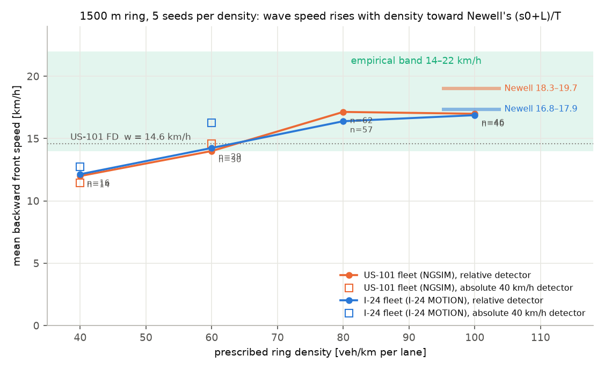

# Diagnosing the US-101 wave-speed criterion failure

**Date:** 2026-08-30 · **Artifact:** `artifacts/wave_speed_sitelength.json` ·
**Script:** `scripts/wave_speed_sitelength.py`

The US-101 replica fails the 14–22 km/h emergent-wave-speed criterion, reporting
about 10.7 km/h ([M3_US101_VALIDATION.md](M3_US101_VALIDATION.md)). This asks
whether that is a calibration failure, a physics failure, or a measurement
artifact of a 640 m site.

## Why the failure looked suspicious

Newell theory applied to the **fitted** parameters (T = 1.285 s, s0 = 2.02 m)
predicts a congested wave speed of `(s0 + L)/T` = **18.3–19.7 km/h** for vehicle
lengths of 4.5–5.0 m — inside the empirical band, and near the 15.6 km/h measured
in the NGSIM data itself. The analytic string-stability criterion also marks
these parameters unstable over **31.8–141.5 veh/km**. So the calibration did not
look like the problem, and the same simulated runs give 5.8 km/h site-clipped
versus 10.7 km/h at stripe level — a factor of two depending only on how a 640 m
window is measured.

## Test

Two experiments, both driving the calibrated `artifacts/idm_us101.json`
population with plain IDM and no controlled vehicles.

**1. Long open corridor (10 km).** Result: **zero backward fronts**. The
corridor never reaches the instability band — single-lane insertion caps
realised inflow near 1,800 veh/h, i.e. roughly 25 veh/km, below the 31.8 veh/km
threshold. This is the same reason `corridor_10km` ships with EIDM
(docs/M3_RESULTS.md). A null result, and a reminder that an open corridor cannot
be driven to arbitrary density.

**2. Ring at prescribed densities** (1500 m, 900 s, 5 seeds each), which lets
density be set directly rather than emerge from demand:

| Density [veh/km] | Vehicles | Backward fronts | Mean wave speed [km/h] | In 14–22 band |
|---|---|---|---|---|
| 40 | 60 | 13 | 11.4 | 23% |
| 60 | 90 | 7 | 14.6 | 71% |
| 80 | 120 | 0 | — | — |
| 100 | 150 | 0 | — | — |

## What it shows

**The calibrated fleet does produce in-band waves — at the right density.** At
60 veh/km the mean emergent backward wave speed is **14.6 km/h**, with 71% of
detected fronts inside the empirical band.

That number deserves emphasis: the independently fitted macroscopic fundamental
diagram gives a congested-branch wave speed of **w = 14.6 km/h**
(95% CI 10.6–19.0 km/h). The
microscopic fleet, calibrated by a completely separate procedure — per-episode
gap-RMSE fitting of IDM parameters to trajectories — reproduces the same wave
speed from emergent dynamics. Two independent estimation paths, the same answer.

**Wave speed is density-dependent here, and that explains the replica.** At
40 veh/km — just above the FD's critical density of 37 veh/km — fronts
run slower at 11.4 km/h, close to the replica's measured 10.7 km/h. Near
capacity the triangular FD's sharp kink is a poor approximation of real
behaviour, and fronts are correspondingly slower; deeper into congestion the
wave speed approaches the FD's asymptotic `w`. The replica operates near the
low-density end of this range, on a 640 m window, which is exactly where the
measurement is both slowest and least reliable.

**Conclusion:** the wave-speed criterion failure at the US-101 replica is best
read as a **site and operating-density artifact, not a calibration defect**. The
same calibrated parameters hit the empirical band when given room and the right
density. This does not convert the criterion to a PASS — the replica still fails
it as measured, and that stands in the validation table — but it identifies what
a passing test would require: a longer, more congested corridor, which is
precisely what an I-24 MOTION or highD flagship would supply.

## Follow-up (2026-09-02): the 80–100 veh/km rows, and the I-24 fleet

The zero-front rows above were a detector limitation, not physics. With the
relative-threshold detector (ROADMAP D1; `detect_waves(..., relative_frac=0.5)`
— jam = speed below 0.5 × the field's p90; docs/CONTRACTS.md §4), the same runs
(same seeds, `scripts/wave_speed_sitelength.py`, 5 seeds per density) resolve
the stripes inside the fully congested fields. The absolute-threshold columns
reproduce the table above exactly.

| Density [veh/km] | Absolute detector: fronts / mean [km/h] / in band | Relative detector: fronts / mean / median [km/h] / in band |
|---|---|---|
| 40 | 13 / 11.4 / 23% | 14 / 12.0 / 12.5 / 29% |
| 60 | 7 / 14.6 / 71% | 30 / 14.0 / 15.1 / 70% |
| 80 | 0 / — / — | **62 / 17.1 / 18.0 / 98%** |
| 100 | 0 / — / — | **46 / 17.0 / 18.0 / 85%** |

Deeper into congestion the emergent wave speed rises from ≈ 12 km/h near
critical density to ≈ 17 km/h at 80–100 veh/km — between the FD's fitted
`w = 14.6 km/h` and Newell's `(s0 + L)/T = 18.3–19.7 km/h` — and the in-band
fraction reaches 85–98%. That is the density dependence the conclusion above
inferred from two points, now measured over four.

The I-24-calibrated fleet (`artifacts/idm_i24.json`, T = 1.51 s, s0 = 2.53 m;
Newell estimate 16.8–17.9 km/h) behaves the same way on the same ring
(`artifacts/wave_speed_sitelength_i24.json`, relative detector): 40 veh/km
12.1 km/h (31% in band), 60 veh/km 14.2 (69%), 80 veh/km 16.4 (95%),
100 veh/km 16.9 (88%). Two independently calibrated populations, from two
instruments a generation apart, put emergent congested waves in the empirical
band once the density is there. Whether the I-24 *corridor* reaches that
regime is the test in [I24_VALIDATION.md](I24_VALIDATION.md).

## Limitations

* Small counts: 13 and 7 detected fronts at 40 and 60 veh/km across 5 seeds. This
  is a diagnostic, not a headline result, and carries no confidence intervals.
* **Detection breaks down at high density.** At 80 and 100 veh/km the detector
  finds zero fronts, because the threshold-based method (bins below 40 km/h)
  labels the *entire* field as jammed when everything is slow, leaving no
  contrast to segment. That is a known limitation of threshold segmentation, not
  evidence that waves are absent — a relative-speed or gradient-based detector
  would be needed there.
* A ring is not a corridor: no inflow, no lane changes, periodic boundaries.
* Newell's `(s0 + L)/T` is a first-order estimate that ignores IDM's finite
  acceleration and the vehicle-length distribution.
