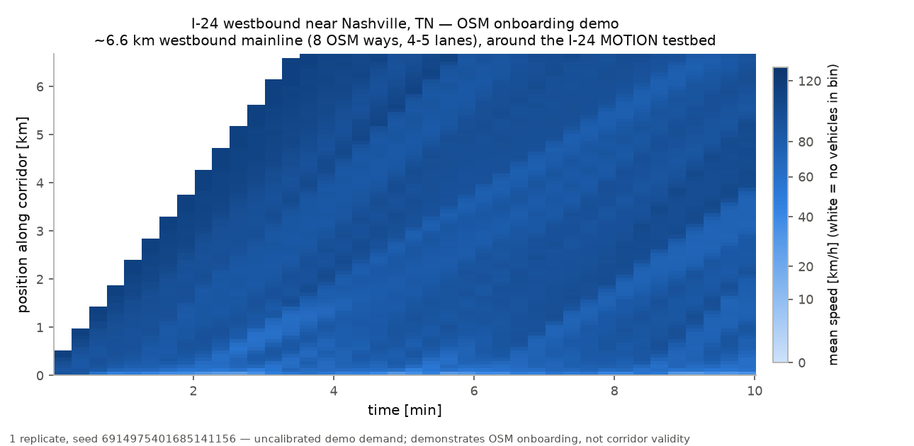
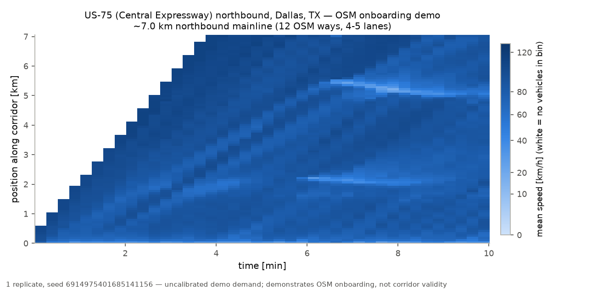

# Demo corridor gallery (M5)

Two real corridors onboarded through the `osm_generic` "any city" pipeline
(CLAUDE.md §3.2.4): OSM bbox → motorway-only Overpass extract → `netconvert`
import (`microsim.networks.osm_import`) → mainline corridor chain → runnable
SUMO scenario → space-time speed heatmap. End to end, each corridor took
minutes of compute (the single 600 s replicate runs at 240–360× realtime on a
laptop).

**What this demonstrates:** that an arbitrary freeway corridor can go from an
OSM bounding box to a runnable, calibrated-fleet micro simulation in minutes —
the onboarding path a corridor study starts from.

**What it does NOT claim:** calibrated validity. Demand is uncalibrated
(a flat, plausible-order-of-magnitude load), the fleet comes from the US-101
IDM population fit (a different site, with the raw-NGSIM caveats of
docs/M2_RESULTS.md §7), ramps and frontage roads are pruned away so real
merge bottlenecks are absent, and each corridor ran a single replicate — no
CIs, no quantitative claims. Validating a corridor is the M2/M3 workflow
(FD + IDM + demand calibration against observed data, then the FHWA-style
criteria table); this gallery is the step before that work, not a substitute
for it.

## I-24 westbound near Nashville, TN

Bbox (36.00, −86.65) – (36.09, −86.55), around the I-24 MOTION testbed miles
southeast of Nashville — the corridor the future `i24_replica` validation
flagship will model. Westbound mainline chain: 8 OSM ways, ~6.6 km, 4–5
lanes. Demo demand 4,500 veh/h total; 747/750 planned vehicles inserted;
single replicate, seed spawned from master seed 42 (config hash
`7529e2b0dd63`).



The corridor free-flows at this demand (as it should — there is no downstream
constraint and no merge traffic); the visible structure is the first platoon
filling the empty network and mild speed variation from the calibrated
heterogeneous fleet.

## US-75 (Central Expressway) northbound, Dallas, TX

Bbox (32.80, −96.79) – (32.87, −96.74), north of downtown Dallas. Northbound
mainline chain: 12 OSM ways, ~7.0 km, 4–5 lanes. Demo demand 4,000 veh/h
total; 666/666 planned vehicles inserted; single replicate, same master seed
(config hash `f8c6011feb3e`).



Mostly free-flowing, with localized slow bands just upstream of x = 2.23 km
and x = 5.50 km — exactly where the imported geometry drops from 5 to 4
lanes (verified against the compiled net). Real network features producing
plausible bottleneck behavior — but remember: uncalibrated demand, no ramps,
one seed.

## Reproduction

```bash
# 1. fetch the motorway-only OSM extracts (Overpass; query recorded in the script)
uv run --no-sync python scripts/fetch_gallery_osm.py

# 2. run one replicate of either corridor (writes runs/gallery/<hash>/<seed>/)
uv run --no-sync python -c "
from flowstate_core.rng import spawn_seeds
from microsim.scenarios import load_scenario, run_scenario
cfg = load_scenario('scenarios/gallery_i24_nashville.yaml')
run_scenario('scenarios/gallery_i24_nashville.yaml', 'runs/gallery', spawn_seeds(cfg.seed, 1)[0])
"
```

The heatmaps are `validation.fields.speed_field` (15 s × 75 m bins) over each
run's `trajectories.parquet`, in the same style as the M3 figures.

Notes from making this work (both fixed, both honest):

* `osm_import` pruning previously broke on real motorway extracts: edge ids
  in a compiled net are post-`--geometry.remove` ids that can span several
  raw OSM ways, so pruning by them at load time silently shortened or
  disconnected the corridor (I-24) or failed outright when the join stage
  renamed a kept edge (US-75). Fixed minimally in
  `microsim/networks.py`: corridor edges are named at raw-way granularity
  and pinned through the join with
  `--geometry.remove.keep-edges.explicit`; the network test battery stays
  green.
* On macOS arm64, libsumo's bundled libarrow can livelock pyarrow's
  mimalloc pool at artifact-write time. Workaround:
  `ARROW_DEFAULT_MEMORY_POOL=system` in the environment before running.
