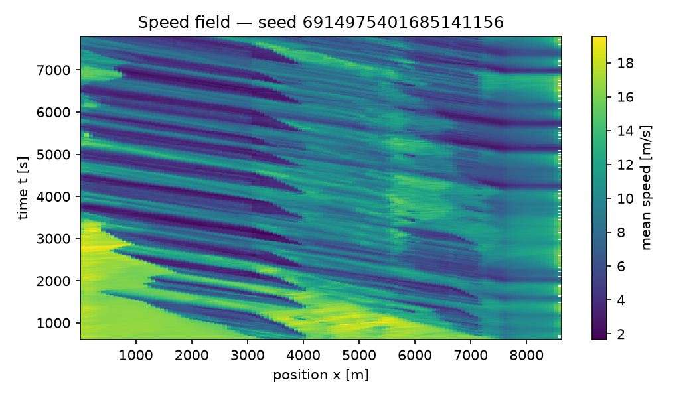
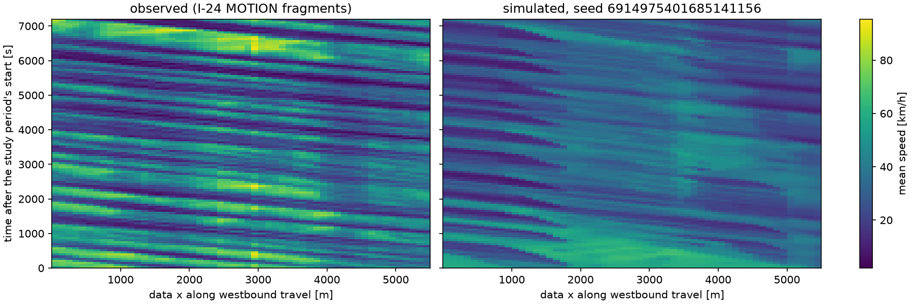

# FlowState auto-report, regenerated: e13_i24_b5 (scenarios/i24_replica_flow_rcs_speedcal_dc_refit_b5.yaml)

Generated: 2026-10-08T17:16:25Z by `scripts/regenerate_report.py` (stage `p22_reports`, code `f0551e7a873c4a84bf22cd3eb79a1b48a7d91b8a`).

## Provenance

figures from replicate 6914975401685141156; tables from artifacts/i24_validation_p15_b5.json

The figure replicate reproduces the battery's replicate 6914975401685141156: ramps, demand_realized_fraction, n_collisions are identical to the battery's record of that seed.

| Item | Value |
|---|---|
| battery artifact | `artifacts/i24_validation_p15_b5.json`, sha256 `a437997dc764` |
| battery written | 2026-10-08T08:35:47Z |
| scenario | `scenarios/i24_replica_flow_rcs_speedcal_dc_refit_b5.yaml`, sha256 `f3a51cb0343b` |
| replicates (battery) | n = 20 distinct seeds |
| criteria profile | fhwa_default — FlowState default profile (CLAUDE.md §7.1). GEH < 5 for >= 85% of link-hour comparisons transcribes the 'GEH Statistic < 5 for Individual Link Flows: > 85% of cases' row of the Wisconsin DOT freeway model calibration criteria table (captioned 'Table 4' on the HTML edition) in §5.6 'Calibration Targets' of the FHWA Traffic Analysis Toolbox Vol. III, 2004 (FHWA-HRT-04-040), verified 2026-09-03 at https://ops.fhwa.dot.gov/trafficanalysistools/tat_vol3/sect5.htm; the source says '> 85%' where this profile, like CLAUDE.md, uses '>= 85%' (geh_pass_inclusive=True). The 2019 update (FHWA-HOP-18-036) Chapter 5, verified the same day at https://ops.fhwa.dot.gov/publications/fhwahop18036/chapter5.htm, prescribes no GEH or 85% target (it builds data-driven variation envelopes, Criteria I-IV) and says the analyst need not calibrate multiple random-seed runs; the citation of FHWA-HOP-18-036 for the GEH wording elsewhere in this repository is therefore a citation of the toolbox lineage, not of the 2019 text. The segment-speed RMSPE <= 15% bound is FlowState's own convention (CLAUDE.md §7.1, 'common microsim practice'); the 14-22 km/h emergent backward wave-speed band is the empirical stop-and-go literature value (flowstate_core.constants.WAVE_SPEED_BAND_KMH); the ring emergence/dampening rows reproduce Sugiyama et al. (2008) and Stern et al. (2018) per CLAUDE.md §3.2.1; min_seeds = 20 and the penetration {1,2,5,10,15,20}% x compliance {25,50,80,100}% grid are CLAUDE.md §0.6/§7.1 internal standards; so is the no_collisions model-integrity row (zero SUMO collisions in every run, each run recording the counter; CLAUDE.md §3.3 and the owner decision of 2026-10-04) and the no_locks row (no run locked: no queue standing without discharge for the validation.locks duration; docs/I94_COLLAPSE_DIAGNOSIS.md, 2026-10-07), both present in every profile. None of these is prescribed by the cited DOT/FHWA documents. The wave-speed row is measured with the profile's wave_detector (validation.waves.WAVE_DETECTORS; default 'stack', chosen on the planted-stripe benchmark in validation.waves), and the evaluated row names that detector and its parameters. |
| config hash, battery | `ef355b83cc00` (policy v4) |
| config hash, figure replicate | `ef355b83cc00` (policy v4) |
| figure replicate | `runs/p22/e13_i24_b5/ef355b83cc00/6914975401685141156`; seed 6914975401685141156; wall time 451.8 s |

Seeds of the battery: 6914975401685141156, 134183728835869882, 2378473973028931053, 3747978530954135749, 677105600768189526, 661281422688282993, 3011106312394044631, 6953598295321596746, 165503670820534583, 6134032994440706937, 8557154790156791364, 6538422657834023852, 6904272788004776631, 6143473282319009404, 3944094060050347669, 4910985839736976611, 7382187975121682178, 5690692725577505498, 887972120279483394, 8026499204807041784.

### What comes from where

| Part of this report | Source |
|---|---|
| acceptance criteria, metric intervals, model integrity, observed data, notes | `artifacts/i24_validation_p15_b5.json`: all 20 replicates of the battery |
| speed-contour figures | replicate 6914975401685141156 re-run with its trajectories by stage `p22_reports` (code `f0551e7a873c4a84bf22cd3eb79a1b48a7d91b8a`) |
| calibration artifacts | the figure replicate's metadata (the configuration fixes them) |

### Package versions (battery)

- eclipse-sumo: `1.27.1`
- flowstate_core: `2.0.0`
- libsumo: `1.27.1`
- microsim: `2.0.0`
- numpy: `2.5.2`
- pandas: `3.0.5`
- pyarrow: `25.0.1`
- python: `3.12.15`

### Calibration artifacts used

| Artifact | data_hash |
|---|---|
| `artifacts/idm_i24_capacity_amax_k1.0.json` | `aa97dd93d2bf250ea23c3624f91afe8d7035a672fd13efbd53013709e12c7d56` |

Read from the figure replicate's metadata: the configuration, the same as the battery's, fixes them.

### Observed data

| Field | Value |
|---|---|
| recording data hash | aa97dd93d2bf250ea23c3624f91afe8d7035a672fd13efbd53013709e12c7d56 |
| study period | 06:30-08:30 CST |
| measured span (data x) [m] | 0–5492 |
| link-flow sections (data x) [m] | 200, 1000, 2200, 3200, 4800, 5400 |
| window [s] | 300 |
| windows | 24 |
| speed segments | 10 |
| fragments | 301180 |
| coverage estimator | artifacts/i24_coverage.json: max(section_gap_mixture, capacity_bound_fd) (pooled.recommended_filled per 900 s window) |

## Model integrity

What the battery artifact records about the simulation itself misbehaving, pooled over its
replicates as the battery read them from every run's metadata. A collision or a lock is a model
defect, not a traffic outcome; a count the battery did not record is reported as not recorded,
never as zero.

- Collisions: 0 over 20 run(s) that record the counter; per run 0 [0, 0] (two-sided 95 % t-interval, n = 20); 0 per 1,000 departed vehicles (0 over 311067 departed in 20 run(s), whole runs including warm-up).
- Locks: 0 of 20 run(s) locked (0 %; 95 % Clopper–Pearson interval 0–16.8 %). A lock is a queue standing with no discharge past a point for at least 10 min.
- Insertion: 0.967 of the planned vehicles departed on average over 20 run(s), lowest 0.959 (departed over planned, per run).

## Acceptance criteria

| Criterion | Value | Threshold | Evaluated | Result |
|---|---|---|---|---|
| link_flows_geh | 0.3125 | GEH < 5 for >= 85% of link-hour comparisons | yes | FAIL — fraction of comparisons with GEH < 5 |
| speeds_rmspe | 0.3599 | segment-speed RMSPE <= 15% | yes | FAIL |
| wave_speed | NaN | backward wave speed in [14, 22] km/h (emergent, unseeded) | yes | FAIL — detector: stack: slant-stack peak of the two-way demeaned field on 15 s x 75 m bins over front speeds [-40, -2] km/h in 0.25 km/h steps, peak/median contrast >= 3, edge peaks rejected; no backward wave detected |
| ring_emergence | 1 | Sugiyama ring emergence benchmark reproduced | yes | PASS |
| ring_dampening | 1 | Stern single-AV dampening benchmark reproduced | yes | PASS |
| n_seeds | 20 | n_seeds >= 20 | yes | PASS |
| sensitivity_grid | 1 | penetration {1%, 2%, 5%, 10%, 15%, 20%} x compliance {25%, 50%, 80%, 100%} grid published with CIs | yes | PASS — 24/24 required cells present |
| no_collisions | 0 | zero SUMO collisions in every run, each run recording the counter | yes | PASS — no collision in 20 run(s); FlowState internal standard (CLAUDE.md §3.3; owner decision 2026-10-04), not an FHWA or DOT criterion |
| no_locks | 0 | no run locked (no queue standing without discharge for 10 min or more), every run recorded | yes | PASS — no lock in 20 run(s); FlowState internal standard (CLAUDE.md §0.1; docs/I94_COLLAPSE_DIAGNOSIS.md §7, 2026-10-07), not an FHWA or DOT criterion |

The rows are the battery's, as it scored them. A row marked not evaluated or not recorded is never
a pass, and an unevaluated criterion counts as failing; a row marked reported is a disclosure,
never a pass or a fail.

### Link flows by the observed count's basis

| Observed count | Share of GEH below five | Bins | The criterion row's basis |
|---|---|---|---|
| tracked crossings (lower bound) | 0 | 144 | no |
| crossings / apparent coverage (upper bound) | 0.1597 | 144 | no |
| crossings / recommended coverage | 0.3125 | 144 | yes |

### Backward wave speed by detector

Mean backward front speed [km/h]: the recording's field, and the simulated replicates that showed
a backward front (their number in the last column).

| Detector | Observed | Simulated | Replicates with a front |
|---|---|---|---|
| standard | 14.17 | 9.863 | 20 |
| stripe | 15.98 | 13.84 | 20 |
| relative | 16.44 | 13.4 | 20 |
| stack | 19.92 | — | 0 |

### Speed criterion by time aggregation

The segment-speed criterion compares a replicate mean with one recorded day. The floor column is
the recorded field against its own three-window moving average: below that resolution the day does
not repeat itself, so no ensemble mean can score under the floor.

| Aggregation | RMSPE, replicate mean vs observed | Floor: observed vs its own three-window average |
|---|---|---|
| 5 min (criterion) | 0.3599 | 0.334 |
| 15 min | 0.2667 | 0.1512 |
| 30 min | 0.2203 |  |
| 60 min | 0.1645 |  |
| whole period | 0.1557 |  |

## Metrics

Mean with two-sided t-distribution confidence bounds at the 95 percent level over
n replicates, as the battery computed them. Rows flagged underpowered have fewer than
20 replicates and must not be quoted as headline results.

Rows marked (model estimate) carry fuel (model estimate, SUMO HBEFA emission class; not validated against measured fuel). SUMO computes fuel from its HBEFA emission classes; this study has measured no fuel to check it against (docs/FRISCO_PROTOCOL.md section 8.6).

| Metric | Mean | Lower | Upper | n | Underpowered |
|---|---|---|---|---|---|
| throughput_veh_h | 6331 | 6318 | 6343 | 20 | no |
| mean_tt_s | 611.1 | 606.4 | 615.9 | 20 | no |
| p90_tt_s | 857.3 | 845.9 | 868.7 | 20 | no |
| sigma_v_spatial_ms | 4.964 | 4.929 | 4.999 | 20 | no |
| sigma_v_temporal_ms | 4.163 | 4.122 | 4.204 | 20 | no |
| vmt_veh_km | 1.008e+05 | 1.006e+05 | 1.009e+05 | 20 | no |
| vht_veh_h | 3463 | 3428 | 3499 | 20 | no |
| fuel_ml_per_veh_km (model estimate) | 94.24 | 93.57 | 94.92 | 20 | no |
| wave_count | 14.4 | 12.59 | 16.21 | 20 | no |
| wave_speed_kmh | 10.32 | 9.672 | 10.96 | 20 | no |
| wave_amplitude_ms | 6.998 | 6.775 | 7.222 | 20 | no |
| n_travel_time_veh | 1.075e+04 | 1.073e+04 | 1.077e+04 | 20 | no |

## Notes recorded with the battery

- Observed side: I-24 MOTION westbound fragments, mainline lanes 1-4, 06:30-08:30 CST, data x in [0, 5492) m; counts are fragment crossings (lower bounds at tracking coverage), speeds are coverage-robust.
- Six GEH sections chosen for coverage (holes at 400 m and 2400 m avoided); the observed count at every section is still biased low by 35-50% in the peak.
- Three GEH tables are reported for every arm (tracked counts = lower bound; counts / apparent coverage; counts / recommended coverage); the criteria row uses the recommended-coverage table: every arm's link-flow row is scored against the tracked crossings divided by the coverage artifact's recommended estimator (artifacts/i24_coverage.json, section_gap_mixture floored by the FD capacity bound, chosen on synthetic validation and independent of the car-following model); the tracked and apparent-coverage tables are reported as the lower and upper bounds
- Ring benchmark rows evaluated by validation.ring_benchmark (the CI gate's checks on 20 seeded replicates; pass = every replicate passes); see the 'ring' block.
- The sensitivity_grid criterion row is fed from artifacts/i24_sweep_summary.json (scripts/i24_penetration_sweep.py -> i24_penetration_analyze.py).
- compute_metrics runs on the measured span only (travel time over the span, throughput at data x = 2200 m); its wave metrics use the standard 40 km/h detector on the same site-clipped field, not the criteria row's detector.
- The wave_speed criteria row is measured with the 'fhwa_default' profile's wave_detector (stack); the 'waves' block keeps the standard-detector keys of schema 4 and adds every registered detector under 'by_detector'.
- Per-lane section crossings recorded (--lane-crossings): simulated.lane_crossings and geh.lane_set (the three tables on the observed lane set). The criteria row is scored on every lane of the section's edge, as before; geh.lane_set is reported beside it.
- Explicit scenario file (--scenario scenarios/i24_replica_flow_rcs_speedcal_dc_refit_b5.yaml --label p15_b5); every replicate's SUMO collision count (meta.json n_collisions) is recorded in simulated.n_collisions_per_replicate, pooled in 'collisions' and scored in the no_collisions row.

## Speed contours

Figures from replicate 6914975401685141156, re-run with its trajectories by stage `p22_reports`; a contour covers the run's scored window (its warm-up dropped).

## Limitations

- Model-integrity lines that need every replicate's run metadata beyond what the battery artifact carries (forced lane changes, per-run wall times) are not repeated here.
- Criteria not passed by the battery: link_flows_geh, speeds_rmspe, wave_speed. The results are reported as they came out; no validation claim is made from rows that did not pass.
- The contours show one replicate (seed 6914975401685141156) of 20; the tables describe all of them. A single replicate's contour illustrates the configuration; it is not a statistic and not the replicate-mean field the speed criterion compares.
- Results cover a single corridor and scenario family; transfer to other corridors is not established.
- Model-form uncertainty (car-following and lane-change model assumptions, demand representation) is not captured by seed-to-seed confidence intervals.
- AV penetration and compliance are swept assumptions, not measured behaviour; no strategy result is part of this report.
- Every fuel figure is a model estimate (SUMO HBEFA emission class), not validated against measured fuel; differences in fuel between configurations are model predictions.
