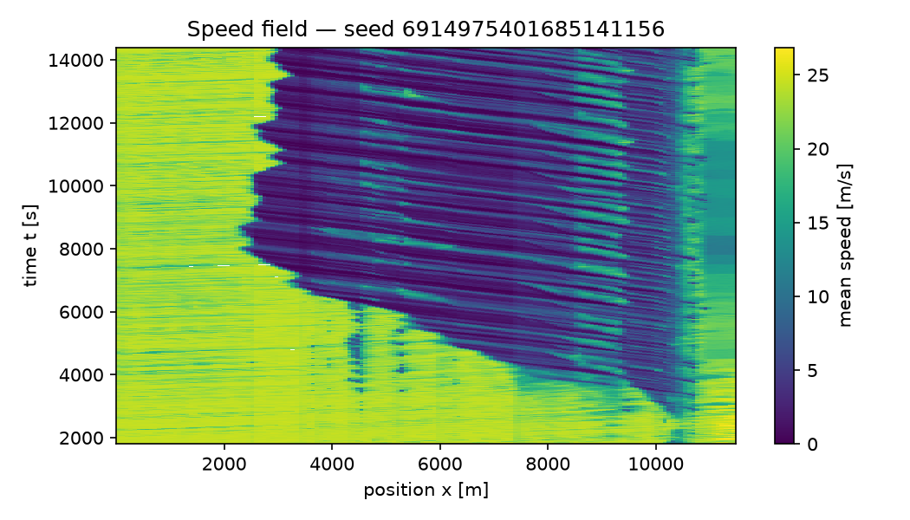

# FlowState auto-report, regenerated: e13_i94_rbc (scenarios/mndot_i94_wb_stpaul_weave_dc_cal_w1b_w2_rbc.yaml)

Generated: 2026-10-08T17:16:25Z by `scripts/regenerate_report.py` (stage `p22_reports`, code `f0551e7a873c4a84bf22cd3eb79a1b48a7d91b8a`).

## Provenance

figures from replicate 6914975401685141156; tables from artifacts/validation_mndot_i94_wb_stpaul_weave_xlsfg_dc_cal_w1b_w2_rbc_gated.json

The figure replicate reproduces the battery's replicate 6914975401685141156: insertion, n_collisions, weave_releases are identical to the battery's record of that seed.

| Item | Value |
|---|---|
| battery artifact | `artifacts/validation_mndot_i94_wb_stpaul_weave_xlsfg_dc_cal_w1b_w2_rbc_gated.json`, sha256 `951dc6b75443` |
| battery written | 2026-10-08T05:42:10Z |
| scenario | `scenarios/mndot_i94_wb_stpaul_weave_dc_cal_w1b_w2_rbc.yaml`, sha256 `d9eae2e7b164` |
| replicates (battery) | n = 20 distinct seeds |
| criteria profile | fhwa_tat3_2004 — FHWA Traffic Analysis Toolbox Vol. III (2004, FHWA-HRT-04-040), §5.6 'Calibration Targets', Wisconsin DOT freeway model calibration criteria (captioned 'Table 4' on the HTML edition at https://ops.fhwa.dot.gov/trafficanalysistools/tat_vol3/sect5.htm, verified 2026-09-03; attributed there to WisDOT District 2, Paramics Calibration and Validation Guidelines, Technical Report I-33, June 2002). Transcribed row: 'GEH Statistic < 5 for Individual Link Flows: > 85% of cases' — strict '> 85%' (geh_pass_inclusive=False). Rows of that table NOT evaluated by FlowState: individual link flows within 15% / 100 veh/h / 400 veh/h by flow band for > 85% of cases; sum of all link flows within 5%; GEH < 4 for the sum of all link flows; journey times within 15% (or 1 min, if higher) for > 85% of cases; visual audits of speed-flow relationships and bottleneck queuing 'to analyst's satisfaction'. The table defines no RMSPE speed bound, so this profile produces no speeds_rmspe row (rmspe_max=None). The 2004 volume gives no fixed minimum run count (its §5 example uses ten replications to estimate a parameter within 5%), so min_seeds keeps FlowState's 20 (CLAUDE.md §0.6). The segment-speed RMSPE <= 15% bound is FlowState's own convention (CLAUDE.md §7.1, 'common microsim practice'); the 14-22 km/h emergent backward wave-speed band is the empirical stop-and-go literature value (flowstate_core.constants.WAVE_SPEED_BAND_KMH); the ring emergence/dampening rows reproduce Sugiyama et al. (2008) and Stern et al. (2018) per CLAUDE.md §3.2.1; min_seeds = 20 and the penetration {1,2,5,10,15,20}% x compliance {25,50,80,100}% grid are CLAUDE.md §0.6/§7.1 internal standards; so is the no_collisions model-integrity row (zero SUMO collisions in every run, each run recording the counter; CLAUDE.md §3.3 and the owner decision of 2026-10-04) and the no_locks row (no run locked: no queue standing without discharge for the validation.locks duration; docs/I94_COLLAPSE_DIAGNOSIS.md, 2026-10-07), both present in every profile. None of these is prescribed by the cited DOT/FHWA documents. The wave-speed row is measured with the profile's wave_detector (validation.waves.WAVE_DETECTORS; default 'stack', chosen on the planted-stripe benchmark in validation.waves), and the evaluated row names that detector and its parameters. |
| config hash, battery | `ad158ff561b1` (policy v4) |
| config hash, figure replicate | `ad158ff561b1` (policy v4) |
| figure replicate | `runs/p22/e13_i94_rbc/ad158ff561b1/6914975401685141156`; seed 6914975401685141156; wall time 978.1 s |
| the battery's own auto-report | `docs/reports/mndot_i94_wb_stpaul_weave_xlsfg_dc_cal_w1b_w2_rbc/report.md` (written on its VM from every replicate's metadata) |

Seeds of the battery: 6914975401685141156, 134183728835869882, 2378473973028931053, 3747978530954135749, 677105600768189526, 661281422688282993, 3011106312394044631, 6953598295321596746, 165503670820534583, 6134032994440706937, 8557154790156791364, 6538422657834023852, 6904272788004776631, 6143473282319009404, 3944094060050347669, 4910985839736976611, 7382187975121682178, 5690692725577505498, 887972120279483394, 8026499204807041784.

### What comes from where

| Part of this report | Source |
|---|---|
| acceptance criteria, metric intervals, model integrity, observed data, notes, baseline gate | `artifacts/validation_mndot_i94_wb_stpaul_weave_xlsfg_dc_cal_w1b_w2_rbc_gated.json`: all 20 replicates of the battery |
| speed-contour figures | replicate 6914975401685141156 re-run with its trajectories by stage `p22_reports` (code `f0551e7a873c4a84bf22cd3eb79a1b48a7d91b8a`) |
| calibration artifacts | the figure replicate's metadata (the configuration fixes them) |

### Package versions (battery)

- eclipse-sumo: `1.27.1`
- flowstate_core: `2.0.0`
- libsumo: `1.27.1`
- microsim: `2.0.0`
- numpy: `2.5.2`
- pandas: `3.0.5`
- pyarrow: `25.0.1`
- python: `3.12.15`

### Calibration artifacts used

| Artifact | data_hash |
|---|---|
| `artifacts/idm_i24_capacity_amax_k1.0.json` | `aa97dd93d2bf250ea23c3624f91afe8d7035a672fd13efbd53013709e12c7d56` |

Read from the figure replicate's metadata: the configuration, the same as the battery's, fixes them.

### Observed data

The link-flow and segment-speed criteria are scored against this observed artifact: hourly volumes formed from the fully observed windows of each hour at every mainline station, and mean speeds per station segment (each station owns the span to the midpoints with its neighbours). Simulation time zero is the artifact's local start time; the run's warm-up, and any window the run does not cover to its end, are excluded, and a station-window the detector did not measure is skipped, never imputed — the coverage rows say how much of the grid was compared. A station whose cross-section lies outside the simulated position span is excluded from both comparisons rather than scored against a simulated flow of zero; the rows say how many were. When the artifact carries a detector-estimated backward wave speed, it is printed here as context for the band the simulated wave speed is scored against — it is a property of the corridor, not a target, and no criterion is evaluated from it.

| Field | Value |
|---|---|
| artifact | artifacts/p1_rehearsal_2026-10-04/observations_calibration.json |
| corridor | I-94 WB |
| source provider | MnDOT RTMC Mayfly API |
| source dates | 20260902, 20260903, 20260908, 20260915, 20260916 |
| source url | https://data.dot.state.mn.us/mayfly |
| aggregation | mean over dates per window (weekday typical profile) |
| local clock time of simulation t = 0 | 05:30 |
| observation window [s] | 300 |
| mainline stations compared | 14 |
| observation windows | 48 |
| windows inside the measurement window | 42 |
| station-windows with an observed flow [fraction] | 1 |
| station-windows with an observed speed [fraction] | 1 |
| link-hour comparisons (pooled over replicates) | 840 |
| speed cells compared (pooled over replicates) | 11760 |
| replicates scored against the observations | 20 |
| stations excluded (outside the simulated span) | 0 |
| detector-estimated backward wave speed (context, not a criterion) | median 19.1 km/h (IQR 18–23.9) from 7 of 13 station pairs; leave-one-date-out 18.5–20.8 km/h over 5 dates (fewest 5 pairs); the model's band is 14–22 km/h |

## Model integrity

What the battery artifact records about the simulation itself misbehaving, pooled over its
replicates as the battery read them from every run's metadata. A collision or a lock is a model
defect, not a traffic outcome; a count the battery did not record is reported as not recorded,
never as zero.

- Collisions: 0 over 20 run(s) that record the counter; per run 0 [0, 0] (two-sided 95 % t-interval, n = 20); 0 per 1,000 departed vehicles (0 over 608243 departed in 20 run(s), whole runs including warm-up).
- Locks: 0 of 20 run(s) locked (0 %; 95 % Clopper–Pearson interval 0–16.8 %). A lock is a queue standing with no discharge past a point for at least 10 min.
- Insertion: 621380 vehicles planned over 20 run(s), 608243 departed (0.979 of plan on average, lowest 0.971), 28415.7 arrived per run (over 20 of 20); verdict: backlog: 2 % of planned vehicles never departed.
- Weave exits at on-ramp 745524613 (exit C-D split 18208090): 436 of 29359 reached exiters (1.49 %) were given up at the gore's end and rerouted through over 20 run(s), within the 2 % threshold.
- Weave exits at on-ramp 769818012 (exit off-ramp 18207598): 976 of 77449 reached exiters (1.26 %) were given up at the gore's end and rerouted through over 20 run(s), within the 2 % threshold.
- Weave rules at on-ramp 745524613 (exit C-D split 18208090): W1b released 281 of 20340 entrance departures (1.38 %) over 20 run(s), above the 1 % design bound; W2 (20 of 20 run(s) with all three guards on): handback skips 3666, close-leader withholds 681, opposing deferrals 7018, of them vetoes 6946.
- Weave rules at on-ramp 769818012 (exit off-ramp 18207598): W1b released 6 of 91997 entrance departures (0.00652 %) over 20 run(s), within the 1 % design bound; W2 (20 of 20 run(s) with all three guards on): handback skips 2924, close-leader withholds 93, opposing deferrals 16372, of them vetoes 15589.

### Waiting measures

Each replicate's travel time and total delay including the time spent waiting on ramps and to
enter the network, with replicate intervals as above.

| Measure | Mean | Lower | Upper | n | Underpowered |
|---|---|---|---|---|---|
| insertion_delay_veh_h | 1097 | 1035 | 1158 | 20 | no |
| meter_wait_veh_h | 0 | 0 | 0 | 20 | no |
| total_delay_incl_waiting_veh_h | 5461 | 5325 | 5598 | 20 | no |
| mean_tt_incl_waiting_s | 918.9 | 901.6 | 936.3 | 20 | no |
| p90_tt_incl_waiting_s | 2004 | 1965 | 2043 | 20 | no |
| n_censored | 2653 | 2589 | 2717 | 20 | no |
| n_demand_veh | 2.82e+04 | 2.82e+04 | 2.82e+04 | 20 | no |
| n_not_inserted | 656.9 | 603.4 | 710.3 | 20 | no |
| n_tt_incl_waiting_veh | 2.777e+04 | 2.776e+04 | 2.777e+04 | 20 | no |
| n_tt_censored | 2220 | 2155 | 2284 | 20 | no |

## Baseline gate

Baseline gate FAILED (docs/FRISCO_PROTOCOL.md section 6): C1 link flows (calibration), C3 speeds (calibration), C1 link flows (validation), C3 speeds (validation), C4 wave speed (calibration). No strategy recommendation may be made from this model.

| Check | Day set | Status | Gating | Statement |
|---|---|---|---|---|
| replicates | all runs | PASS | yes | Replicates: 20 seeded replicate(s); the protocol scores every check over at least 20. |
| days | both day sets | PASS | yes | Day sets: the calibration-day artifact holds exactly the split's 5 calibration day(s) and the validation-day artifact its 4 validation day(s), none shared. |
| quality | both day sets | PASS | yes | Targets quality-masked: calibration days: runs/p1_rehearsal/dq/data_quality.json (sha256 8cae907dec40): 24 masked detector-day(s) (24 excluded whole), 912 reading(s) set aside; validation days: runs/p1_rehearsal/dq/data_quality.json (sha256 8cae907dec40): 19 masked detector-day(s) (19 excluded whole), 720 reading(s) set aside. |
| C1 | calibration | FAIL | yes | Link flows, calibration days: GEH < 5 on 53.3 % of 840 station-hour comparisons pooled over 20 replicate(s) (per-replicate mean 53.3 %, 95 % interval 51.1 % to 55.6 %); the target is >= 85.0 %, short by 31.7 percentage points; hours anchored at the study period's start (1800 s). |
| C2 | calibration | FAIL | no | Link flows, Texas criterion, calibration days: GEH < 3 on 39.0 % of 840 station-hour comparisons pooled over 20 replicate(s) (per-replicate mean 53.3 %, 95 % interval 51.1 % to 55.6 %); the target is >= 100.0 %, short by 61.0 percentage points; hours anchored at the study period's start (1800 s). |
| C3 | calibration | FAIL | yes | Speeds, calibration days: RMSPE of 15-minute station mean speeds 39.7 % (mean over 20 replicate(s), 95 % interval 39.3 % to 40.1 %; point speeds at the stations, as a loop reads them); the target is at most 15.0 %, over by 24.7 percentage points (diagnostics: 5 min 41.0 %; 60 min 34.8 %). |
| C6 | calibration | PASS | yes | Bottlenecks, calibration days: 0 observed bottleneck(s), 0 active for 30 min or more, compared with 20 replicate(s) (point speeds at the stations, as a loop reads them); all four rules hold. |
| C1 | validation | FAIL | yes | Link flows, validation days: GEH < 5 on 48.8 % of 840 station-hour comparisons pooled over 20 replicate(s) (per-replicate mean 48.8 %, 95 % interval 46.1 % to 51.5 %); the target is >= 85.0 %, short by 36.2 percentage points; hours anchored at the study period's start (1800 s). |
| C2 | validation | FAIL | no | Link flows, Texas criterion, validation days: GEH < 3 on 33.7 % of 840 station-hour comparisons pooled over 20 replicate(s) (per-replicate mean 48.8 %, 95 % interval 46.1 % to 51.5 %); the target is >= 100.0 %, short by 66.3 percentage points; hours anchored at the study period's start (1800 s). |
| C3 | validation | FAIL | yes | Speeds, validation days: RMSPE of 15-minute station mean speeds 39.0 % (mean over 20 replicate(s), 95 % interval 38.7 % to 39.4 %; point speeds at the stations, as a loop reads them); the target is at most 15.0 %, over by 24.0 percentage points (diagnostics: 5 min 40.7 %; 60 min 33.1 %). |
| C6 | validation | PASS | yes | Bottlenecks, validation days: 1 observed bottleneck(s), 0 active for 30 min or more, compared with 20 replicate(s) (point speeds at the stations, as a loop reads them); all four rules hold. |
| C4 | calibration | FAIL | yes | Wave speed: a backward front in 20 of 20 replicate(s) (100.0 %; at least 80.0 % needed, a replicate without a front counting as a miss); simulated backward wave speed 5.4 km/h, 95 % interval 5.2 to 5.5 km/h over those replicates (stack detector); the band is 14-22 km/h, outside it by 8.6 km/h; observed on the calibration days (detector cross-correlation): median 19.1 km/h from 7 of 13 station pairs. |
| C5 | all runs | PASS | yes | Collisions: none in 20 run(s). |

## Acceptance criteria

| Criterion | Value | Threshold | Evaluated | Result |
|---|---|---|---|---|
| link_flows_geh | 0.6774 | GEH < 5 for > 85% of link-hour comparisons | yes | FAIL — fraction of comparisons with GEH < 5 |
| wave_speed | 5.375 | backward wave speed in [14, 22] km/h (emergent, unseeded) | yes | FAIL — detector: stack: slant-stack peak of the two-way demeaned field on 15 s x 75 m bins over front speeds [-40, -2] km/h in 0.25 km/h steps, peak/median contrast >= 3, edge peaks rejected |
| ring_emergence | — | Sugiyama ring emergence benchmark reproduced | no | NOT EVALUATED — not evaluated: input not supplied |
| ring_dampening | — | Stern single-AV dampening benchmark reproduced | no | NOT EVALUATED — not evaluated: input not supplied |
| n_seeds | 20 | n_seeds >= 20 | yes | PASS |
| sensitivity_grid | — | penetration {1%, 2%, 5%, 10%, 15%, 20%} x compliance {25%, 50%, 80%, 100%} grid published with CIs | no | NOT EVALUATED — not evaluated: input not supplied |
| no_collisions | 0 | zero SUMO collisions in every run, each run recording the counter | yes | PASS — no collision in 20 run(s); FlowState internal standard (CLAUDE.md §3.3; owner decision 2026-10-04), not an FHWA or DOT criterion |
| no_locks | 0 | no run locked (no queue standing without discharge for 10 min or more), every run recorded | yes | PASS — no lock in 20 run(s); FlowState internal standard (CLAUDE.md §0.1; docs/I94_COLLAPSE_DIAGNOSIS.md §7, 2026-10-07), not an FHWA or DOT criterion |
| w1b_release_share (on-ramp 745524613) | 0.01382 | reported beside no_locks, not gating: W1b releases as a share of the entrance's departures, pooled over the runs; above 1% flagged in Limitations | yes | REPORTED — reported, not gating: 281 of 20340 entrance departures released into the paired exit by W1b over 20 run(s) (1.38 %), ABOVE the 1% design bound (flagged in Limitations); W2 over the runs it was on in: handback skips 3666, close-leader withholds 681, opposing deferrals 7018, of them vetoes 6946; Amendment 4 (docs/FRISCO_PROTOCOL.md, 2026-10-07): weave rules W1b and W2 are part of the model; a FlowState disclosure, not an FHWA or DOT criterion |
| w1b_release_share (on-ramp 769818012) | 6.522e-05 | reported beside no_locks, not gating: W1b releases as a share of the entrance's departures, pooled over the runs; above 1% flagged in Limitations | yes | REPORTED — reported, not gating: 6 of 91997 entrance departures released into the paired exit by W1b over 20 run(s) (0.01 %), within the 1% design bound; W2 over the runs it was on in: handback skips 2924, close-leader withholds 93, opposing deferrals 16372, of them vetoes 15589; Amendment 4 (docs/FRISCO_PROTOCOL.md, 2026-10-07): weave rules W1b and W2 are part of the model; a FlowState disclosure, not an FHWA or DOT criterion |

The rows are the battery's, as it scored them. A row marked not evaluated or not recorded is never
a pass, and an unevaluated criterion counts as failing; a row marked reported is a disclosure,
never a pass or a fail.

## Metrics

Mean with two-sided t-distribution confidence bounds at the 95 percent level over
n replicates, as the battery computed them. Rows flagged underpowered have fewer than
20 replicates and must not be quoted as headline results.

Rows marked (model estimate) carry fuel (model estimate, SUMO HBEFA emission class; not validated against measured fuel). SUMO computes fuel from its HBEFA emission classes; this study has measured no fuel to check it against (docs/FRISCO_PROTOCOL.md section 8.6).

| Metric | Mean | Lower | Upper | n | Underpowered |
|---|---|---|---|---|---|
| throughput_veh_h | 2702 | 2692 | 2712 | 20 | no |
| mean_tt_s | 816.5 | 806.7 | 826.3 | 20 | no |
| p90_tt_s | 2095 | 2073 | 2118 | 20 | no |
| sigma_v_spatial_ms | 6.712 | 6.672 | 6.751 | 20 | no |
| sigma_v_temporal_ms | 4.839 | 4.809 | 4.869 | 20 | no |
| vmt_veh_km | 1.277e+05 | 1.274e+05 | 1.279e+05 | 20 | no |
| vht_veh_h | 5575 | 5499 | 5651 | 20 | no |
| fuel_ml_per_veh_km (model estimate) | 126.9 | 125.6 | 128.2 | 20 | no |
| wave_count | 28.8 | 26.63 | 30.97 | 20 | no |
| wave_speed_kmh | 7.333 | 6.972 | 7.694 | 20 | no |
| wave_amplitude_ms | 14.67 | 14.48 | 14.87 | 20 | no |
| n_travel_time_veh | 1.262e+04 | 1.258e+04 | 1.266e+04 | 20 | no |

## Notes recorded with the battery

- Observed comparisons cover only the artifact's stations and windows; a station-window the detector did not measure is skipped, never imputed.
- The run's configured warm-up is discarded from every metric and from every observed comparison.
- The wave_speed row is measured with the profile's own detector on its own bins; validation.metrics.wave_speed_kmh in metrics_ci is the standard detector's separate diagnostic.
- The insertion block counts the vehicles the runs actually put on the network against their demand plan; a mean departed fraction well under 1 means the metrics above describe less demand than was configured.
- The locks block counts the seeds that locked (validation.locks: vehicles standing with no discharge past a point for the lock duration while a queue builds behind it); every metric, criterion and interval above includes those seeds, whose vehicles trapped behind the lock never finish.
- The weave_exits block counts, per weaving section, the exit-bound vehicles given up at the gore's end and rerouted through; the exit's link flow is short by missed_exit.n and every mainline link downstream carries them, so the geh rows are wrong by that count on those links (flagged above threshold_share of reached exiters).
- Ring rows not evaluated (--ring-seeds 0); reported as failing per CLAUDE.md §0.1.

## Speed contours

Figures from replicate 6914975401685141156, re-run with its trajectories by stage `p22_reports`; a contour covers the run's scored window (its warm-up dropped).

## Limitations

- At the on-ramp 745524613 weave, W1b sent 281 of 20340 entering vehicles (1.38 %, over 20 run(s)) into the paired exit after each stood the W1b dwell at the end of the auxiliary lane — above the 1 % design bound of Amendment 4. W1b is a safeguard that keeps the simulation running, not measured driver behaviour: a release ends either a lock at the gore or a long ordinary wait, the share counts interventions, not realism, and the exit's and the mainline's flows carry those vehicles.
- Model-integrity lines that need every replicate's run metadata beyond what the battery artifact carries (forced lane changes, per-run wall times) are not repeated here; the battery's own auto-report carries them (`docs/reports/mndot_i94_wb_stpaul_weave_xlsfg_dc_cal_w1b_w2_rbc/report.md`).
- Criteria not passed by the battery: link_flows_geh, wave_speed, ring_emergence, ring_dampening, sensitivity_grid. The results are reported as they came out; no validation claim is made from rows that did not pass.
- The contours show one replicate (seed 6914975401685141156) of 20; the tables describe all of them. A single replicate's contour illustrates the configuration; it is not a statistic and not the replicate-mean field the speed criterion compares.
- Results cover a single corridor and scenario family; transfer to other corridors is not established.
- Model-form uncertainty (car-following and lane-change model assumptions, demand representation) is not captured by seed-to-seed confidence intervals.
- AV penetration and compliance are swept assumptions, not measured behaviour; no strategy result is part of this report.
- Every fuel figure is a model estimate (SUMO HBEFA emission class), not validated against measured fuel; differences in fuel between configurations are model predictions.
