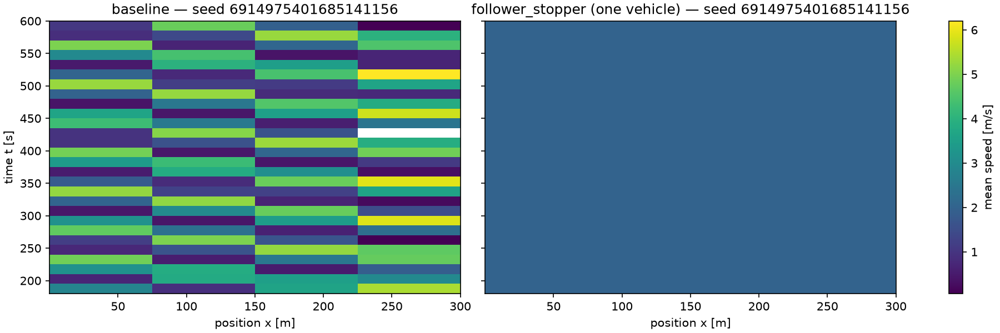

# FlowState auto-report, regenerated: e13_ring (ring_sugiyama benchmark)

Generated: 2026-10-08T17:16:25Z by `scripts/regenerate_report.py` (stage `p22_reports`, code `f0551e7a873c4a84bf22cd3eb79a1b48a7d91b8a`).

## Provenance

figures from replicate 6914975401685141156; tables from artifacts/i24_validation_dc_refit_rc.json

The figure replicate reproduces the battery's replicate 6914975401685141156: emergence, dampening are identical to the battery's record of that seed.

| Item | Value |
|---|---|
| battery artifact | `artifacts/i24_validation_dc_refit_rc.json`, sha256 `9b40c583edd1` |
| battery written | 2026-10-07T19:07:18Z |
| scenario | `ring_sugiyama` (`scenarios/ring_sugiyama.yaml`), sha256 `61094aaabef8` |
| replicates (battery) | n = 20 distinct seeds |
| criteria profile | fhwa_default — FlowState default profile (CLAUDE.md §7.1). GEH < 5 for >= 85% of link-hour comparisons transcribes the 'GEH Statistic < 5 for Individual Link Flows: > 85% of cases' row of the Wisconsin DOT freeway model calibration criteria table (captioned 'Table 4' on the HTML edition) in §5.6 'Calibration Targets' of the FHWA Traffic Analysis Toolbox Vol. III, 2004 (FHWA-HRT-04-040), verified 2026-09-03 at https://ops.fhwa.dot.gov/trafficanalysistools/tat_vol3/sect5.htm; the source says '> 85%' where this profile, like CLAUDE.md, uses '>= 85%' (geh_pass_inclusive=True). The 2019 update (FHWA-HOP-18-036) Chapter 5, verified the same day at https://ops.fhwa.dot.gov/publications/fhwahop18036/chapter5.htm, prescribes no GEH or 85% target (it builds data-driven variation envelopes, Criteria I-IV) and says the analyst need not calibrate multiple random-seed runs; the citation of FHWA-HOP-18-036 for the GEH wording elsewhere in this repository is therefore a citation of the toolbox lineage, not of the 2019 text. The segment-speed RMSPE <= 15% bound is FlowState's own convention (CLAUDE.md §7.1, 'common microsim practice'); the 14-22 km/h emergent backward wave-speed band is the empirical stop-and-go literature value (flowstate_core.constants.WAVE_SPEED_BAND_KMH); the ring emergence/dampening rows reproduce Sugiyama et al. (2008) and Stern et al. (2018) per CLAUDE.md §3.2.1; min_seeds = 20 and the penetration {1,2,5,10,15,20}% x compliance {25,50,80,100}% grid are CLAUDE.md §0.6/§7.1 internal standards; so is the no_collisions model-integrity row (zero SUMO collisions in every run, each run recording the counter; CLAUDE.md §3.3 and the owner decision of 2026-10-04) and the no_locks row (no run locked: no queue standing without discharge for the validation.locks duration; docs/I94_COLLAPSE_DIAGNOSIS.md, 2026-10-07), both present in every profile. None of these is prescribed by the cited DOT/FHWA documents. The wave-speed row is measured with the profile's wave_detector (validation.waves.WAVE_DETECTORS; default 'stack', chosen on the planted-stripe benchmark in validation.waves), and the evaluated row names that detector and its parameters. |
| config hash, battery (as shipped, one FollowerStopper vehicle) | `d5472987265c`, `148959d59786` (policy v3, v3) |
| config hash, figure replicate (as shipped, one FollowerStopper vehicle) | `258c09ac0074`, `58a2c186d609` (policy v4) |
| figure replicate | `runs/p22/e13_ring/258c09ac0074/6914975401685141156`, `runs/p22/e13_ring/58a2c186d609/6914975401685141156`; seed 6914975401685141156; wall time 0.4611 s |

Seeds of the battery: 6914975401685141156, 134183728835869882, 2378473973028931053, 3747978530954135749, 677105600768189526, 661281422688282993, 3011106312394044631, 6953598295321596746, 165503670820534583, 6134032994440706937, 8557154790156791364, 6538422657834023852, 6904272788004776631, 6143473282319009404, 3944094060050347669, 4910985839736976611, 7382187975121682178, 5690692725577505498, 887972120279483394, 8026499204807041784.

### What comes from where

| Part of this report | Source |
|---|---|
| ring thresholds, per-check intervals and the two ring criteria rows | `artifacts/i24_validation_dc_refit_rc.json`, its ring block: all 20 seeds |
| speed-contour figures | replicate 6914975401685141156 re-run with its trajectories by stage `p22_reports` (code `f0551e7a873c4a84bf22cd3eb79a1b48a7d91b8a`) |
| calibration artifacts | the figure replicate's metadata (the configuration fixes them) |

### Package versions (battery)

- eclipse-sumo: `1.27.1`
- flowstate_core: `2.0.0`
- libsumo: `1.27.1`
- microsim: `2.0.0`
- numpy: `2.5.2`
- pandas: `3.0.5`
- pyarrow: `25.0.1`
- python: `3.12.15`

### Calibration artifacts used

No calibration artifacts recorded: defaults in use are literature values, not calibrated claims.

## Ring benchmark

The ring benchmark of the battery: `ring_sugiyama` as shipped (emergence) and with one compliant follower_stopper vehicle (dampening), each over 20 seeds; a row passes when every seed passes its checks.

| Threshold | Value |
|---|---|
| warmup_s | 180.0 |
| tail_s | 300.0 |
| sigma_v_min_ms | 1.5 |
| v_min_after_warmup_ms | 3.0 |
| drift_band_kmh | [-25.0, -5.0] |
| dampening_sigma_factor | 0.75 |
| min_speed_raise_ms | 0.5 |
| mean_tail_speed_min_ms | 1.0 |
| single_av_penetration | 0.045 |
| dampening_controller | follower_stopper |
| provenance | tests/test_microsim/test_microsim_ring_gate.py (CLAUDE.md §3.2.1) |

### Emergence (20 of 20 seeds pass; every seeded replicate passes the ring-gate emergence checks)

| Check value | Mean | Lower | Upper | n | Smallest | Largest |
|---|---|---|---|---|---|---|
| spatial speed std, tail [m/s] | 2.338 | 2.252 | 2.423 | 20 | 1.627 | 2.474 |
| jam drift [km/h] (negative: backward) | -14.45 | -14.83 | -14.08 | 20 | -15.62 | -11.58 |
| lowest speed after the warm-up [m/s] | 0 | 0 | 0 | 20 | 0 | 0 |

### Dampening (20 of 20 seeds pass; every seeded replicate passes the ring-gate dampening checks)

| Check value | Mean | Lower | Upper | n | Smallest | Largest |
|---|---|---|---|---|---|---|
| spatial speed std with the controller, tail [m/s] | 1.801e-06 | 1.07e-06 | 2.532e-06 | 20 | 5.704e-07 | 6.419e-06 |
| reduction of the spatial speed std [fraction] | 1 | 1 | 1 | 20 | 1 | 1 |
| lowest tail speed with the controller [m/s] | 2.018 | 1.993 | 2.043 | 20 | 1.936 | 2.163 |

## Acceptance criteria

| Criterion | Value | Threshold | Evaluated | Result |
|---|---|---|---|---|
| ring_emergence | 1 | Sugiyama ring emergence benchmark reproduced | yes | PASS |
| ring_dampening | 1 | Stern single-AV dampening benchmark reproduced | yes | PASS |

The rows are the battery's, as it scored them. A row marked not evaluated or not recorded is never
a pass, and an unevaluated criterion counts as failing; a row marked reported is a disclosure,
never a pass or a fail.

## Notes recorded with the battery

- Ring benchmark rows evaluated by validation.ring_benchmark (the CI gate's checks on 20 seeded replicates; pass = every replicate passes); see the 'ring' block.

## Speed contours

Figures from replicate 6914975401685141156, re-run with its trajectories by stage `p22_reports`; a contour covers the run's scored window (its warm-up dropped).

## Limitations

- The ring tests string instability and one controller on a closed loop, not any corridor.
- The contours show one replicate (seed 6914975401685141156) of 20; the tables describe all of them. A single replicate's contour illustrates the configuration; it is not a statistic and not the replicate-mean field the speed criterion compares.
