# FlowState v2 — i24_replica validation report, corrected arm: demand divided by the apparent tracking coverage (I-24 MOTION westbound, 30 Nov 2022 06:30-08:30 CST, measured downstream boundary)

Generated: 2026-09-03T01:58:48Z

## Provenance

Profile: `fhwa_default`. Seeds: 134183728835869882, 165503670820534583, 2378473973028931053, 3011106312394044631, 3747978530954135749, 3944094060050347669, 4910985839736976611, 5690692725577505498, 6134032994440706937, 6143473282319009404, 6538422657834023852, 661281422688282993, 677105600768189526, 6904272788004776631, 6914975401685141156, 6953598295321596746, 7382187975121682178, 8026499204807041784, 8557154790156791364, 887972120279483394.

| Run | Config hash | Seed | Tier | seeded | Wall time [s] |
|---|---|---|---|---|---|
| 134183728835869882 | `a3efae6955bd` | 134183728835869882 | micro | seeded=False | 257.9 |
| 165503670820534583 | `a3efae6955bd` | 165503670820534583 | micro | seeded=False | 286.9 |
| 2378473973028931053 | `a3efae6955bd` | 2378473973028931053 | micro | seeded=False | 221.6 |
| 3011106312394044631 | `a3efae6955bd` | 3011106312394044631 | micro | seeded=False | 234.3 |
| 3747978530954135749 | `a3efae6955bd` | 3747978530954135749 | micro | seeded=False | 257.7 |
| 3944094060050347669 | `a3efae6955bd` | 3944094060050347669 | micro | seeded=False | 301.7 |
| 4910985839736976611 | `a3efae6955bd` | 4910985839736976611 | micro | seeded=False | 257.9 |
| 5690692725577505498 | `a3efae6955bd` | 5690692725577505498 | micro | seeded=False | 188.2 |
| 6134032994440706937 | `a3efae6955bd` | 6134032994440706937 | micro | seeded=False | 258 |
| 6143473282319009404 | `a3efae6955bd` | 6143473282319009404 | micro | seeded=False | 273.8 |
| 6538422657834023852 | `a3efae6955bd` | 6538422657834023852 | micro | seeded=False | 250.3 |
| 661281422688282993 | `a3efae6955bd` | 661281422688282993 | micro | seeded=False | 263 |
| 677105600768189526 | `a3efae6955bd` | 677105600768189526 | micro | seeded=False | 232.2 |
| 6904272788004776631 | `a3efae6955bd` | 6904272788004776631 | micro | seeded=False | 284.8 |
| 6914975401685141156 | `a3efae6955bd` | 6914975401685141156 | micro | seeded=False | 225.6 |
| 6953598295321596746 | `a3efae6955bd` | 6953598295321596746 | micro | seeded=False | 259.8 |
| 7382187975121682178 | `a3efae6955bd` | 7382187975121682178 | micro | seeded=False | 189.7 |
| 8026499204807041784 | `a3efae6955bd` | 8026499204807041784 | micro | seeded=False | 186.5 |
| 8557154790156791364 | `a3efae6955bd` | 8557154790156791364 | micro | seeded=False | 294.4 |
| 887972120279483394 | `a3efae6955bd` | 887972120279483394 | micro | seeded=False | 187.4 |

### Package versions (from run metadata)

- eclipse-sumo: `1.27.1`
- flowstate_core: `2.0.0`
- libsumo: `1.27.1`
- microsim: `2.0.0`
- numpy: `2.5.2`
- pandas: `3.0.5`
- pyarrow: `25.0.1`
- python: `3.12.13`

### Calibration artifacts used

| Artifact | data_hash |
|---|---|
| `artifacts/idm_i24.json` | `aa97dd93d2bf250ea23c3624f91afe8d7035a672fd13efbd53013709e12c7d56` |

## Acceptance criteria

| Criterion | Value | Threshold | Evaluated | Result |
|---|---|---|---|---|
| link_flows_geh | 0.1528 | GEH < 5 for >= 85% of link-hour comparisons | yes | FAIL — fraction of comparisons with GEH < 5 |
| speeds_rmspe | 0.3679 | segment-speed RMSPE <= 15% | yes | FAIL |
| wave_speed | 10.26 | backward wave speed in [14, 22] km/h (emergent, unseeded) | yes | FAIL |
| ring_emergence | — | Sugiyama ring emergence benchmark reproduced | no | FAIL — not evaluated: input not supplied |
| ring_dampening | — | Stern single-AV dampening benchmark reproduced | no | FAIL — not evaluated: input not supplied |
| n_seeds | 20 | n_seeds >= 20 | yes | PASS |

Rows marked not evaluated had no input supplied and count as failing; an
unevaluated criterion is never a pass.

## Metrics

Mean with two-sided t-distribution confidence bounds at the
95 percent level over n replicates. Rows flagged
underpowered have fewer than 20 replicates and must not be
quoted as headline results.

| Metric | Mean | Lower | Upper | n | Underpowered |
|---|---|---|---|---|---|
| throughput_veh_h | 5266 | 5246 | 5287 | 20 | no |
| mean_tt_s | 619.6 | 611.9 | 627.3 | 20 | no |
| p90_tt_s | 1019 | 997 | 1040 | 20 | no |
| sigma_v_spatial_ms | 5.132 | 5.088 | 5.176 | 20 | no |
| sigma_v_temporal_ms | 4.489 | 4.454 | 4.524 | 20 | no |
| vmt_veh_km | 9.223e+04 | 9.192e+04 | 9.253e+04 | 20 | no |
| vht_veh_h | 3651 | 3622 | 3680 | 20 | no |
| fuel_ml_per_veh_km | 107.9 | 107.1 | 108.7 | 20 | no |
| wave_count | 8.5 | 7.04 | 9.96 | 20 | no |
| wave_speed_kmh | 10.26 | 8.889 | 11.64 | 20 | no |
| wave_amplitude_ms | 8.085 | 7.568 | 8.602 | 20 | no |

## Speed contours

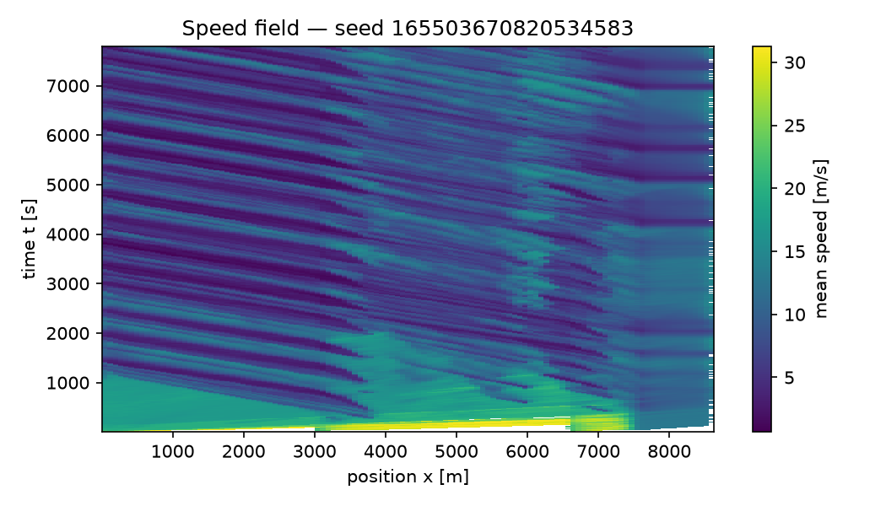
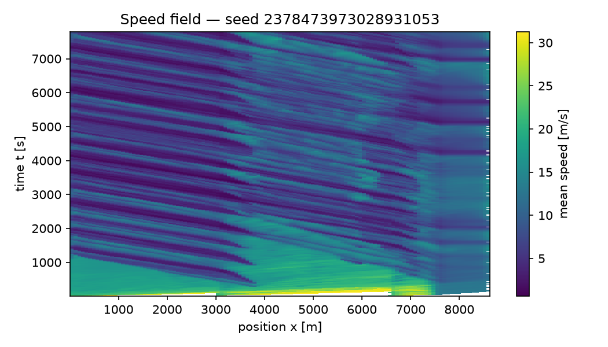
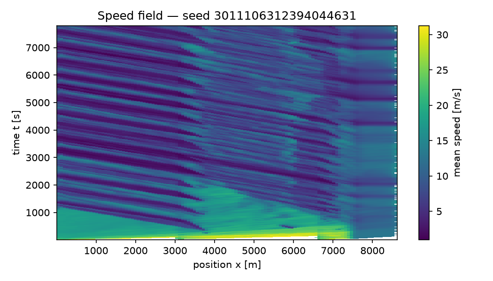
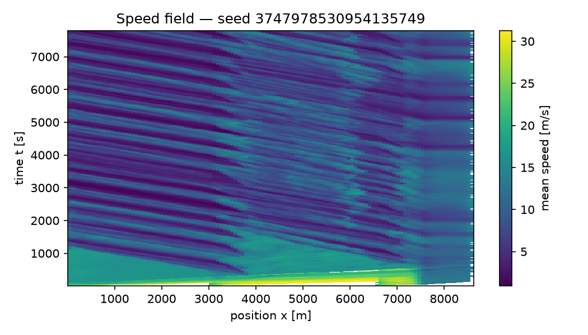
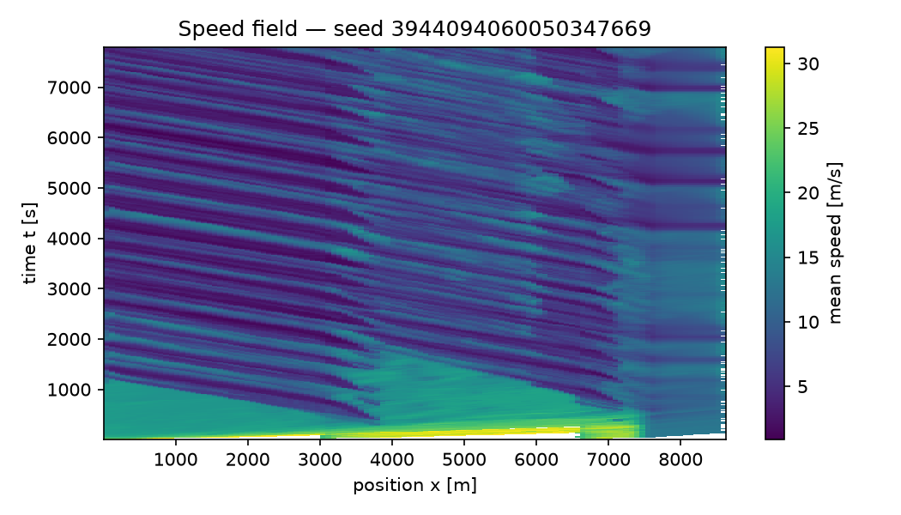

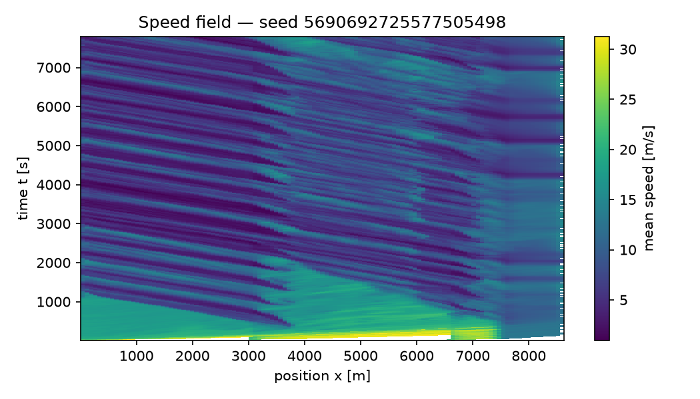

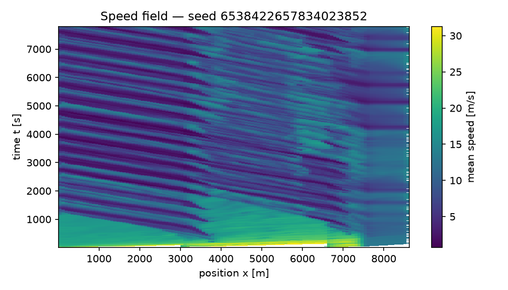

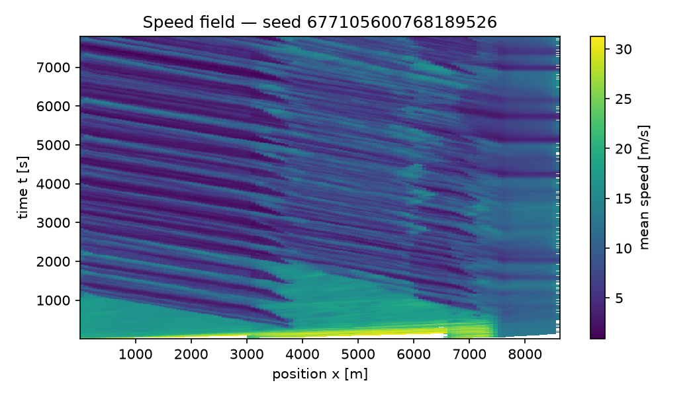
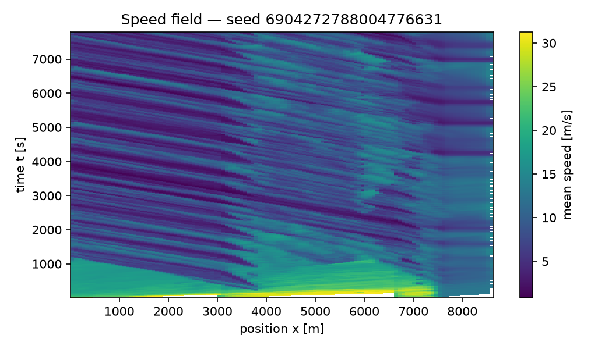
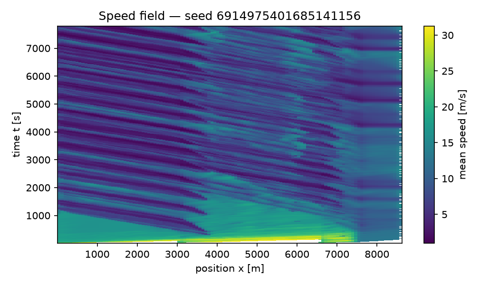
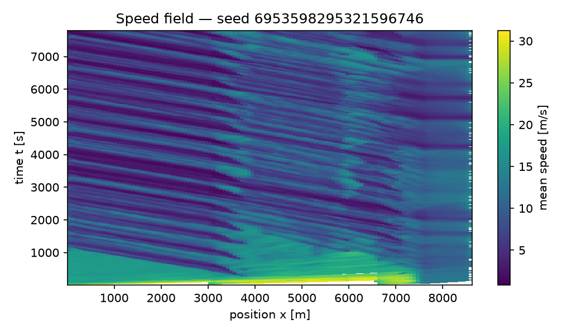
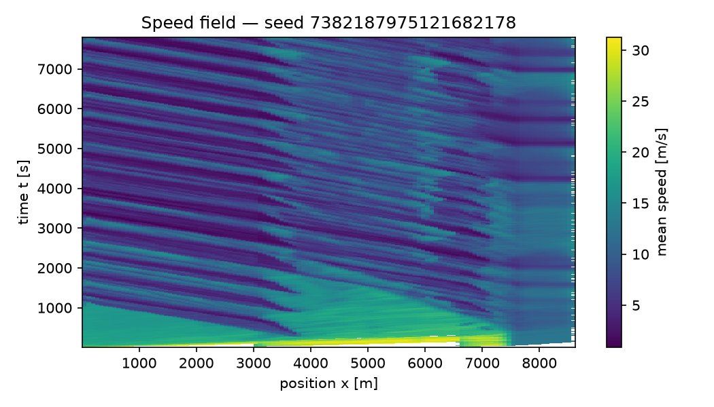
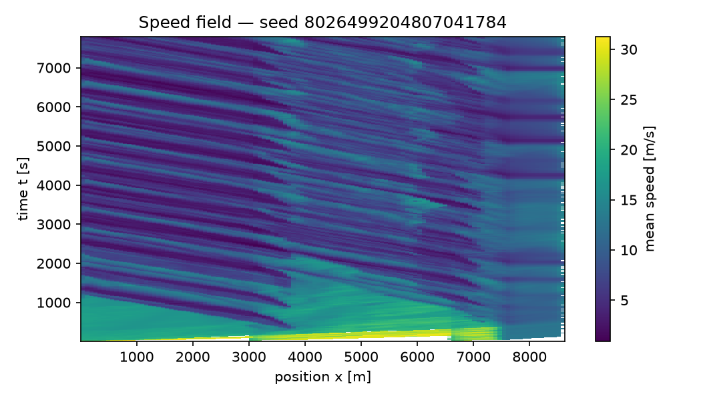
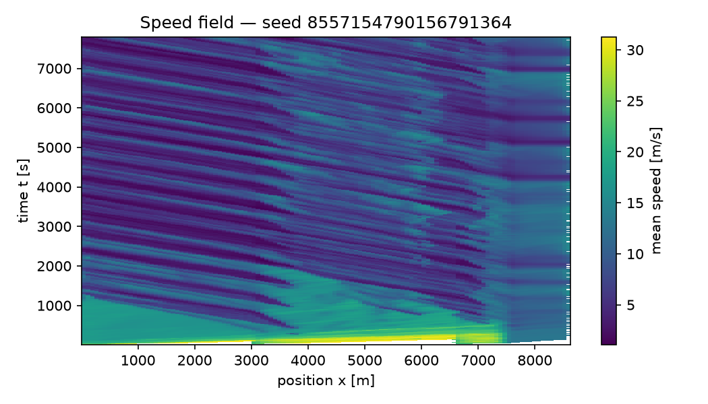
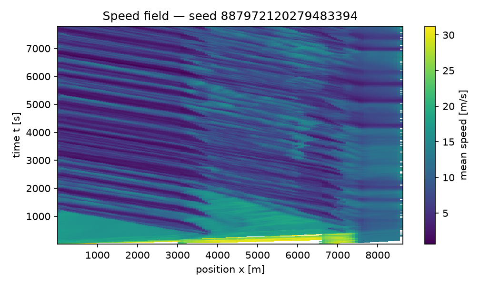

## Limitations

- Results cover a single corridor/scenario family; transfer to other
  corridors is not established.
- Model-form uncertainty (IDM/SUMO car-following assumptions, effective
  single-pipe demand representation) is not captured by seed-to-seed
  confidence intervals.
- AV penetration and compliance are swept assumptions, not measured
  behavior; conclusions hold only within the swept grid.
- Metrics from fewer than 20 replicates are flagged
  underpowered and are diagnostics, not claims.
