# FlowState v2 — i24_replica validation report, ramps arm: fitted level with the jointly fitted ramp levels (I-24 MOTION westbound, 30 Nov 2022 06:30-08:30 CST, measured downstream boundary)

Generated: 2026-09-17T22:59:06Z

## Provenance

Profile: `fhwa_default`. Seeds: 134183728835869882, 165503670820534583, 2378473973028931053, 3011106312394044631, 3747978530954135749, 3944094060050347669, 4910985839736976611, 5690692725577505498, 6134032994440706937, 6143473282319009404, 6538422657834023852, 661281422688282993, 677105600768189526, 6904272788004776631, 6914975401685141156, 6953598295321596746, 7382187975121682178, 8026499204807041784, 8557154790156791364, 887972120279483394.

Measurement window: each run's configured warm-up is discarded from every metric (warm-up per run, in seconds: 600). Travel times keep whole journeys that begin inside the window and are measured over [2256.22, 7637.83] m. Fuel per vehicle-km remains a whole-run ratio unless the run records a post-warm-up fuel total.

| Run | Config hash | Seed | Tier | seeded | Wall time [s] |
|---|---|---|---|---|---|
| 134183728835869882 | `baa746ca199d` | 134183728835869882 | micro | seeded=False | 551 |
| 165503670820534583 | `baa746ca199d` | 165503670820534583 | micro | seeded=False | 530.7 |
| 2378473973028931053 | `baa746ca199d` | 2378473973028931053 | micro | seeded=False | 547.9 |
| 3011106312394044631 | `baa746ca199d` | 3011106312394044631 | micro | seeded=False | 538.5 |
| 3747978530954135749 | `baa746ca199d` | 3747978530954135749 | micro | seeded=False | 723.5 |
| 3944094060050347669 | `baa746ca199d` | 3944094060050347669 | micro | seeded=False | 718.4 |
| 4910985839736976611 | `baa746ca199d` | 4910985839736976611 | micro | seeded=False | 722.9 |
| 5690692725577505498 | `baa746ca199d` | 5690692725577505498 | micro | seeded=False | 514.3 |
| 6134032994440706937 | `baa746ca199d` | 6134032994440706937 | micro | seeded=False | 533 |
| 6143473282319009404 | `baa746ca199d` | 6143473282319009404 | micro | seeded=False | 689.5 |
| 6538422657834023852 | `baa746ca199d` | 6538422657834023852 | micro | seeded=False | 715.5 |
| 661281422688282993 | `baa746ca199d` | 661281422688282993 | micro | seeded=False | 585.4 |
| 677105600768189526 | `baa746ca199d` | 677105600768189526 | micro | seeded=False | 527.3 |
| 6904272788004776631 | `baa746ca199d` | 6904272788004776631 | micro | seeded=False | 706 |
| 6914975401685141156 | `baa746ca199d` | 6914975401685141156 | micro | seeded=False | 583 |
| 6953598295321596746 | `baa746ca199d` | 6953598295321596746 | micro | seeded=False | 712.8 |
| 7382187975121682178 | `baa746ca199d` | 7382187975121682178 | micro | seeded=False | 534.3 |
| 8026499204807041784 | `baa746ca199d` | 8026499204807041784 | micro | seeded=False | 536.8 |
| 8557154790156791364 | `baa746ca199d` | 8557154790156791364 | micro | seeded=False | 675.4 |
| 887972120279483394 | `baa746ca199d` | 887972120279483394 | micro | seeded=False | 541.1 |

### Package versions (from run metadata)

- eclipse-sumo: `1.27.1`
- flowstate_core: `2.0.0`
- libsumo: `1.27.1`
- microsim: `2.0.0`
- numpy: `2.5.2`
- pandas: `3.0.5`
- pyarrow: `25.0.1`
- python: `3.12.14`

### Calibration artifacts used

| Artifact | data_hash |
|---|---|
| `artifacts/idm_i24_capacity.json` | `aa97dd93d2bf250ea23c3624f91afe8d7035a672fd13efbd53013709e12c7d56` |

## Acceptance criteria

| Criterion | Value | Threshold | Evaluated | Result |
|---|---|---|---|---|
| link_flows_geh | 0.2014 | GEH < 5 for >= 85% of link-hour comparisons | yes | FAIL — fraction of comparisons with GEH < 5 |
| speeds_rmspe | 0.3484 | segment-speed RMSPE <= 15% | yes | FAIL |
| wave_speed | 15.58 | backward wave speed in [14, 22] km/h (emergent, unseeded) | yes | PASS — detector: stack: slant-stack peak of the two-way demeaned field on 15 s x 75 m bins over front speeds [-40, -2] km/h in 0.25 km/h steps, peak/median contrast >= 3, edge peaks rejected |
| ring_emergence | — | Sugiyama ring emergence benchmark reproduced | no | NOT EVALUATED — not evaluated: input not supplied |
| ring_dampening | — | Stern single-AV dampening benchmark reproduced | no | NOT EVALUATED — not evaluated: input not supplied |
| n_seeds | 20 | n_seeds >= 20 | yes | PASS |
| sensitivity_grid | — | penetration {1%, 2%, 5%, 10%, 15%, 20%} x compliance {25%, 50%, 80%, 100%} grid published with CIs | no | NOT EVALUATED — not evaluated: input not supplied |

A row marked not evaluated is never a pass: either no input was supplied,
or the value was measured with a recipe this profile does not accept (the
row's result says which). An unevaluated criterion counts as failing.

Wave-speed criterion input: mean over 18 of 20 unseeded replicate(s) of group baseline (`baa746ca199d`), measured with the stack detector on its own bins; 2 replicate(s) detected no backward front and are excluded from the mean; fewer than 20 contributing replicate(s) — underpowered, not a headline value.

### Speed criterion by time aggregation

The segment-speed criterion compares a replicate mean with one recorded
day. The floor column is the recorded field against its own three-window
moving average: below that resolution the day does not repeat itself, so
no ensemble mean can score under the floor. The criterion row keeps its
native resolution; this table says how much of its value is resolution.

| Aggregation | RMSPE, replicate mean vs observed | Floor: observed vs its own three-window average |
|---|---|---|
| 5 min (criterion) | 0.3484 | 0.334 |
| 15 min | 0.2555 | 0.1512 |
| 30 min | 0.2211 |  |
| 60 min | 0.1944 |  |
| whole period | 0.1891 |  |

## Metrics

Mean with two-sided t-distribution confidence bounds at the
95 percent level over n replicates. Rows flagged
underpowered have fewer than 20 replicates and must not be
quoted as headline results. Travel-time rows rest on the vehicles counted by
the n_travel_time_veh row, which are those that entered within the
measurement window and completed the span.

The wave_speed_kmh row is the metrics detector's diagnostic reading (standard); the acceptance criterion above is measured separately with the profile's stack detector on its own bins, so the two values can differ.

### baseline (`baa746ca199d`)

Replicates: n = 20 distinct seeds (134183728835869882, 165503670820534583, 2378473973028931053, 3011106312394044631, 3747978530954135749, 3944094060050347669, 4910985839736976611, 5690692725577505498, 6134032994440706937, 6143473282319009404, 6538422657834023852, 661281422688282993, 677105600768189526, 6904272788004776631, 6914975401685141156, 6953598295321596746, 7382187975121682178, 8026499204807041784, 8557154790156791364, 887972120279483394); replicate
criterion (n_seeds >= 20): PASS.

| Metric | Mean | Lower | Upper | n | Underpowered |
|---|---|---|---|---|---|
| throughput_veh_h | 5699 | 5683 | 5715 | 20 | no |
| mean_tt_s | 606.8 | 601.7 | 611.9 | 20 | no |
| p90_tt_s | 952.9 | 934.9 | 971 | 20 | no |
| sigma_v_spatial_ms | 5.57 | 5.53 | 5.61 | 20 | no |
| sigma_v_temporal_ms | 4.864 | 4.831 | 4.896 | 20 | no |
| vmt_veh_km | 9.205e+04 | 9.179e+04 | 9.23e+04 | 20 | no |
| vht_veh_h | 3474 | 3453 | 3495 | 20 | no |
| fuel_ml_per_veh_km | 103.1 | 102.6 | 103.7 | 20 | no |
| wave_count | 9.25 | 7.954 | 10.55 | 20 | no |
| wave_speed_kmh | 9.196 | 8.494 | 9.897 | 20 | no |
| wave_amplitude_ms | 6.672 | 6.38 | 6.964 | 20 | no |
| n_travel_time_veh | 1.025e+04 | 1.022e+04 | 1.028e+04 | 20 | no |

## Speed contours

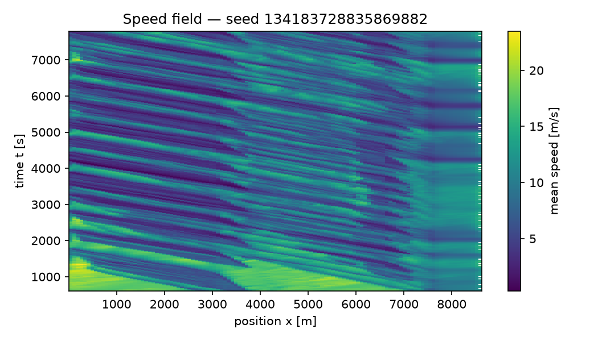
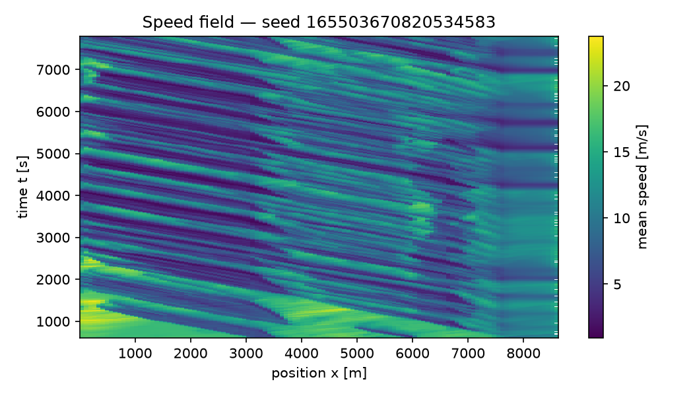
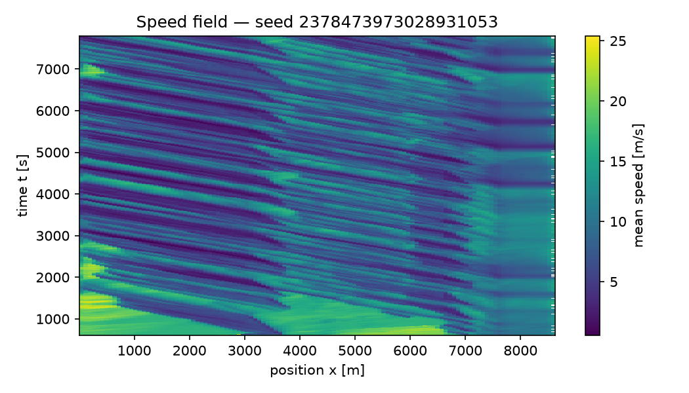

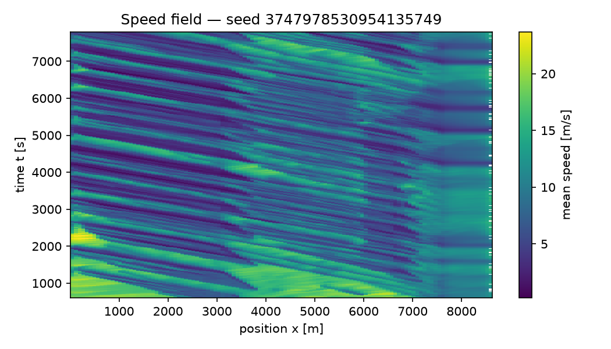
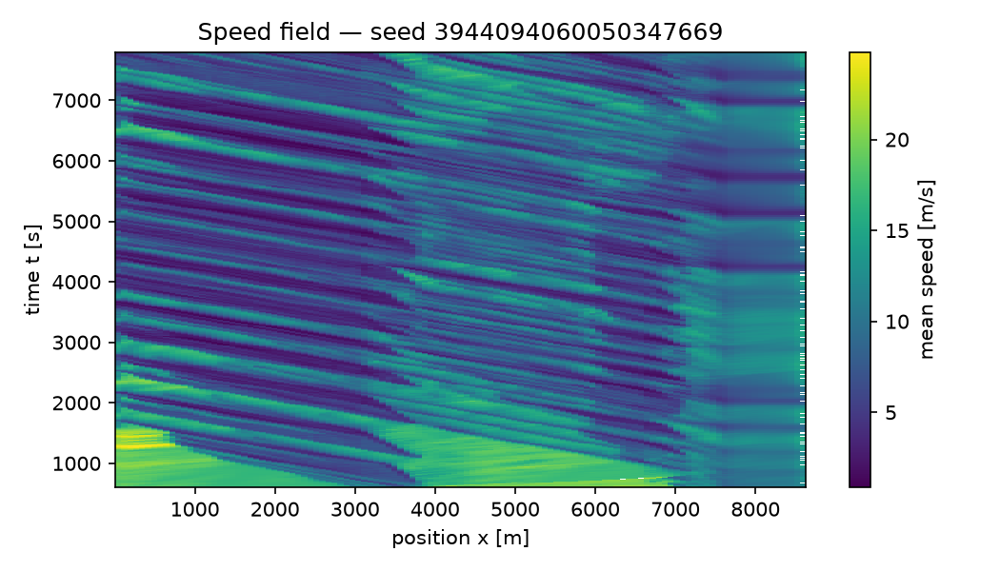

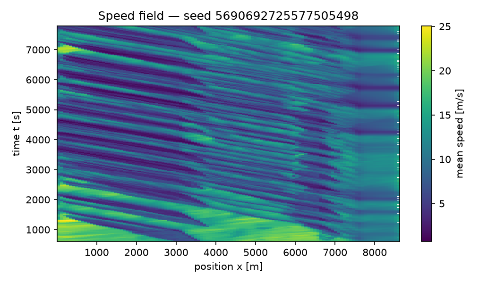
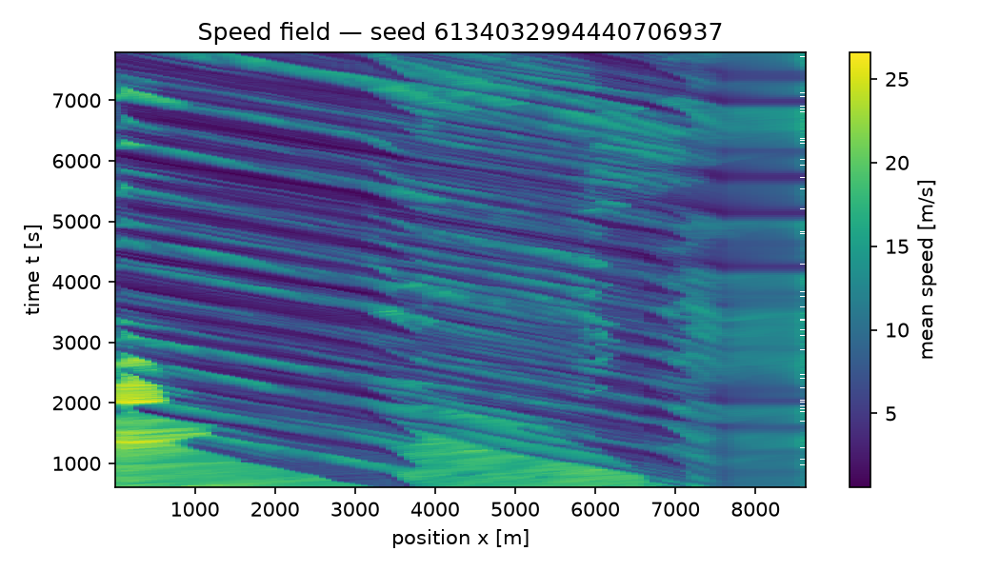
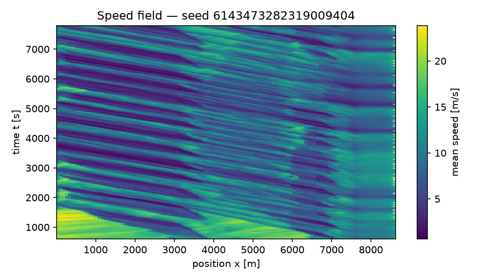
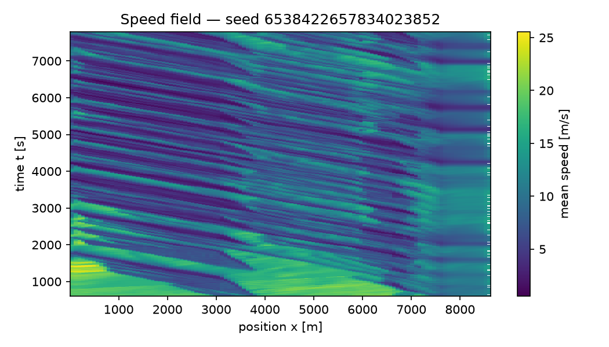
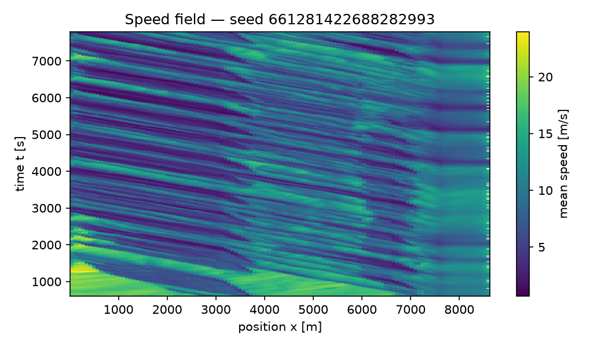

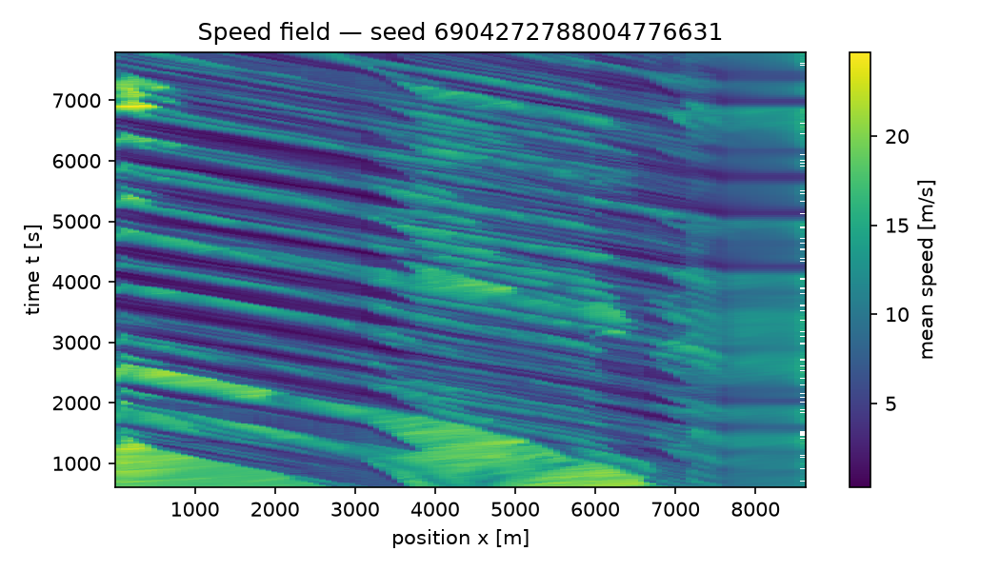
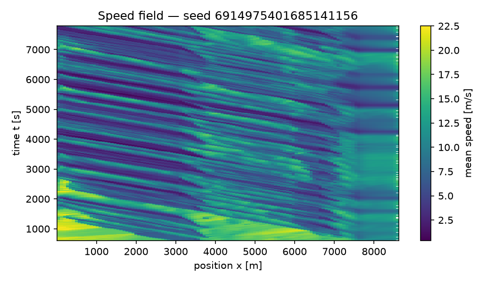
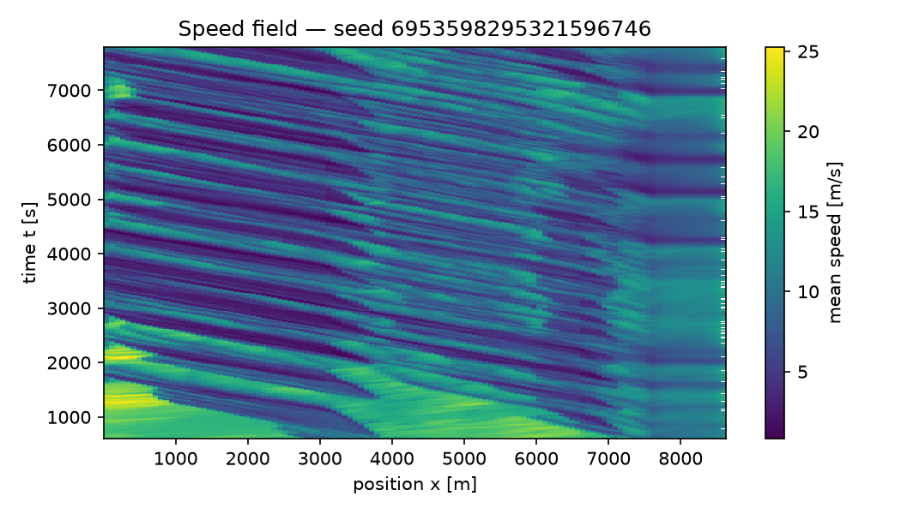

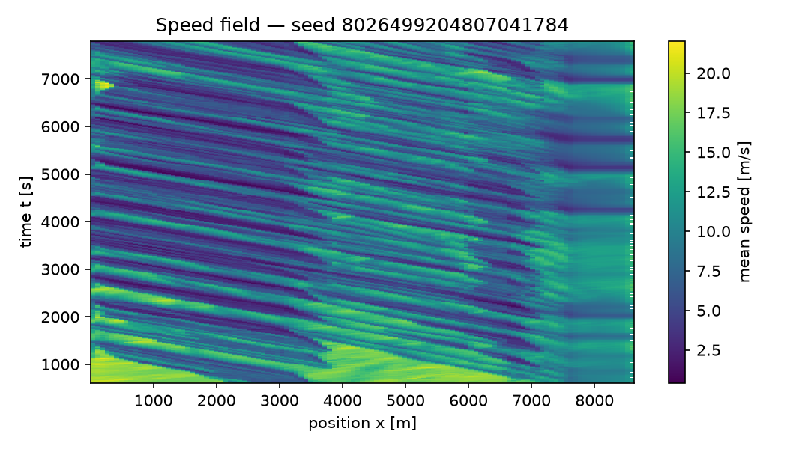
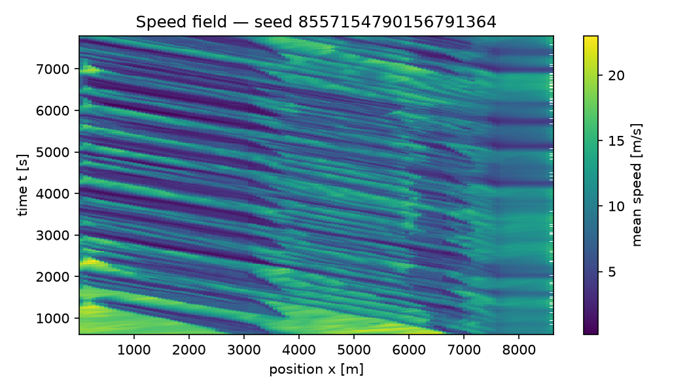
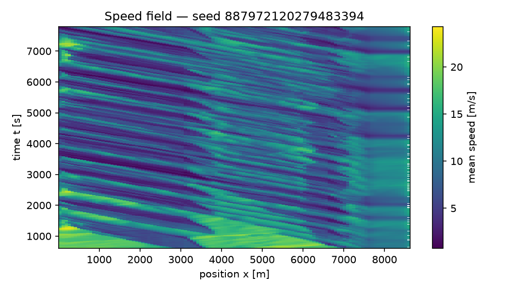

## Limitations

- Results cover a single corridor/scenario family; transfer to other
  corridors is not established.
- Model-form uncertainty (IDM/SUMO car-following assumptions, effective
  single-pipe demand representation) is not captured by seed-to-seed
  confidence intervals.
- AV penetration and compliance are swept assumptions, not measured
  behavior; conclusions hold only within the swept grid.
- Metrics from fewer than 20 replicates are flagged
  underpowered and are diagnostics, not claims.
- Measurement window: each run's configured warm-up is discarded from every metric (warm-up per run, in seconds: 600). Travel times keep whole journeys that begin inside the window and are measured over [2256.22, 7637.83] m. Fuel per vehicle-km remains a whole-run ratio unless the run records a post-warm-up fuel total.
