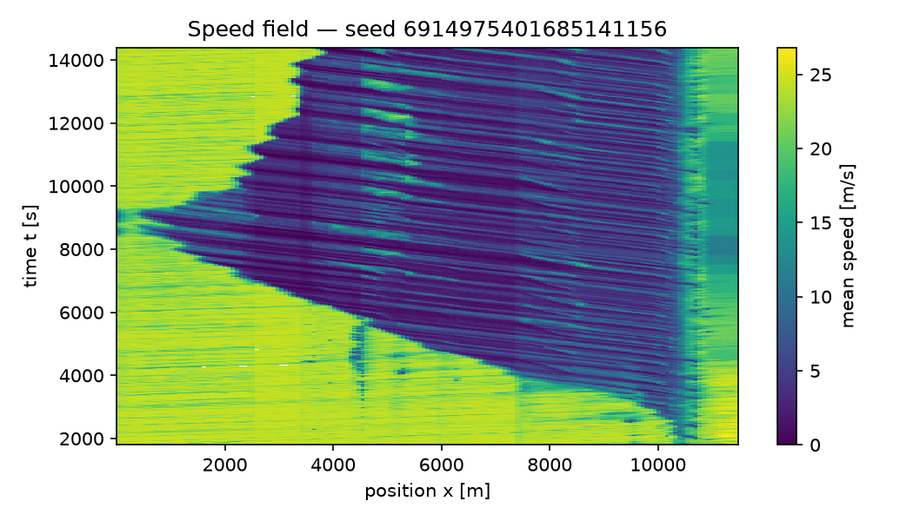

# FlowState calibration & validation report

> **MODEL INTEGRITY FAILURE — 4 SUMO collision(s) in 4 of 20 run(s); the no_collisions acceptance criterion fails. A collision is a model defect, not a traffic outcome: see Model integrity and Limitations.**
Generated: 2026-10-07T12:30:37Z

## Client summary

Baseline gate FAILED (docs/FRISCO_PROTOCOL.md section 6): C1 link flows (calibration), C3 speeds (calibration), C6 bottlenecks (calibration), C1 link flows (validation), C3 speeds (validation), C4 wave speed (calibration), C5 collisions (all runs). No strategy recommendation may be made from this model.

- replicates PASS: Replicates: 20 seeded replicate(s); the protocol scores every check over at least 20. Source: [FlowState] CLAUDE.md section 0.6; protocol section 4.
- days PASS: Day sets: the calibration-day artifact holds exactly the split's 5 calibration day(s) and the validation-day artifact its 4 validation day(s), none shared. Source: [FlowState] protocol section 3.2.
- quality PASS: Targets quality-masked: calibration days: runs/p1_rehearsal/dq/data_quality.json (sha256 8cae907dec40): 24 masked detector-day(s) (24 excluded whole), 912 reading(s) set aside; validation days: runs/p1_rehearsal/dq/data_quality.json (sha256 8cae907dec40): 19 masked detector-day(s) (19 excluded whole), 720 reading(s) set aside. Source: [FlowState] protocol section 2.2.
- C1 FAIL: Link flows, calibration days: GEH < 5 on 35.0 % of 840 station-hour comparisons pooled over 20 replicate(s) (per-replicate mean 35.0 %, 95 % interval 31.4 % to 38.6 %); the target is >= 85.0 %, short by 50.0 percentage points; hours anchored at the study period's start (1800 s). Source: [federal] FHWA TAT Vol. III 2004 (profile fhwa_default).
- C2 FAIL (reported, not part of the gate): Link flows, Texas criterion, calibration days: GEH < 3 on 22.5 % of 840 station-hour comparisons pooled over 20 replicate(s) (per-replicate mean 35.0 %, 95 % interval 31.4 % to 38.6 %); the target is >= 100.0 %, short by 77.5 percentage points; hours anchored at the study period's start (1800 s). Source: [federal] TxDOT TSAP ch. 13 (profile txdot_tsap_ch13); reported, not gating.
- C3 FAIL: Speeds, calibration days: RMSPE of 15-minute station mean speeds 44.6 % (mean over 20 replicate(s), 95 % interval 39.4 % to 49.7 %; point speeds at the stations, as a loop reads them); the target is at most 15.0 %, over by 29.6 percentage points (diagnostics: 5 min 45.9 %; 60 min 39.2 %). Source: common microsimulation practice (CLAUDE.md section 7.1), cited in the report.
- C6 FAIL: Bottlenecks, calibration days: 0 observed bottleneck(s), 0 active for 30 min or more, compared with 20 replicate(s) (point speeds at the stations, as a loop reads them); rule no_phantom fails — 11 of 20 replicates (55%; limit 50%) contain a bottleneck active for more than 30 min away from every observed one (counted once per replicate); by station pair: S790→S97 in 11. Source: [FlowState] protocol section 5.
- C1 FAIL: Link flows, validation days: GEH < 5 on 34.2 % of 840 station-hour comparisons pooled over 20 replicate(s) (per-replicate mean 34.2 %, 95 % interval 31.0 % to 37.4 %); the target is >= 85.0 %, short by 50.8 percentage points; hours anchored at the study period's start (1800 s). Source: [federal] FHWA TAT Vol. III 2004 (profile fhwa_default).
- C2 FAIL (reported, not part of the gate): Link flows, Texas criterion, validation days: GEH < 3 on 23.0 % of 840 station-hour comparisons pooled over 20 replicate(s) (per-replicate mean 34.2 %, 95 % interval 31.0 % to 37.4 %); the target is >= 100.0 %, short by 77.0 percentage points; hours anchored at the study period's start (1800 s). Source: [federal] TxDOT TSAP ch. 13 (profile txdot_tsap_ch13); reported, not gating.
- C3 FAIL: Speeds, validation days: RMSPE of 15-minute station mean speeds 44.6 % (mean over 20 replicate(s), 95 % interval 38.2 % to 51.1 %; point speeds at the stations, as a loop reads them); the target is at most 15.0 %, over by 29.6 percentage points (diagnostics: 5 min 46.4 %; 60 min 38.2 %). Source: common microsimulation practice (CLAUDE.md section 7.1), cited in the report.
- C6 PASS: Bottlenecks, validation days: 1 observed bottleneck(s), 0 active for 30 min or more, compared with 20 replicate(s) (point speeds at the stations, as a loop reads them); all four rules hold. Source: [FlowState] protocol section 5.
- C4 FAIL: Wave speed: a backward front in 20 of 20 replicate(s) (100.0 %; at least 80.0 % needed, a replicate without a front counting as a miss); simulated backward wave speed 5.5 km/h, 95 % interval 5.1 to 5.9 km/h over those replicates (stack detector); the band is 14-22 km/h, outside it by 8.5 km/h; observed on the calibration days (detector cross-correlation): median 19.1 km/h from 7 of 13 station pairs. Source: empirical stop-and-go literature (flowstate_core.constants.WAVE_SPEED_BAND_KMH).
- C5 FAIL: Collisions: 4 SUMO collision(s) in 4 of 20 run(s) that record the counter; the gate requires zero. Source: [FlowState] CLAUDE.md section 3.3; owner decision 2026-10-04.

### What we are confident about, and what we are not

| Statement | Confident | Basis |
|---|---|---|
| Traffic counts at the detectors (link flows, C1) | no | Link flows, calibration days: GEH < 5 on 35.0 % of 840 station-hour comparisons pooled over 20 replicate(s) (per-replicate mean 35.0 %, 95 % interval 31.4 % to 38.6 %); the target is >= 85.0 %, short by 50.0 percentage points; hours anchored at the study period's start (1800 s). Link flows, validation days: GEH < 5 on 34.2 % of 840 station-hour comparisons pooled over 20 replicate(s) (per-replicate mean 34.2 %, 95 % interval 31.0 % to 37.4 %); the target is >= 85.0 %, short by 50.8 percentage points; hours anchored at the study period's start (1800 s). |
| Speeds at the detectors, 15-minute averages (C3) | no | Speeds, calibration days: RMSPE of 15-minute station mean speeds 44.6 % (mean over 20 replicate(s), 95 % interval 39.4 % to 49.7 %; point speeds at the stations, as a loop reads them); the target is at most 15.0 %, over by 29.6 percentage points (diagnostics: 5 min 45.9 %; 60 min 39.2 %). Speeds, validation days: RMSPE of 15-minute station mean speeds 44.6 % (mean over 20 replicate(s), 95 % interval 38.2 % to 51.1 %; point speeds at the stations, as a loop reads them); the target is at most 15.0 %, over by 29.6 percentage points (diagnostics: 5 min 46.4 %; 60 min 38.2 %). |
| Where and when the slowdowns form (bottlenecks, C6) | no | Bottlenecks, calibration days: 0 observed bottleneck(s), 0 active for 30 min or more, compared with 20 replicate(s) (point speeds at the stations, as a loop reads them); rule no_phantom fails — 11 of 20 replicates (55%; limit 50%) contain a bottleneck active for more than 30 min away from every observed one (counted once per replicate); by station pair: S790→S97 in 11. Bottlenecks, validation days: 1 observed bottleneck(s), 0 active for 30 min or more, compared with 20 replicate(s) (point speeds at the stations, as a loop reads them); all four rules hold. |
| Stop-and-go wave speed (C4) | no | Wave speed: a backward front in 20 of 20 replicate(s) (100.0 %; at least 80.0 % needed, a replicate without a front counting as a miss); simulated backward wave speed 5.5 km/h, 95 % interval 5.1 to 5.9 km/h over those replicates (stack detector); the band is 14-22 km/h, outside it by 8.5 km/h; observed on the calibration days (detector cross-correlation): median 19.1 km/h from 7 of 13 station pairs. |
| No simulated collisions (C5) | no | Collisions: 4 SUMO collision(s) in 4 of 20 run(s) that record the counter; the gate requires zero. |
| Fuel (model estimate, SUMO HBEFA emission class; not validated against measured fuel) | no | fuel is not validated: no measured fuel was compared, so every fuel figure is a model estimate (docs/FRISCO_PROTOCOL.md section 8.6) |
| Effects of the strategies | no | not delivered: the model did not reproduce the corridor |
| Robustness of strategy effects to driver and demand uncertainty | no | not evaluated in this report (docs/FRISCO_PROTOCOL.md section 8.5) |
| Waiting time on ramps and before entering the network | yes | counted: every run records total delay and travel time including waiting (docs/FRISCO_PROTOCOL.md section 8.2); no strategy recommendation is made because the run set has no single baseline (do-nothing) group to compare against |

### Strategy results

This report contains no strategy recommendations: the model did not reproduce the corridor (the baseline gate failed), so strategy results are not delivered as findings.

### Data, days and assumptions

- Calibration days: 2026-09-02, 2026-09-03, 2026-09-08, 2026-09-15, 2026-09-16. Validation days: 2026-09-01, 2026-09-09, 2026-09-10, 2026-09-17. Drawn by the protocol's seeded split (seed 20261004, docs/FRISCO_PROTOCOL.md section 3).
- Excluded detector 3240: S792 lane-3 loop chatters: 14 percent occupancy against 27-32 percent on its neighbours, 78 percent null night samples, count rises 775 veh/h into a bracket nothing enters (docs/ONBOARDING_MNDOT.md section 7 item 2, 2026-09-24)
- Observed data: artifacts/p1_rehearsal_2026-10-04/observations_calibration.json, dates 20260902, 20260903, 20260908, 20260915, 20260916; mean over dates per window (weekday typical profile).
- Ramp volumes estimated from mainline differences, and every split assumption behind them, are listed in the study's ramp-estimation artifact, not in this run set (docs/FRISCO_PROTOCOL.md section 2.3).
- Strategy assumptions: each strategy arm's penetration, compliance and settings are as its label states; they are assumptions, not measured behaviour.

### Limits of this study

- Single corridor: the results describe this corridor, period and day set; transfer to other corridors is not established.
- Model-form uncertainty: the car-following and lane-change models' own assumptions are not captured by the seed-to-seed intervals.
- Every fuel figure is a model estimate (SUMO HBEFA emission class), not validated against measured fuel; differences in fuel between configurations are model predictions.
- Compliance and strategy assumptions: strategy results hold only for the settings simulated, under the configured driver population and demand.
- Results are reported as they came out, including failures.

## Provenance

Profile: `fhwa_tat3_2004`. Seeds: 134183728835869882, 165503670820534583, 2378473973028931053, 3011106312394044631, 3747978530954135749, 3944094060050347669, 4910985839736976611, 5690692725577505498, 6134032994440706937, 6143473282319009404, 6538422657834023852, 661281422688282993, 677105600768189526, 6904272788004776631, 6914975401685141156, 6953598295321596746, 7382187975121682178, 8026499204807041784, 8557154790156791364, 887972120279483394.

Measurement window: each run's configured warm-up is discarded from every metric (warm-up per run, in seconds: 1800). Travel times keep whole journeys that begin inside the window and are measured over [1089.1, 11071.8] m. Fuel per vehicle-km, a model estimate (SUMO HBEFA emission class; not validated against measured fuel), remains a whole-run ratio unless the run records a post-warm-up fuel total.

Insertion: 647080 vehicles planned over 20 run(s), 619685 departed (0.958 of plan on average, lowest 0.761), 28922.7 arrived per run (over 20 of 20); verdict: backlog: 4 % of planned vehicles never departed.

Weave exits at on-ramp 745524613 (exit C-D split 18208090): 492 of 27593 reached exiters (1.78 %) were given up at the gore's end and rerouted through over 20 run(s), within the 2 % threshold; the exit's link flow is short by that count and every mainline link downstream carries it.

Weave exits at on-ramp 769818012 (exit off-ramp 18207598): 1124 of 75384 reached exiters (1.49 %) were given up at the gore's end and rerouted through over 20 run(s), within the 2 % threshold; the exit's link flow is short by that count and every mainline link downstream carries it.

| Run | Config hash | Seed | Tier | seeded | Wall time [s] |
|---|---|---|---|---|---|
| 134183728835869882 | `182e3ec2f500` | 134183728835869882 | micro | seeded=False | 1259 |
| 165503670820534583 | `182e3ec2f500` | 165503670820534583 | micro | seeded=False | 1852 |
| 2378473973028931053 | `182e3ec2f500` | 2378473973028931053 | micro | seeded=False | 1723 |
| 3011106312394044631 | `182e3ec2f500` | 3011106312394044631 | micro | seeded=False | 1209 |
| 3747978530954135749 | `182e3ec2f500` | 3747978530954135749 | micro | seeded=False | 1372 |
| 3944094060050347669 | `182e3ec2f500` | 3944094060050347669 | micro | seeded=False | 1468 |
| 4910985839736976611 | `182e3ec2f500` | 4910985839736976611 | micro | seeded=False | 1699 |
| 5690692725577505498 | `182e3ec2f500` | 5690692725577505498 | micro | seeded=False | 1519 |
| 6134032994440706937 | `182e3ec2f500` | 6134032994440706937 | micro | seeded=False | 2283 |
| 6143473282319009404 | `182e3ec2f500` | 6143473282319009404 | micro | seeded=False | 1199 |
| 6538422657834023852 | `182e3ec2f500` | 6538422657834023852 | micro | seeded=False | 1300 |
| 661281422688282993 | `182e3ec2f500` | 661281422688282993 | micro | seeded=False | 1879 |
| 677105600768189526 | `182e3ec2f500` | 677105600768189526 | micro | seeded=False | 1374 |
| 6904272788004776631 | `182e3ec2f500` | 6904272788004776631 | micro | seeded=False | 1210 |
| 6914975401685141156 | `182e3ec2f500` | 6914975401685141156 | micro | seeded=False | 1264 |
| 6953598295321596746 | `182e3ec2f500` | 6953598295321596746 | micro | seeded=False | 1389 |
| 7382187975121682178 | `182e3ec2f500` | 7382187975121682178 | micro | seeded=False | 1171 |
| 8026499204807041784 | `182e3ec2f500` | 8026499204807041784 | micro | seeded=False | 1242 |
| 8557154790156791364 | `182e3ec2f500` | 8557154790156791364 | micro | seeded=False | 1101 |
| 887972120279483394 | `182e3ec2f500` | 887972120279483394 | micro | seeded=False | 1304 |

### Package versions (from run metadata)

- eclipse-sumo: `1.27.1`
- flowstate_core: `2.0.0`
- libsumo: `1.27.1`
- microsim: `2.0.0`
- numpy: `2.5.2`
- pandas: `3.0.5`
- pyarrow: `25.0.1`
- python: `3.12.15`

### Calibration artifacts used

| Artifact | data_hash |
|---|---|
| `artifacts/idm_i24_capacity_amax_k1.0.json` | `aa97dd93d2bf250ea23c3624f91afe8d7035a672fd13efbd53013709e12c7d56` |

### Observed data

The link-flow and segment-speed criteria are scored against this observed artifact: hourly volumes formed from the fully observed windows of each hour at every mainline station, and mean speeds per station segment (each station owns the span to the midpoints with its neighbours). Simulation time zero is the artifact's local start time; the run's warm-up, and any window the run does not cover to its end, are excluded, and a station-window the detector did not measure is skipped, never imputed — the coverage rows say how much of the grid was compared. A station whose cross-section lies outside the simulated position span is excluded from both comparisons rather than scored against a simulated flow of zero; the rows say how many were. When the artifact carries a detector-estimated backward wave speed, it is printed here as context for the band the simulated wave speed is scored against — it is a property of the corridor, not a target, and no criterion is evaluated from it.

| Field | Value |
|---|---|
| artifact | artifacts/p1_rehearsal_2026-10-04/observations_calibration.json |
| corridor | I-94 WB |
| source provider | MnDOT RTMC Mayfly API |
| source dates | 20260902, 20260903, 20260908, 20260915, 20260916 |
| source url | https://data.dot.state.mn.us/mayfly |
| aggregation | mean over dates per window (weekday typical profile) |
| local clock time of simulation t = 0 | 05:30 |
| observation window [s] | 300 |
| mainline stations compared | 14 |
| observation windows | 48 |
| windows inside the measurement window | 42 |
| station-windows with an observed flow [fraction] | 1 |
| station-windows with an observed speed [fraction] | 1 |
| link-hour comparisons (pooled over replicates) | 840 |
| speed cells compared (pooled over replicates) | 11760 |
| replicates scored against the observations | 20 |
| stations excluded (outside the simulated span) | 0 |
| detector-estimated backward wave speed (context, not a criterion) | median 19.1 km/h (IQR 18–23.9) from 7 of 13 station pairs; leave-one-date-out 18.5–20.8 km/h over 5 dates (fewest 5 pairs); the model's band is 14–22 km/h |

## Model integrity

What the runs' metadata records about the simulation itself misbehaving
(docs/CONTRACTS.md). A collision in a car-following simulation is a model
defect, not a traffic outcome. A run whose metadata carries no counter is
reported as not recorded, never as zero.

- Collisions: 4 over 20 run(s) that record the counter; per run 0.2 [0.007931, 0.3921] (two-sided 95 % t-interval, n = 20); 0.00645 per 1,000 departed vehicles (4 over 619685 departed in 20 run(s), whole runs including warm-up).
- Runs with collisions: 134183728835869882 (1), 165503670820534583 (1), 677105600768189526 (1), 6953598295321596746 (1)
- Forced lane changes at on-ramp 18207436 (scripted merge): 1569 of 14656 completed change(s) over 20 run(s) were made under SUMO's forced lane-change mode, in which SUMO refuses a change only on an overlap — the path around its own lane-change safety checks.
- Forced lane changes at on-ramp 178547099 (scripted merge): 2725 of 19369 completed change(s) over 20 run(s) were made under SUMO's forced lane-change mode, in which SUMO refuses a change only on an overlap — the path around its own lane-change safety checks.
- Forced lane changes at on-ramp 745524613 (weave section): 9692 of 24176 completed change(s) over 20 run(s) were made under SUMO's forced lane-change mode, in which SUMO refuses a change only on an overlap — the path around its own lane-change safety checks.
- Forced lane changes at on-ramp 769818012 (weave section): 10097 of 89393 completed change(s) over 20 run(s) were made under SUMO's forced lane-change mode, in which SUMO refuses a change only on an overlap — the path around its own lane-change safety checks.

| Lane | Edge | Collisions logged | Position along the lane [m] | Runs |
|---|---|---|---|---|
| `51388891_2` | `51388891` | 2 | 36.1–85.2 | 677105600768189526, 6953598295321596746 |
| `51388891_1` | `51388891` | 1 | 76.7 | 165503670820534583 |
| `999007700_0` | `999007700` | 1 | 114.9 | 134183728835869882 |

## Acceptance criteria

| Criterion | Value | Threshold | Evaluated | Result |
|---|---|---|---|---|
| link_flows_geh | 0.4452 | GEH < 5 for > 85% of link-hour comparisons | yes | FAIL — fraction of comparisons with GEH < 5 |
| wave_speed | 5.517 | backward wave speed in [14, 22] km/h (emergent, unseeded) | yes | FAIL — detector: stack: slant-stack peak of the two-way demeaned field on 15 s x 75 m bins over front speeds [-40, -2] km/h in 0.25 km/h steps, peak/median contrast >= 3, edge peaks rejected |
| ring_emergence | — | Sugiyama ring emergence benchmark reproduced | no | NOT EVALUATED — not evaluated: input not supplied |
| ring_dampening | — | Stern single-AV dampening benchmark reproduced | no | NOT EVALUATED — not evaluated: input not supplied |
| n_seeds | 20 | n_seeds >= 20 | yes | PASS |
| sensitivity_grid | — | penetration {1%, 2%, 5%, 10%, 15%, 20%} x compliance {25%, 50%, 80%, 100%} grid published with CIs | no | NOT EVALUATED — not evaluated: input not supplied |
| no_collisions | 4 | zero SUMO collisions in every run, each run recording the counter | yes | FAIL — 4 collision(s) in 4 of 20 run(s) that record the counter; FlowState internal standard (CLAUDE.md §3.3; owner decision 2026-10-04), not an FHWA or DOT criterion |

A row marked not evaluated is never a pass: either no input was supplied,
or the value was measured with a recipe this profile does not accept (the
row's result says which). An unevaluated criterion counts as failing. A row
marked not recorded is never a pass either: some run in the set carries no
record of what the row checks, and a missing record is not a zero. The
no_collisions row is a FlowState model-integrity requirement, not an FHWA
criterion: every run must record its SUMO collision counter, and the total
must be zero.

Wave-speed criterion input: mean over 20 of 20 unseeded replicate(s) of group merge scripted on on-ramp 18207436 + merge scripted on on-ramp 178547099 + merge weave on on-ramp 745524613 + merge weave on on-ramp 769818012 (`182e3ec2f500`), measured with the stack detector on its own bins.

### Speed criterion by time aggregation

The segment-speed criterion compares a replicate mean with one recorded
day. The floor column is the recorded field against its own three-window
moving average: below that resolution the day does not repeat itself, so
no ensemble mean can score under the floor. The criterion row keeps its
native resolution; this table says how much of its value is resolution.

| Aggregation | RMSPE, replicate mean vs observed | Floor: observed vs its own three-window average |
|---|---|---|
| 5 min (criterion) | 0.5672 | 0.03733 |
| 15 min | 0.566 | 0.07091 |
| 30 min | 0.5618 |  |
| 60 min | 0.5376 |  |
| whole period | 0.5177 |  |

## Metrics

Mean with two-sided t-distribution confidence bounds at the
95 percent level over n replicates. Rows flagged
underpowered have fewer than 20 replicates and must not be
quoted as headline results. Travel-time rows rest on the vehicles counted by
the n_travel_time_veh row, which are those that entered within the
measurement window and completed the span.

The wave_speed_kmh row is the metrics detector's diagnostic reading (standard); the acceptance criterion above is measured separately with the profile's stack detector on its own bins, so the two values can differ.

Rows marked (model estimate) carry fuel (model estimate, SUMO HBEFA emission class; not validated against measured fuel). SUMO computes fuel from its HBEFA emission classes; this study has measured no fuel to check it against (docs/FRISCO_PROTOCOL.md section 8.6).

### merge scripted on on-ramp 18207436 + merge scripted on on-ramp 178547099 + merge weave on on-ramp 745524613 + merge weave on on-ramp 769818012 (`182e3ec2f500`)

Replicates: n = 20 distinct seeds (134183728835869882, 165503670820534583, 2378473973028931053, 3011106312394044631, 3747978530954135749, 3944094060050347669, 4910985839736976611, 5690692725577505498, 6134032994440706937, 6143473282319009404, 6538422657834023852, 661281422688282993, 677105600768189526, 6904272788004776631, 6914975401685141156, 6953598295321596746, 7382187975121682178, 8026499204807041784, 8557154790156791364, 887972120279483394); replicate
criterion (n_seeds >= 20): PASS.

Not delivered: the model did not reproduce the corridor (the baseline gate failed, docs/FRISCO_PROTOCOL.md section 6). Strategy runs are kept for internal learning only; their numbers are not findings and are not shown.

## Speed contours

## Limitations

- This run set contains 4 SUMO collision(s) in 4 of 20 run(s) (134183728835869882 (1), 165503670820534583 (1), 677105600768189526 (1), 6953598295321596746 (1)), at lane `51388891_2` (edge `51388891`, 36.1–85.2 m): 2; lane `51388891_1` (edge `51388891`, 76.7 m): 1; lane `999007700_0` (edge `999007700`, 114.9 m): 1. A collision is a model defect, not a traffic outcome, and every metric of those runs includes the vehicles involved; see Model integrity.
- Results cover a single corridor/scenario family; transfer to other
  corridors is not established.
- Model-form uncertainty (IDM/SUMO car-following assumptions, effective
  single-pipe demand representation) is not captured by seed-to-seed
  confidence intervals.
- AV penetration and compliance are swept assumptions, not measured
  behavior; conclusions hold only within the swept grid.
- Metrics from fewer than 20 replicates are flagged
  underpowered and are diagnostics, not claims.
- Every fuel figure is a model estimate (SUMO HBEFA emission class), not validated against measured fuel; differences in fuel between configurations are model predictions.
- Measurement window: each run's configured warm-up is discarded from every metric (warm-up per run, in seconds: 1800). Travel times keep whole journeys that begin inside the window and are measured over [1089.1, 11071.8] m. Fuel per vehicle-km, a model estimate (SUMO HBEFA emission class; not validated against measured fuel), remains a whole-run ratio unless the run records a post-warm-up fuel total.
- The observed comparison covers the artifact's stations, windows and days
  only; station-windows the detectors did not measure are excluded from both
  criteria rather than filled in, so the coverage rows bound how much of the
  corridor and period the two rows actually speak for.
