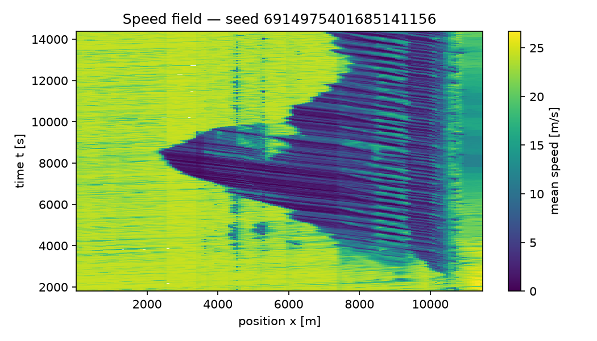

# FlowState calibration & validation report

> **MODEL INTEGRITY FAILURE — 3 of 20 run(s) locked (a permanent standstill); the no_locks acceptance criterion fails. Every metric of those runs includes the vehicles trapped behind the lock: see Model integrity and Limitations.**
Generated: 2026-10-07T12:12:59Z

## Client summary

Baseline gate: NOT EVALUATED. No baseline gate result was supplied with this run set, so the model has not been shown to reproduce the corridor under the study protocol (docs/FRISCO_PROTOCOL.md section 6), and this report makes no strategy recommendation.

### What we are confident about, and what we are not

| Statement | Confident | Basis |
|---|---|---|
| Traffic counts at the detectors (link flows, C1) | not established | the baseline gate was not evaluated for this run set |
| Speeds at the detectors, 15-minute averages (C3) | not established | the baseline gate was not evaluated for this run set |
| Where and when the slowdowns form (bottlenecks, C6) | not established | the baseline gate was not evaluated for this run set |
| Stop-and-go wave speed (C4) | not established | the baseline gate was not evaluated for this run set |
| No simulated collisions (C5) | not established | the baseline gate was not evaluated for this run set |
| No permanent standstill (gridlock) in any run | no | 3 of 20 run(s) locked, at on-ramp 178547099 (3), on-ramp 745524613 (2), off-ramp 18207390 (1), x 1350 m (1), on-ramp 1077665160 (1), on-ramp 769818012 (1), off-ramp 42165869 (1), on-ramp 53062592 (1), x 6550 m (1), x 5450 m (1), x 3250 m (1): a queue stood with no discharge for 10 min or more and its vehicles never finished (see Model integrity) |
| Fuel (model estimate, SUMO HBEFA emission class; not validated against measured fuel) | no | fuel is not validated: no measured fuel was compared, so every fuel figure is a model estimate (docs/FRISCO_PROTOCOL.md section 8.6) |
| Effects of the strategies | no | the baseline gate was not evaluated, so no strategy result is a finding |
| Robustness of strategy effects to driver and demand uncertainty | no | not evaluated in this report (docs/FRISCO_PROTOCOL.md section 8.5) |
| Waiting time on ramps and before entering the network | yes | counted: every run records total delay and travel time including waiting (docs/FRISCO_PROTOCOL.md section 8.2); no strategy recommendation is made because the run set has no single baseline (do-nothing) group to compare against |

### Strategy results

This report contains no strategy recommendations: the baseline gate was not evaluated. Any strategy table below is model output, not a finding.

### Data, days and assumptions

- Calibration and validation days: not stated (no day split accompanies this report).
- Excluded detectors: not stated (no baseline gate result).
- Observed data: data/mndot/mndot_i94_wb_stpaul/observations.json, dates 20260901, 20260902, 20260903, 20260908, 20260909, 20260910, 20260915, 20260916, 20260917; mean over dates per window (weekday typical profile).
- Ramp volumes estimated from mainline differences, and every split assumption behind them, are listed in the study's ramp-estimation artifact, not in this run set (docs/FRISCO_PROTOCOL.md section 2.3).
- Strategy assumptions: each strategy arm's penetration, compliance and settings are as its label states; they are assumptions, not measured behaviour.

### Limits of this study

- Single corridor: the results describe this corridor, period and day set; transfer to other corridors is not established.
- Model-form uncertainty: the car-following and lane-change models' own assumptions are not captured by the seed-to-seed intervals.
- Every fuel figure is a model estimate (SUMO HBEFA emission class), not validated against measured fuel; differences in fuel between configurations are model predictions.
- Compliance and strategy assumptions: strategy results hold only for the settings simulated, under the configured driver population and demand.
- Results are reported as they came out, including failures.

## Provenance

Profile: `fhwa_tat3_2004`. Seeds: 134183728835869882, 165503670820534583, 2378473973028931053, 3011106312394044631, 3747978530954135749, 3944094060050347669, 4910985839736976611, 5690692725577505498, 6134032994440706937, 6143473282319009404, 6538422657834023852, 661281422688282993, 677105600768189526, 6904272788004776631, 6914975401685141156, 6953598295321596746, 7382187975121682178, 8026499204807041784, 8557154790156791364, 887972120279483394.

Measurement window: each run's configured warm-up is discarded from every metric (warm-up per run, in seconds: 1800). Travel times keep whole journeys that begin inside the window and are measured over [1089.1, 11071.8] m. Fuel per vehicle-km, a model estimate (SUMO HBEFA emission class; not validated against measured fuel), remains a whole-run ratio unless the run records a post-warm-up fuel total.

Insertion: 678240 vehicles planned over 20 run(s), 648017 departed (0.955 of plan on average, lowest 0.889), 31026.2 arrived per run (over 20 of 20); verdict: backlog: 4 % of planned vehicles never departed.

Weave exits at on-ramp 745524613 (exit C-D split 18208090): 598 of 28565 reached exiters (2.09 %) were given up at the gore's end and rerouted through over 20 run(s), above the 2 % threshold; the exit's link flow is short by that count and every mainline link downstream carries it.

Weave exits at on-ramp 769818012 (exit off-ramp 18207598): 1017 of 77466 reached exiters (1.31 %) were given up at the gore's end and rerouted through over 20 run(s), within the 2 % threshold; the exit's link flow is short by that count and every mainline link downstream carries it.

| Run | Config hash | Seed | Tier | seeded | Wall time [s] |
|---|---|---|---|---|---|
| 134183728835869882 | `db9fbab5fc6e` | 134183728835869882 | micro | seeded=False | 897.3 |
| 165503670820534583 | `db9fbab5fc6e` | 165503670820534583 | micro | seeded=False | 775.6 |
| 2378473973028931053 | `db9fbab5fc6e` | 2378473973028931053 | micro | seeded=False | 920.7 |
| 3011106312394044631 | `db9fbab5fc6e` | 3011106312394044631 | micro | seeded=False | 1401 |
| 3747978530954135749 | `db9fbab5fc6e` | 3747978530954135749 | micro | seeded=False | 1725 |
| 3944094060050347669 | `db9fbab5fc6e` | 3944094060050347669 | micro | seeded=False | 1394 |
| 4910985839736976611 | `db9fbab5fc6e` | 4910985839736976611 | micro | seeded=False | 1162 |
| 5690692725577505498 | `db9fbab5fc6e` | 5690692725577505498 | micro | seeded=False | 1242 |
| 6134032994440706937 | `db9fbab5fc6e` | 6134032994440706937 | micro | seeded=False | 1308 |
| 6143473282319009404 | `db9fbab5fc6e` | 6143473282319009404 | micro | seeded=False | 945.2 |
| 6538422657834023852 | `db9fbab5fc6e` | 6538422657834023852 | micro | seeded=False | 1412 |
| 661281422688282993 | `db9fbab5fc6e` | 661281422688282993 | micro | seeded=False | 1003 |
| 677105600768189526 | `db9fbab5fc6e` | 677105600768189526 | micro | seeded=False | 1815 |
| 6904272788004776631 | `db9fbab5fc6e` | 6904272788004776631 | micro | seeded=False | 955.3 |
| 6914975401685141156 | `db9fbab5fc6e` | 6914975401685141156 | micro | seeded=False | 1308 |
| 6953598295321596746 | `db9fbab5fc6e` | 6953598295321596746 | micro | seeded=False | 1144 |
| 7382187975121682178 | `db9fbab5fc6e` | 7382187975121682178 | micro | seeded=False | 1018 |
| 8026499204807041784 | `db9fbab5fc6e` | 8026499204807041784 | micro | seeded=False | 1117 |
| 8557154790156791364 | `db9fbab5fc6e` | 8557154790156791364 | micro | seeded=False | 992.5 |
| 887972120279483394 | `db9fbab5fc6e` | 887972120279483394 | micro | seeded=False | 1044 |

### Package versions (from run metadata)

- eclipse-sumo: `1.27.1`
- flowstate_core: `2.0.0`
- libsumo: `1.27.1`
- microsim: `2.0.0`
- numpy: `2.5.2`
- pandas: `3.0.5`
- pyarrow: `25.0.1`
- python: `3.12.15`

### Calibration artifacts used

| Artifact | data_hash |
|---|---|
| `artifacts/idm_i24_capacity_amax_k1.0.json` | `aa97dd93d2bf250ea23c3624f91afe8d7035a672fd13efbd53013709e12c7d56` |

### Observed data

The link-flow and segment-speed criteria are scored against this observed artifact: hourly volumes formed from the fully observed windows of each hour at every mainline station, and mean speeds per station segment (each station owns the span to the midpoints with its neighbours). Simulation time zero is the artifact's local start time; the run's warm-up, and any window the run does not cover to its end, are excluded, and a station-window the detector did not measure is skipped, never imputed — the coverage rows say how much of the grid was compared. A station whose cross-section lies outside the simulated position span is excluded from both comparisons rather than scored against a simulated flow of zero; the rows say how many were. When the artifact carries a detector-estimated backward wave speed, it is printed here as context for the band the simulated wave speed is scored against — it is a property of the corridor, not a target, and no criterion is evaluated from it.

| Field | Value |
|---|---|
| artifact | data/mndot/mndot_i94_wb_stpaul/observations.json |
| corridor | I-94 WB |
| source provider | MnDOT RTMC Mayfly API |
| source dates | 20260901, 20260902, 20260903, 20260908, 20260909, 20260910, 20260915, 20260916, 20260917 |
| source url | https://data.dot.state.mn.us/mayfly |
| aggregation | mean over dates per window (weekday typical profile) |
| local clock time of simulation t = 0 | 05:30 |
| observation window [s] | 300 |
| mainline stations compared | 14 |
| observation windows | 48 |
| windows inside the measurement window | 42 |
| station-windows with an observed flow [fraction] | 1 |
| station-windows with an observed speed [fraction] | 1 |
| link-hour comparisons (pooled over replicates) | 840 |
| speed cells compared (pooled over replicates) | 11760 |
| replicates scored against the observations | 20 |
| stations excluded (outside the simulated span) | 0 |
| detector-estimated backward wave speed (context, not a criterion) | median 21.3 km/h (IQR 18.6–24.2) from 6 of 13 station pairs; leave-one-date-out 18.4–21.6 km/h over 9 dates (fewest 5 pairs); the model's band is 14–22 km/h |

## Model integrity

What the runs' metadata records about the simulation itself misbehaving
(docs/CONTRACTS.md). A collision in a car-following simulation is a model
defect, not a traffic outcome, and so is a lock: vehicles standing with no
discharge past a point while a queue builds behind it, read from each run's
space-time table and vehicle table (validation.locks). A run whose metadata
carries no counter, or that has neither table, is reported as not recorded,
never as zero.

- Collisions: 0 over 20 run(s) that record the counter; per run 0 [0, 0] (two-sided 95 % t-interval, n = 20); 0 per 1,000 departed vehicles (0 over 648017 departed in 20 run(s), whole runs including warm-up).
- Locks: 3 of 20 run(s) locked (15 %; 95 % Clopper–Pearson interval 3.21–37.9 %). A lock is a queue standing with no discharge past a point for at least 10 min.
- Forced lane changes at on-ramp 18207436 (scripted merge): 861 of 9862 completed change(s) over 20 run(s) were made under SUMO's forced lane-change mode, in which SUMO refuses a change only on an overlap — the path around its own lane-change safety checks.
- Forced lane changes at on-ramp 178547099 (scripted merge): 2765 of 16315 completed change(s) over 20 run(s) were made under SUMO's forced lane-change mode, in which SUMO refuses a change only on an overlap — the path around its own lane-change safety checks.
- Forced lane changes at on-ramp 745524613 (weave section): 5710 of 16356 completed change(s) over 20 run(s) were made under SUMO's forced lane-change mode, in which SUMO refuses a change only on an overlap — the path around its own lane-change safety checks.
- Forced lane changes at on-ramp 769818012 (weave section): 9502 of 91052 completed change(s) over 20 run(s) were made under SUMO's forced lane-change mode, in which SUMO refuses a change only on an overlap — the path around its own lane-change safety checks.

| Run | Head x [m] | Section | Onset [s] | Duration [min] | To the run's end | Trapped in network | Never departed upstream |
|---|---|---|---|---|---|---|---|
| 3011106312394044631 | 5316.6 | on-ramp 745524613 (weave) | 10110 | ≥ 71.5 | yes | 1928 | 3398 |
| 3011106312394044631 | 4450.0 | on-ramp 178547099 (merge) | 10275 | ≥ 68.8 | yes | 1587 | 3108 |
| 3011106312394044631 | 2350.0 | off-ramp 18207390 (diverge) | 10950 | ≥ 57.5 | yes | 867 | 1902 |
| 3011106312394044631 | 1850.0 | on-ramp 1077665160 (merge) | 11475 | ≥ 48.8 | yes | 723 | 1902 |
| 3011106312394044631 | 1350.0 | x 1350 m | 11460 | ≥ 49 | yes | 531 | 1902 |
| 677105600768189526 | 10731.6 | on-ramp 769818012 (weave) | 11805 | ≥ 43.2 | yes | 3049 | 3294 |
| 677105600768189526 | 9250.0 | off-ramp 42165869 (diverge) | 12195 | ≥ 36.8 | yes | 2340 | 653 |
| 677105600768189526 | 7250.0 | on-ramp 53062592 (merge) | 12780 | ≥ 27 | yes | 1798 | 366 |
| 677105600768189526 | 6550.0 | x 6550 m | 12795 | ≥ 26.8 | yes | 1576 | 366 |
| 677105600768189526 | 5450.0 | x 5450 m | 12990 | ≥ 23.5 | yes | 1306 | 145 |
| 677105600768189526 | 4250.0 | on-ramp 178547099 (merge) | 13335 | ≥ 17.8 | yes | 873 | 31 |
| 8026499204807041784 | 5316.6 | on-ramp 745524613 (weave) | 12495 | ≥ 31.8 | yes | 1593 | 382 |
| 8026499204807041784 | 4250.0 | on-ramp 178547099 (merge) | 12780 | ≥ 27 | yes | 1154 | 140 |
| 8026499204807041784 | 3250.0 | x 3250 m | 13395 | ≥ 16.8 | yes | 598 | 0 |

Onset is when the head started standing (simulation time); ≤ marks an upper bound read at the run's end, ≥ a duration cut short by the run's end. Trapped: vehicles still in the network at the end, upstream of the head and bound past it. Never departed: vehicles of origins at or upstream of the head that never entered the network, any ordinary backlog of those origins included.

## Acceptance criteria

| Criterion | Value | Threshold | Evaluated | Result |
|---|---|---|---|---|
| link_flows_geh | 0.5226 | GEH < 5 for > 85% of link-hour comparisons | yes | FAIL — fraction of comparisons with GEH < 5 |
| wave_speed | 4.897 | backward wave speed in [14, 22] km/h (emergent, unseeded) | yes | FAIL — detector: stack: slant-stack peak of the two-way demeaned field on 15 s x 75 m bins over front speeds [-40, -2] km/h in 0.25 km/h steps, peak/median contrast >= 3, edge peaks rejected |
| ring_emergence | — | Sugiyama ring emergence benchmark reproduced | no | NOT EVALUATED — not evaluated: input not supplied |
| ring_dampening | — | Stern single-AV dampening benchmark reproduced | no | NOT EVALUATED — not evaluated: input not supplied |
| n_seeds | 20 | n_seeds >= 20 | yes | PASS |
| sensitivity_grid | — | penetration {1%, 2%, 5%, 10%, 15%, 20%} x compliance {25%, 50%, 80%, 100%} grid published with CIs | no | NOT EVALUATED — not evaluated: input not supplied |
| no_collisions | 0 | zero SUMO collisions in every run, each run recording the counter | yes | PASS — no collision in 20 run(s); FlowState internal standard (CLAUDE.md §3.3; owner decision 2026-10-04), not an FHWA or DOT criterion |
| no_locks | 3 | no run locked (no queue standing without discharge for 10 min or more), every run recorded | yes | FAIL — 3 of 20 recorded run(s) locked; FlowState internal standard (CLAUDE.md §0.1; docs/I94_COLLAPSE_DIAGNOSIS.md §7, 2026-10-07), not an FHWA or DOT criterion |

A row marked not evaluated is never a pass: either no input was supplied,
or the value was measured with a recipe this profile does not accept (the
row's result says which). An unevaluated criterion counts as failing. A row
marked not recorded is never a pass either: some run in the set carries no
record of what the row checks, and a missing record is not a zero. The
no_collisions row is a FlowState model-integrity requirement, not an FHWA
criterion: every run must record its SUMO collision counter, and the total
must be zero. So is the no_locks row: every run must carry a lock record, and
no run may lock.

Wave-speed criterion input: mean over 19 of 20 unseeded replicate(s) of group merge scripted on on-ramp 18207436 + merge scripted on on-ramp 178547099 + merge weave on on-ramp 745524613 + merge weave on on-ramp 769818012 (`db9fbab5fc6e`), measured with the stack detector on its own bins; 1 replicate(s) detected no backward front and are excluded from the mean; fewer than 20 contributing replicate(s) — underpowered, not a headline value.

### Speed criterion by time aggregation

The segment-speed criterion compares a replicate mean with one recorded
day. The floor column is the recorded field against its own three-window
moving average: below that resolution the day does not repeat itself, so
no ensemble mean can score under the floor. The criterion row keeps its
native resolution; this table says how much of its value is resolution.

| Aggregation | RMSPE, replicate mean vs observed | Floor: observed vs its own three-window average |
|---|---|---|
| 5 min (criterion) | 0.4113 | 0.02832 |
| 15 min | 0.4071 | 0.06799 |
| 30 min | 0.3977 |  |
| 60 min | 0.3909 |  |
| whole period | 0.3426 |  |

## Metrics

Mean with two-sided t-distribution confidence bounds at the
95 percent level over n replicates. Rows flagged
underpowered have fewer than 20 replicates and must not be
quoted as headline results. Travel-time rows rest on the vehicles counted by
the n_travel_time_veh row, which are those that entered within the
measurement window and completed the span.

The wave_speed_kmh row is the metrics detector's diagnostic reading (standard); the acceptance criterion above is measured separately with the profile's stack detector on its own bins, so the two values can differ.

Rows marked (model estimate) carry fuel (model estimate, SUMO HBEFA emission class; not validated against measured fuel). SUMO computes fuel from its HBEFA emission classes; this study has measured no fuel to check it against (docs/FRISCO_PROTOCOL.md section 8.6).

### merge scripted on on-ramp 18207436 + merge scripted on on-ramp 178547099 + merge weave on on-ramp 745524613 + merge weave on on-ramp 769818012 (`db9fbab5fc6e`)

Replicates: n = 20 distinct seeds (134183728835869882, 165503670820534583, 2378473973028931053, 3011106312394044631, 3747978530954135749, 3944094060050347669, 4910985839736976611, 5690692725577505498, 6134032994440706937, 6143473282319009404, 6538422657834023852, 661281422688282993, 677105600768189526, 6904272788004776631, 6914975401685141156, 6953598295321596746, 7382187975121682178, 8026499204807041784, 8557154790156791364, 887972120279483394); replicate
criterion (n_seeds >= 20): PASS.

| Metric | Mean | Lower | Upper | n | Underpowered |
|---|---|---|---|---|---|
| throughput_veh_h | 2866 | 2755 | 2976 | 20 | no |
| mean_tt_s | 572.6 | 547.7 | 597.5 | 20 | no |
| p90_tt_s | 1352 | 1279 | 1425 | 20 | no |
| sigma_v_spatial_ms | 7.669 | 7.474 | 7.864 | 20 | no |
| sigma_v_temporal_ms | 4.897 | 4.824 | 4.971 | 20 | no |
| vmt_veh_km | 1.288e+05 | 1.253e+05 | 1.322e+05 | 20 | no |
| vht_veh_h | 4231 | 3957 | 4506 | 20 | no |
| fuel_ml_per_veh_km (model estimate) | 112.5 | 105.4 | 119.7 | 20 | no |
| wave_count | 35.25 | 31.88 | 38.62 | 20 | no |
| wave_speed_kmh | 7.926 | 7.627 | 8.225 | 20 | no |
| wave_amplitude_ms | 15.36 | 15.22 | 15.51 | 20 | no |
| n_travel_time_veh | 1.236e+04 | 1.205e+04 | 1.267e+04 | 20 | no |

## Speed contours

## Limitations

- This run set contains 3 locked run(s) of 20 (3011106312394044631 at on-ramp 745524613 from 10110 s, on-ramp 178547099 from 10275 s, off-ramp 18207390 from 10950 s, on-ramp 1077665160 from 11475 s, x 1350 m from 11460 s; 677105600768189526 at on-ramp 769818012 from 11805 s, off-ramp 42165869 from 12195 s, on-ramp 53062592 from 12780 s, x 6550 m from 12795 s, x 5450 m from 12990 s, on-ramp 178547099 from 13335 s; 8026499204807041784 at on-ramp 745524613 from 12495 s, on-ramp 178547099 from 12780 s, x 3250 m from 13395 s). A lock is a model defect, not a traffic outcome: the vehicles trapped behind it never finish, so the travel times of those runs are censored and their flows past the lock fall to zero, and every metric and interval above includes them; see Model integrity.
- Results cover a single corridor/scenario family; transfer to other
  corridors is not established.
- Model-form uncertainty (IDM/SUMO car-following assumptions, effective
  single-pipe demand representation) is not captured by seed-to-seed
  confidence intervals.
- AV penetration and compliance are swept assumptions, not measured
  behavior; conclusions hold only within the swept grid.
- Metrics from fewer than 20 replicates are flagged
  underpowered and are diagnostics, not claims.
- Every fuel figure is a model estimate (SUMO HBEFA emission class), not validated against measured fuel; differences in fuel between configurations are model predictions.
- Measurement window: each run's configured warm-up is discarded from every metric (warm-up per run, in seconds: 1800). Travel times keep whole journeys that begin inside the window and are measured over [1089.1, 11071.8] m. Fuel per vehicle-km, a model estimate (SUMO HBEFA emission class; not validated against measured fuel), remains a whole-run ratio unless the run records a post-warm-up fuel total.
- The observed comparison covers the artifact's stations, windows and days
  only; station-windows the detectors did not measure are excluded from both
  criteria rather than filled in, so the coverage rows bound how much of the
  corridor and period the two rows actually speak for.
